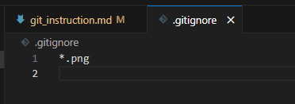

# Работа с git
## Проверка наличия установленного GIt
В терминале выполняем команду git version. Если git установлен, появится сообщение с информацией о версии файла. Иначе будет сообщение об ошибке.
## Настройка GIT
При первом использовании GIT необходимо представиться. Для этого надо ввести две команды: git config --global user.email "you@example.com", git config --global user.name "Your Name".
Для того, чтобы проверить, прошла ли регистрация, надо ввести команду git config --list.
## Инициализация репозитория
Для того, чтобы получить репозиторий из папки, выполняем команду git init. В исходной папке появится скрытая папка .git. 
## Настройка отслеживания файла
Для того, чтобы изменения начали отслеживаться, необходимо применить команду git add file_name. Если у вас не настроено автосохранение, необходимо применять эту команду регулярно.
## Проверка текущего статуса репозитория
Для проверки статуса репозитория используется команда git status. Она позволяет проверить, является ли папка репозиторием, какие файлы были добавлены или изменены, сохранены ли они и отслеживает ли их GIT.
## Комментирование версии файла
Команда git commit позволяет прокоментировать текущее сохранение файла при использовании атрибута -m. Это позволяет четко отслеживать изменения в файле, особенно, если каждое изменение правильно проименовать.
## Просмотр истории коммитов
Команда git log позволяет отследить последнюю историю комментариев к версии файла - коммитов, в обратном к хронологическому порядке. Здесь же можно заметить, что каждое сохраненное изменение имеет идентификатор.
## Возврат к предыдущим версиям
Для возврата к предыдущим версиям файла используется функция git chekout identificator, где identificator - индивидуальное название каждой версии файла, сохраненной GITом. Этот идентификатор упоминался в предыдущем разделе.
## А сохранился ли он?..
Для сверки откоммиченной версии файла с текущей используется функция git diff - она выведет различия между этими версиями на экран, что позволит оценить масштаб трагедии. Если файл успешно сохранен и прокомментирован, функция ничего не покажет.

## Добавление картинок и игнорирование файлов

Для того, чтобы разместить картинку в нашем файле, необходимо добавить ее в папку, после чего она должна отобразиться в проводнике. В нужном месте в файле прописываем следующую команду: 

Для того, чтобы удалить файлы с изображениями из отслеживания, нужно создать файл .gitignore.
Чтобы убрать все файла формата png, в gitignore пишем *.png.
Выглядит это так:

## Ветвление
Для создания новой ветки необходимо ввести git branch ветка_нейм. Ветвление необходимо для работы с файлами в отдельной ветке, сохраняя при этом исходное состояние файла до их слияния. Чтобы отобразить созданные ветки, испрользуется команда git_branch. Чтобы перейти на другую ветку, вводим в терминале команду git checkout ветка_нейм.
Вот так выглядит множество веток, если обратиться к функции **branch**: 

## Конфликты
Конфликты возникают при слиянии двух веток в одну и когда в этих ветках была изменена одна и та же строка (строки). Разрешение конфликта возможно путем следующих методов: принять текущие изменения, принять входящие изменения, оба изменения и сравнить изменения.  Выглядит это так:

При выборе одного из вариантов решения конфликта и после должной редактуры, изменение необходимо закоммитить.

## Удаление веток
После успешного слияния двух веток, ненужную можно удалить через функцию branch с атрибутом -d.
Вот так:

## Работа с удаленными репозиториями
Копировать внешний репозиторий на свой ПК можно командой git clone. 

Команда git clone составная: она не только
загружает все изменения, но и пытается слить 
все ветки на локальном компьютере и в
удаленном репозитории. 

Git pull позволяет скачать все 
из текущего репозитория и автоматически
сделать merge с нашей версией файла.

Отправить свою версию репозитория во внешний репозиторий поможет команда git push. При первом её использовании нужна авторизация.