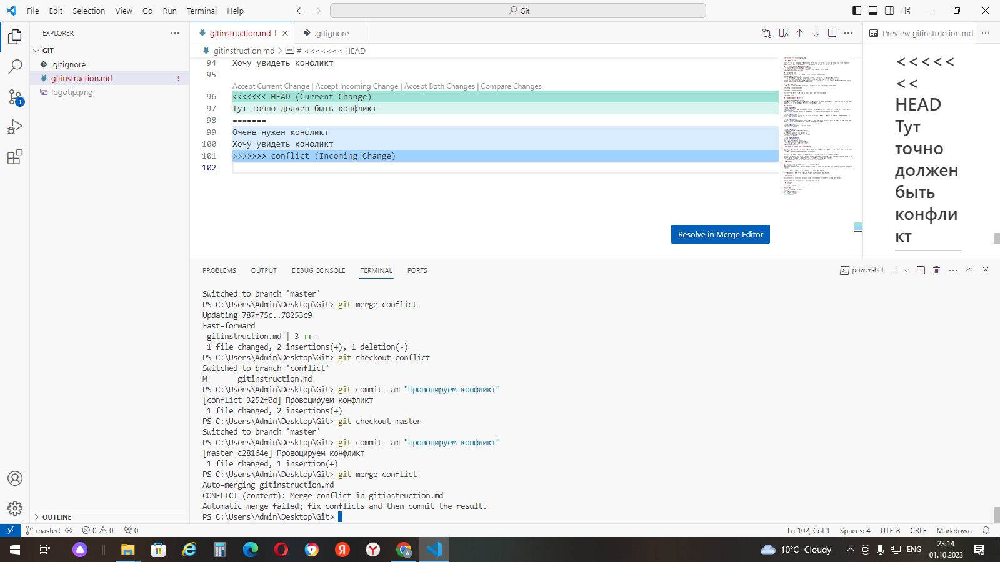
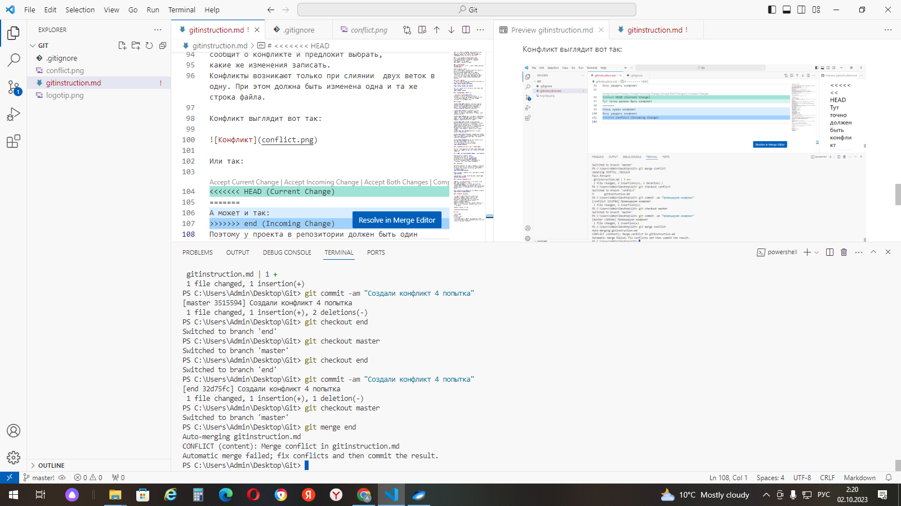
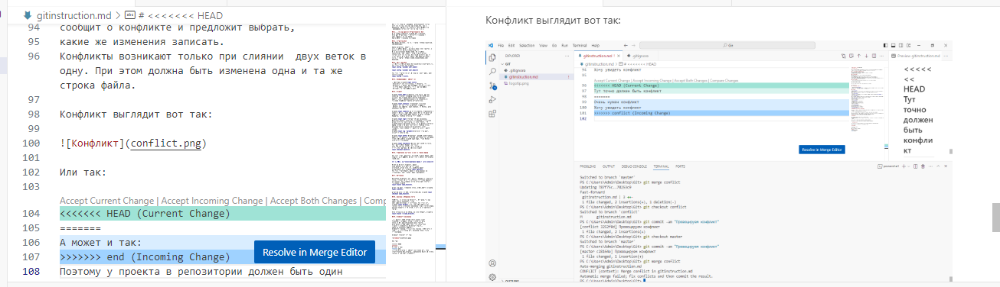

# Инструкция по Git

Git - это одна из рализаций распределенных систем контроля версий, имеющая как локальные, так и удаленные репозитории. Является самой популярной реализацией систем контроля версий в мире.

## 1. Проверка наличия установленного Git
В терминале выполняем команду git --version. 
Если git установлен, то появится сообщение с информацией о версии файла. 
Иначе будет сообщение об ошибке

## 2. Установка Git
Загружаем последнюю версию с сайта - https://git-scm.com/downloads. 

Также необходим редактор, в
котором будем писать. На самом деле можно обойтись и блокнотом, но лучше воспользоваться
программой Visual Studio Code. Её мы будем использовать как редактор кода и оболочку для
системы контроля версий. Ещё она пригодится нам во время самого программирования. Загружаем последнюю версию с сайта - https://code.visualstudio.com/Download.

## 3. Настройка Git
При первом использовании Git необходимо представиться, для этого вводим две команды:
**git config --global user.name**

**git config --global user.email**

Для того чтобы проверить прошла ли регистрация, надо ввести команду 
**git config --list**.

## 4. Инициализация репозитория 

Прописываем команду **git init**.
 Если посмотрите в проводник, то увидите, что поменялось в нашей рабочей папке. А если откроете скрытые файлы, заметите, что в рабочей папке появилась скрытая папка *.git*.

## 5. Команды

Команда **git add** добавляет содержимое рабочего каталога в индекс (staging area) для последующего коммита. Эта команда дается после добавления
файлов. Писать название целиком не обязательно: терминал дозаполнит данные автоматически.

Команда **git status** отслеживает состояние репозитория. Для этого необходимо в папке с репозиторием написать *git status*. Мы увидим, были изменения или нет.

Команда **git commit** берёт все данные, добавленные в индекс с помощью *git add*, фиксирует и сохраняет их слепок во внутренней базе данных, а затем сдвигает указатель текущей ветки на этот слепок.

Команда **git log** вызывает журнал изменений, позволяет увидеть количество сохранений и состояние более новых версий проекта. Но если вызвать эту команду изсамой «свежей» ветки, мы не увидим исходного
файла. Когда мы правим текст/код в текущей ветке,
автоматического слияния не происходит: можно
создавать один документ в разных версиях в разных ветках.   
Команда **git log --graph** позволяет отобразить коммиты в виде дерева.

Команда **git diff** показывает разницу между текущим файлом и сохранённым. Перед переключением версии файла в Git используйте команду *git log*, чтобы увидеть
количество сохранений.

Команда **git checkout** переключает между версиями.
Для работы нужно указать не только
интересующий вас коммит, но и вернуться 
в тот, где работаем, при помощи команды 
**git checkout master**.

## 6. Добавление картинок и игнорироваине файла

Для того чтобы разместить картинку в нашем файле, надо добавить ее в папку и после этого в нужном месте пишем следующее:

**! [Подпись картинки](Название файла с расширением)**

В Git не принято добавлять файлы
изображений, их хранят на сторонних
носителях. Чтобы исключить ненужные файлы
из загрузки, есть команда **git ignore**.
Для того чтобы удалить файлы с изображением из отслеживаия, надо создать файл *.gitignor*.

## 7. Ветвление

Ветвление необходимо для работы с файлами в отдельной ветке, сохраняя при этом исходное состояние файла до их слияния. Для создания новой ветки надо ввести в терминале команду
**git branch name_branch**.
 
Чтобы отбразить созданные ветки, используется команда **git branch**. 

Чтобы перейти в другую ветку испольуем команду **git checkout name_branch**.

## 8. Слияние и удаление веток

Допустим, черновики нас полностью устраивают и нам нужно внести изменения, чтобы
информация появилась в чистовике. Для этого есть команда **git merge**. Т.е, она используется для слияния веток и внесения изменений в наш основной файл.
Слияние делается в ту ветку, в которой мы находимся сейчас.

Если ветка больше не нужна, ее можно удалить командой 
**git branch -d name_branch**.

## 9. Конфликты изменений

При работе в двух ветках одновременно может
возникнуть ситуация, когда в одной и другой
ветке мы по-разному изменили блок текста.
Если затем мы попробуем слить эти ветки, Git
сообщит о конфликте и предложит выбрать,
какие же изменения записать.
Конфликты возникают только при слиянии  двух веток в одну. При этом должна быть изменена одна и та же строка файла. 

Конфликт выглядит вот так:

Или так:

Поближе:

Поэтому у проекта в репозитории должен быть один
ответственный пользователь, наделённый правом проводить
слияния и разрешать конфликты.

# Работа с удаленными репозиториями. 

## Скачивание из текущего репозитория и слияние со своей версией

При запуске команды *git init* всё происходит только в локальном репозитории: в папке на
компьютере пользователя, эту папку создавшего. Но для работы в команде программисты
используют удаленные репозитории.
Освоить работу с удаленными репозиториями, которые находятся не на локальной, а на удаленной машине, например, на сервере помогает GitHub.

GitHub представляет собой сервис компании Майкрософт для организации работы удаленных репозиториев.

Работать будем со следущими основными командами:

Копировать внешний репозиторий на свой ПК можно командой **git clone**.

Команда *git clone* составная: она не только
загружает все изменения, но и пытается слить 
все ветки на локальном компьютере и в
удаленном репозитории.

Команда **git pull** позволяет скачать все из текущего репозитория и автоматически слить
(сделать merge) с нашей версией.

Отправить свою версию репозитория во
внешний репозиторий поможет команда **git
push**. При первом её использовании нужна
git pull авторизация.

## Как настроить совместную работу:

1. Создать аккаунт на *GitHub.com*.

2. Создать локальный репозиторий.

3. “Подружить” ваш локальный и удалённый репозитории. GitHub при создании нового репозитория подскажет, как это можно сделать.

4. Отправить (**push**) ваш локальный репозиторий в удалённый (на GitHub), при этом, возможно, вам нужно будет авторизоваться на удалённом репозитории.

5. Провести изменения “с другого компьютера”.

6. Выкачать (**pull**) актуальное состояние из удалённого репозитория.

## Pull request

➜ команда для предложения изменений

➜ запрос на вливание изменений в репозиторий.

В больших компаниях один ответственный за проект создает аккаунт. Другие пользователи дают
команду **pull request**. Предлагать изменения на GitHub нужно в отдельной ветке. Сначала
пользователь копирует репозиторий на свой компьютер, делает **fork** репозитория, затем
клонирует версию на своём ПК, создаёт ветку с предлагаемыми изменениями, отправляет
изменения командой push в свой аккаунт на GitHub и даёт команду pull request. 

Как сделать pull request:

  * Делаем   (ответвление) репозитория fork;

  * Делаем git clone   версии репозитория СВОЕЙ;
  
  * Создаем новую ветку и в НЕЕ вносим свои изменения;

  * Фиксируем изменения (делаем коммиты);

  * Отправляем свою версию в свой GitHub;

  * На сайте GitHub нажимаем кнопку pull request.

  Конец