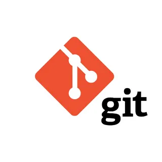

# Инструкция по GIT
## 1. Проверка наличия установленного GIT
В терминале выполняем команду git --version. Если GIT установлен, появится информация о версии GIT.
## 2. Настройка Git
При первом использовании GIT надо представиться. Для этого вводим команды

git config --global user.email "Почта"

git config --global user.name "Имя"
## 3. Инициализация репозитория
* Чтобы начать слежение за проектом, перейдите в папку проекта и введите команду

git init

Этой командой вы задаете репозиторий.

* Основным инструменом для определения состояния файлов является команда

git status

Так же эта команда показывает имя ветки, на каторой вы в данный момент находитесь

## 4. Сохранение изменений в файле

* Чтобы произвести индексирование файла, воспользуйтесь командой 

git add

* Для того, чтобы узнать, что именно изменилось в файле (что отредактировали) введите команду 

git diff

Эта команда сравнивает содержимое в рабочей папке и в области индексирования. Она выводит список изменений, которые вы внесли, но не проиндексировали.

*  Чтобы посмотреть различия между файлами в промежуточной области и последней имеющейся версией необходимо ввести:

git diff -staged

* Для фиксации файла используйте команду

git commit -m"Коментарий"

И обязательно не забудте ввести краткий коментарий

* Для одновременного индексирования и фиксации файла введите команду 

git commit -am"Коментарий"

* Для удаления файла из резервной копии, но сохранения его содержимого необходимо ввести

git reset [file] 

* Для отмены все фиксаций после указанной фиксации и сохранения изменения локально необходимо ввести

git reset [commit] 

* Для удаления всей истории и возвращения к указанному коммиту необходимо ввести

git reset –hard [commit]

* Для удаления файла из вашего рабочего каталога и инициации удаления необходимо ввести

git rm [file]  

* Эта команда показывает изменения метаданных и содержимого указанного коммита.

git show [commit]

* Эта команда используется для присвоения тегов указанному коммиту.

Пример:

git tag [commitID]

## 5. Перемещение между сохранениями

* Для просмотра фиксированых версий введите команду

git log

Она выводит в обратном хронологическом порядке список сохраненных в данный репозитория версий

* Для открытия превыдущей зафиксированной версии введите команду

git checkout номерКоммита

* Для открытия последный фиксированной версии введите команду

git checkout master

* Эта команда выводит историю версий файла, включая переименование файлов.

Пример:

git log –follow[file]

* Эта команда используется для просмотра истории версий текущей ветки в виде сокращенного, сжатого списка.

Пример:

git log –-oneline

* Эта команда используется для просмотра истории версий текущей ветки в виде графа.

Пример:

git log –-graph

## 6. Добавление картинок и игнорирование файлов

Чтобы вставить изображение в текст, достаточно написать следующее:

, например

Для игнорирования файлов нужно создать папку .gitignore и записать в нее либо имя конкретных файлов, которые надо игнорировать, либо расширение файлов, которые надо игнорировать, в формате *.расширение

## 7. Ветвление

* Для просмотра доступных веток необходимо ввести команду

git branch

* Для создания новой ветки ввести команду

git branch ИмяВетки

* Для проверки, на какой именно ветке находишься, можно ввести команды

git status

или

git branch

* Для перехода на другую ветку нужно написать

git checkout ИмяВетки

* Для одновременного создания ветки и перехода на нее необходимо ввести команду

git checkout -b ИмяВетки

* Для удаления ветки ввести команду

git branch -d Имяветки

* Эта команда показывает различия между двумя упомянутыми ветвями.

Пример:

git diff [first branch] [second branch] 

## 8. Слияние веток

Для слияния веток необходимо перейти в главную ветке командой

git checkout master

и после этого ввести команду

git merge ИмяВетки

## 9. Разрешение конфликтов

Для разрешения конфликта нужно либо принять оба варианта, либо какой-то один 

## 10. Работа с удаленными репозиториями

* Для копирования удаленного репозитория ввести команду

git clone Ссылка

* Для подключения вашего локального репозитория к удаленному серверу введи команду

git remote add ЛокальныйРепозиторий УдаленныйРепозиторий

* Для отправки изменения из ветки master в удаленный репозиторий необходимо ввести

git push [variable name] master 

Либо заместо ветки master можно отправить любую другую ветку, написав ее имя.

* Эта команда помещает все ветки в ваш удаленный репозиторий:

git push –all [variable name] 

* Эта команда удаляет ветку в вашем удаленном репозитории:

git push [variable name] :[branch name]

* Эта команда извлекает и объединяет изменения на удаленном сервере в ваш рабочий каталог.

git pull [Repository Link] 

## 11. git stash
* Эта команда временно сохраняет все измененные отслеживаемые файлы.

Пример:

git stash save

* Эта команда восстанавливает самые последние спрятанные файлы.

Пример:

git stash pop  

* Эта команда выводит список всех спрятанных наборов изменений.

Пример:

git stash list

* Эта команда удаляет последний сохраненный набор изменений.

Пример:

git stash drop

## 11. Другое

Для перехода в другую папку необходимо ввести 

cd ИмяПапки
 

## The end.
 
 