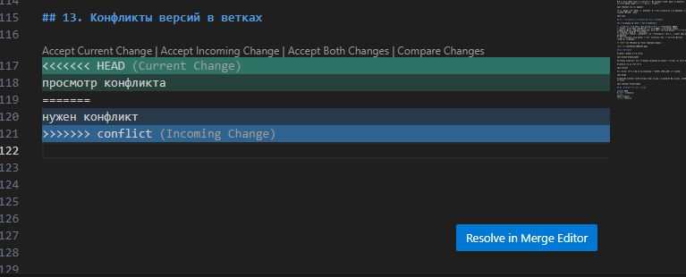

# Инструкция по GIT 
## 1. Проверка наличия установленного GIT 
В терминале выполняем команду **git --version**. Если GIT установлен, то появится информация о версии GIT. 
## 2. Настройка GIT 
При первом использовании GIT надо представиться. Для этого в терминале вводим команды:
git config --global user.email "mnl3@yandex.ru"
git config --global user.name "MNL3"

## 3. Инициализация репозитория
Чтобы создать новый репозиторий применяется команда **git init**. С ее помощью можно преобразовать существующий проект без управления версиями в репозиторий Git или инициализировать новый пустой репозиторий. При выполнении команды git init в текущем рабочем каталоге создается подкаталог .git со всеми необходимыми метаданными Git для нового репозитория.

Для вывода всего списка проиндексированный и неотслеживаемых файлов используют команду **git status**. Данная команда позволяет увидеть какие изменения добавлены и зафиксированы.

## 4. Сохраняем изменения в файле
Команда **git add** добавляет изменение из рабочего каталога в раздел проиндексированных файлов. Она сообщает Git, что вы хотите включить изменения в конкретном файле. Однако на самом деле команда git add не оказывает существенного влияния на репозиторий: изменения регистрируются в нем только после выполнения команды git commit. 

Для того чтобы зафиксировать или сохранить изменения необходимо в терминале выполнить команду **git commit**.
**git commit -m "commit massage"** - это быстрая команда, которая создает коммит с указанным комментарием. По умолчанию команда git commit открывает локально настроенный текстовый редактор с предложением ввести комментарий к коммиту. 

**git commit -am "commit massage"**- более опытные пользователи используют команду git commit с параметрами -a и -m. Эта комбинация параметров создает коммит всех проиндексированных изменений и добавляет к коммиту подставленный комментарий. Т.е. объединяет команды git add и git commit. 

## 5. Перемещение между сохраненениями
Для вывода журнала изменений в терминале вводим команду **git log**. Перед переключением версии файла в Git используйте команду git log, чтобы увидеть количество сохранений.

Проанализировать два входных набора данных и отобразить различия между ними поможет команда **git diff**. Данная команда представляет собой многоцелевую команду Git, которая инициирует функцию сравнения источников данных Git — коммитов, веток, файлов и т. д. *(зачастую вместе с командой git diff используются git status и git log для анализа текущего состояния репозитория Git)*.

Если возникла ситуация, в которой необходимо переключиться на одну из предыдущих версий в терминале вводим команду **git checkout**. Для работы нужно указать интересующий вас коммит. Например: git checkout 9d8e373, где 9d8e373 - это первые символы нужного коммита.

Чтобы вернуться в текущую рабочую версию файла в терминале вводим команду **git checkout main**.

## 6. Добавление картинок и игнорирование файлов
Чтобы вставить изображение в текст, достаточно написать следующее:
, например:

Однако, в Git не принято добавлять файлы изображений, их хранят на сторонних носителях. Чтобы исключить ненужные файлы из загрузки, есть команда git ignore.
Делается это с помощью файла .gitignore, который нужно создать в корне проекта. В этот файл с помощью текстового редактора добавляются имена файлов и директорий, которые надо игнорировать.
Как только .gitignore создан и в него добавлен какой-то файл или директория, игнорирование заработает автоматически. Все новые файлы, попадающие под игнорирование, не отобразятся в выводе команды git status. Чтобы не перечислять все файлы, которые мы хотим игнорировать при отслеживании можем просто указать необходимое расширение таких файлов: *.png

## 7. Ветвление
Для работы в черновиках принято создавать ветки. Ветки представляю собой отдельное направление разработки. Разработка в отдельных ветках не только позволяет работать над ними параллельно, но и предотвращает попадание сомнительного кода в главную ветку main.
Сознать ветку можно командой **git branch *<название новой ветки>***
Если у нас несколько версий черновика, мы можем вывести на экран ветку, где находимся, командой **git branch**.
Переключаться между ветками можно с помощью уже ранее изученной команды в п. 5 **git chechout *<имя ветки>***

## 8. Слияние веток
Команда **git merge** объединяет несколько последовательностей коммитов в общую историю. Чаще всего команду **git merge** используют для объединения двух веток. 
Перед слиянием следует предпринять несколько подготовительных действий, чтобы операция прошла без проблем. Выполните команду **git status**. Это позволит убедиться, что HEAD указывает на ветку, принимающую результаты слияния. При необходимости выполните команду **git checkout <принимающая-ветка>**, чтобы переключиться на принимающую ветку. Для примера выполним команду **git checkout main**. После указанных выше действий по подготовке можете приступать к слиянию. Для этого выполните команду **git merge <название ветки>**, где <название ветки> — название ветки, которая будет объединена с принимающей.

## 9. Разрешение конфликта
При работе в двух ветках одновременно может возникнуть ситуация, когда в одной и другой ветке мы по-разному изменили блок текста. Если затем мы попробуем слить эти ветки, Git сообщит о конфликте и предложит выбрать, какие же изменения записать. Git позволяет выполнять слияния очень просто. В большинстве случаев Git самостоятельно решает, как автоматически интегрировать новые изменения.

## 10. Работа с удаленным репозиторием. Скачивание из текущего репозитория и слияние со своей версией.
Копировать внешний репозиторий на свой ПК можно командой **git clone**. Команда git clone составная: она не только загружает все изменения, но и пытается слить все ветки на локальном компьютере и в удаленном репозитории.
Команда **git pull** позволяет скачать все из текущего репозитория и автоматически сделать merge с нашей версией.
Команда **git push** позволяет отправить нашу версию репозитория на внешний репозиторий. ТРЕБУЕТ АВТОРИЗАЦИИ на внешнем репозитории.

# Как настроить совместную работу
1. Создать аккаунт на GitHub.com
2. Создать локальный репозиторий
3. “Подружить” ваш локальный и удалённый репозитории. GitHub при создании нового репозитория подскажет, как это можно сделать
4. Отправить (push) ваш локальный репозиторий в удалённый (на GitHub), при этом, возможно, вам нужно будет авторизоваться на удалённом репозитории
5. Провести изменения “с другого компьютера”
6. Выкачать (pull) актуальное состояние из удалённого репозитория

Команда **pull request** предназначена для предложения изменений и направления запроса на вливание изменений в "чужой" репозиторий.
Как правило, один ответственный за проект создает аккаунт. Другие пользователи дают команду pull request. Предлагать изменения на GitHub нужно в **отдельной ветке**. Сначала пользователь копирует репозиторий на свой компьютер, делает **fork** репозитория, затем клонирует версию на своём ПК, создаёт ветку с предлагаемыми изменениями, отправляет изменения командой push в свой аккаунт на GitHub и даёт команду pull request. 

## Как сделать pull request
1. Делаем   (ответвление) репозитория fork
2. Делаем git clone   версии репозитория СВОЕЙ
3. Создаем новую ветку и в НЕЕ вносим свои изменения
4. Фиксируем изменения (делаем коммиты)
5. Отправляем свою версию в свой GitHub
6. На сайте GitHub нажимаем кнопку pull request

