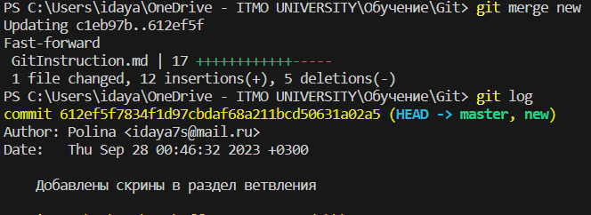
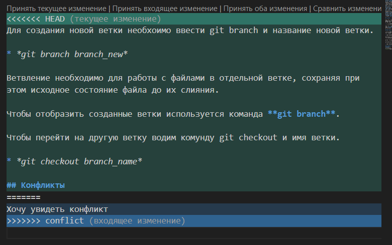
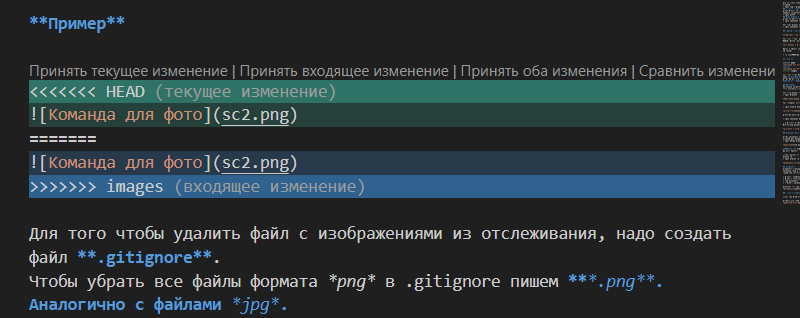

# Работа с git

## Проверка наличия установленного GIT
В терминале выполняем команду 
* *git vertsion*

Если git установлен, то появится сообщение с информацией о версии файла. Иначе будет информация с сообщением об ошибке.
## Настройка Git
При первом использовании Git необходимо представиться. Для этого надо ввести две команды: 
* *git config --global user.email*
* *git config --global user.name*

Для того чтобы проверить прошла  ли регистрация, необходимо ввести команду 
* *git config --list*
## Инициализация репозитория
Для того чтобы получить репозиторий из папки, выполняем команду 
* *git init* 

В исходной папке появится скрытая папка .git.
## Проверка состояния
Для того чтобы посмотреть текущее состояние ветки, например, какие файлы добавлены или не добавлены для создания commit, можно выполнить команду 
* *git status* 

Мы увидим, что есть не сохраненные файл, и нам предложат их добавить для отслеживания.
## Отслеживание файла для дальнейшего сохранения
Чтобы отслеживать файл, в котором мы будем делать commit, надо использовать команду 
* *git add <*НАЗВАНИЕ ФАЙЛА*>*
## Сохранение состояния
Чтобы сохранить текущее состояние и все, что было написано необходимо выполнить команду 
* *git commit -m "*НАЗВАНИЕ ИЗМЕНЕНИЯ*"* 

При этом также можно использовать команду с -am, чтобы каждый раз не вводить git add. 
* *git commit -am "*НАЗВАНИЕ ИЗМЕНЕНИЯ*"*
## Просмотр commit-ов или изменений
Чтобы посмотреть предыдущие версии, нам необходимо использовать команду 
* *git log* 

Есть также команда, которая выводит изменения в сокращенном виде, без указания на создателя изменения 
* *git log --oneline*

Еще мы можем видеть все ветки и сохранения в них, для этого надо ввести команду
* *git log --graph*

## Просмотр отличий текущего состояния от последнего сохранения
Чтобы посмотреть, различия в текущем состоянии файла, и его последнего commit, необходимо использовать команду 
* *git diff*
## Возвращение к предыдущей версии файла
Чтобы вернуться к какой-либо версии файла, надо использовать команду 
* *git checkout <*КОД commit-а*>* 

Для возвращения к последней версии надо ввести команду 
* *git checkout <*НАЗВАНИЕ ВЕТКИ*>*

## Работа с картинками

Для того чтобы разместить картинку в нашем файле, необходимо добавить ее в папку, после чего она должна отразиться в проводнике.

 

Затем в нужном месте в файле прописываем такую команду, чтобы вставить картинку:

* 

**Пример**

Для того чтобы удалить файл с изображениями из отслеживания, надо создать файл **.gitignore**.
Чтобы убрать все файлы формата *png* в .gitignore пишем ***.png**. Аналогично с файлами *jpg*.

Если вы добавляете картинку, но неверно указываете название файла или расширение, то вместо фото у вас будет выводиться сообщение из квадратных скобок.

## Ветвления
Ветвление необходимо для работы с файлами в отдельной ветке, сохраняя при этом исходное состояние файла до их слияния.

Для отображения созданных веток используется команда 
* *git branch*

Для создания новой ветки необхоимо ввести git branch и название новой ветки.

* *git branch branch_new*

Чтобы перейти на другую ветку вводим команду git checkout и имя ветки.

* *git checkout branch_name*

При просмотре существующих веток видно, в какой именно ты ветке, она подсвечена зеленым.

## Слияние веток

Чтобы изменения из одной ветки перенести в главную, надо использовать команду git merge и имя ветки, из которой мыберем данные
* *git merge branch_name*

**ВАЖНО** !!! Использовать команду надо из той ветки, куда происходит перенос данных.

После слияния мы можем удалить ненужную ветку, для этого используем команду branch -d.
* *git branch -d branch_name*

## Конфликты
Конфликты возникают при слиянии двух веток в одну и когда в этих ветках изменена одна и таже строка (строки). Разрешение конфликта возможно путем следующих методов: 

* принять текущие изменения
* принять входящие изменения
* оба изменения
* сравнить изменения

Выглядит это так:

## Примеры конфликтов и ветвлений

**ПРИМЕР 1**

Получился конфликт, когда я удалила строки из раздела с картинками и вставила их в новый раздел.

Приняв оба изменения, я получила два фото, поэтому пришлось произвести удаление одного из них.

Все это удалось сделать, когда произошло слияние раздела master и images.

**ПРИМЕР 2**

В ходе слияния ветки master и graph мы добавили картинку к команде log.

И при возвращении был изиенен заголовок, из-за чего произошел конфликт. Так как актуальным был вариант из ветки master, то было принято текущее изменение.

**ПРИМЕР 3**

При слиянии веток error и master конфликтов не произошло.

**ПРИМЕР 4**

Также была создана и удалена ветка new, чтобы были скрины для раздела "Ветвления".

## Работа с удаленным репозиторием

Для работы над большими проектами мы можем использовать удаленные репозитории. Но чтобы не нарушать код других людей, необходим человек, который загрузит части у разных участников.

Чтобы начать работу над частью кода, надо сделать копию репозитория в своем аккаунте на GitHub