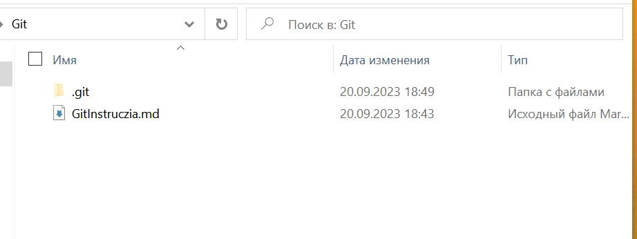
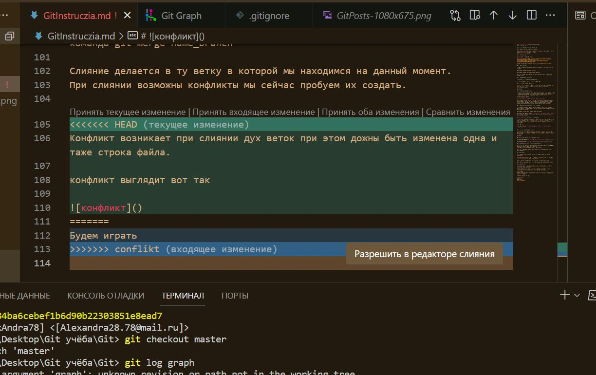
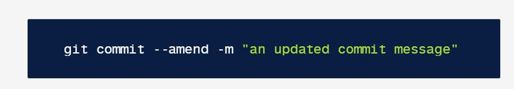
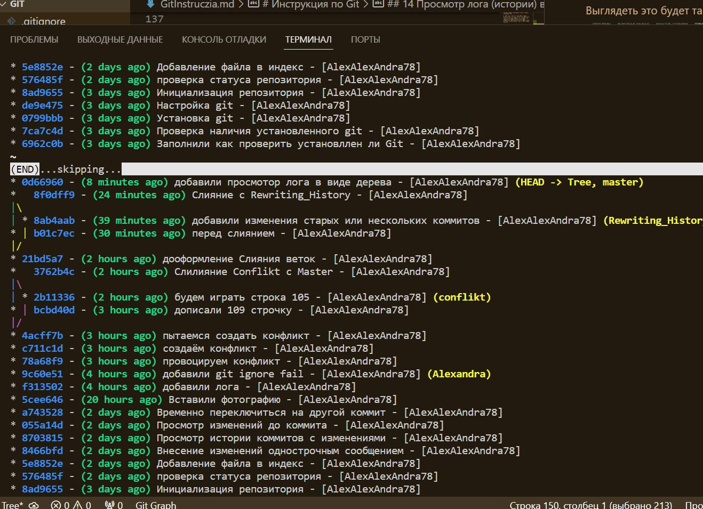
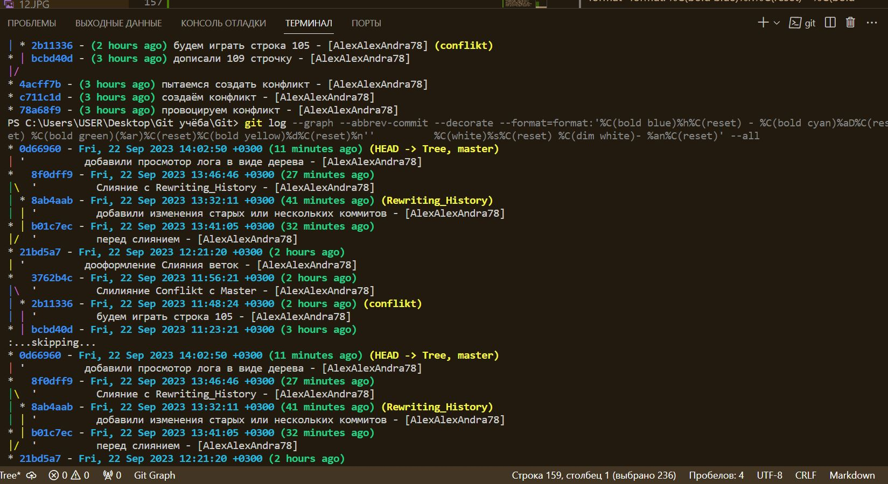
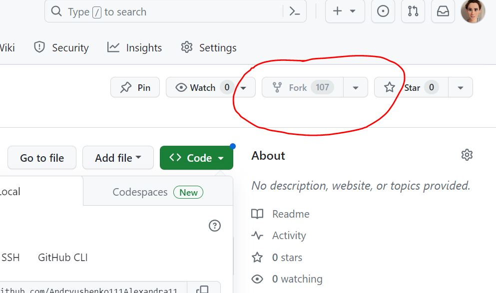
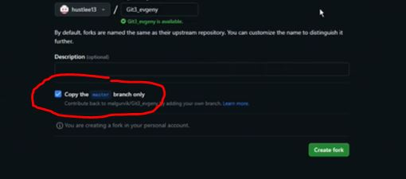
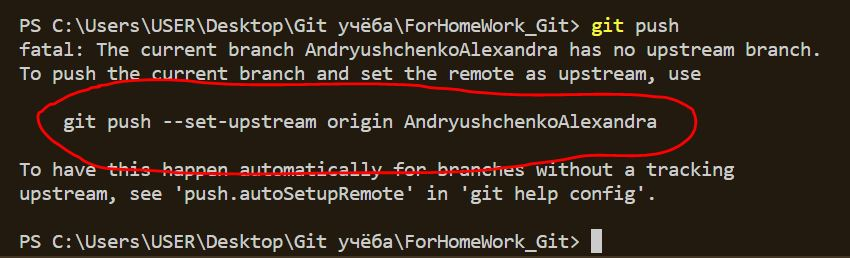
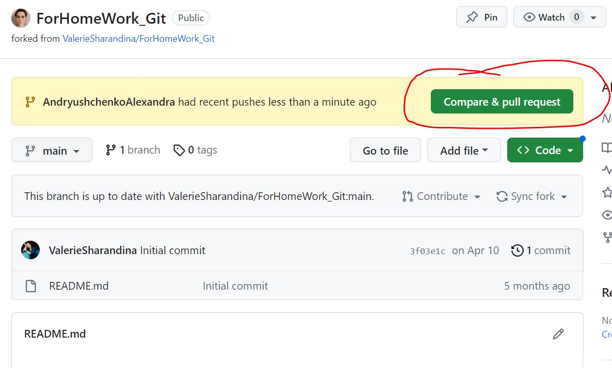

# Инструкция по Git

## 1. Проверка наличия установленного Git

В терминале выполняем команду git version.

Если Git если Git установлен, то появиться сообщение с информацией о версии файла, иначе будет сообщение об ошибке. 


## 2. Установка Git

Смотрим видео и делаем по видео:

для [Windows](https://gbcdn.mrgcdn.ru/uploads/record/53869/attachment/3de0ac7e50a023626dbcec71fbaa44ae.mp4) и для 
[MacOs](https://gbcdn.mrgcdn.ru/uploads/record/53868/attachment/4b8ca2920c7b990110e62a60cfbfbb21.mp4)

Ссылка для скачивания последней версии с [сайта](https://git-scm.com/)

Для того чтобы проверить прошла ли регистрация надо ввести команду:
```
 git config --list 
 ```
После этого на экране терминала появится много строчек с информацией.  Если все данные внесены без ошибок, то на последних строчках будет отображено имя и почта пользователя. 

## 3. Настройка Git

При первом использовании Git необходимо представиться, для этого ввсти две команды:

git config --global user.name "[name]"

git config --global user.email "[emai addresы]"

Для того чтобы проверить прошла ли регистрация надо ввести команду: git config --list

## 4. Инициализация Репозитория

Прописываем  в терминале команду *git init*.

 В исходной папке в скрытых появиться папка .git


## 5. Проверка статуса репозитория

Просмотреть статус нужного репозитория можно по ключевому слову status: его действие распространяется на подготовленные, неподготовленные и неотслеживаемые файлы.

git status

## 6. Добавление файла в индекс

 Добавить отдельный файл в область подготовленных файлов можно параметром add с указанием имени файла. Просто начните писать название файла, а дальше нажмите "Tab" и выберите нужнцй файл двигая стрелочки вверх.

git add [название файла]

При работе с командой `git add` возможно использовать следующие сокращения:

* Для обновления отслеживаемых файлов `git add -u`
* Для добавления изменений из всех отслеживаемых и неотслеживаемых файлов `git add -A` или `git add --all`

***После ввода этой команды вы можете сделать коммит.***

>Есть похожие команды, например:

 > git add . индексирует сразу все изменённые файлы и папки в директории, где вы находитесь. Обратите внимание, между точкой и словом add нужно ставить пробел. 
 
 > git add :/ добавляет в индекс все файлы независимо от того, в какой директории вы находитесь.

## 7. Внесение изменений однострочным сообщением 

При создании коммита в репозитории можно добавить однострочное сообщение с помощью параметра commit с флагом -m. Само сообщение вводится непосредственно после флага, в кавычках.

git commit -m "Your short summary about the commit"

git commit -am "Name of commit" - *закоммитить отслеживаемые индексированные файлы (указано название коммита, не требует git add, не добавит в коммит неотслеживаемые файлы)*

## 8. Просмотр истории коммитов с изменениями

Просматривать изменения, внесённые в репозиторий, можно с помощью параметра log. Он отображает список последних коммитов в порядке выполнения. Кроме того, добавив флаг -p, вы можете подробно изучить изменения, внесённые в каждый файл.

 git log -p

 git log --oneline  - *эта команда позволит видеть сокращённый список коммитов.* 
 
 Выглядит это так
 

## 9. Просмотр изменений до коммита

Можно просматривать список изменений, внесённых в репозиторий, используя параметр diff. По умолчанию отображаются только изменения, не подготовленные для фиксации.

git diff

Для того чтобы посмотреть изменения, которые были внесенв в файл и зафиксированны командой *git add* необходимо в терминале ввести команду:
```
git diff -c или
git diff --cached
```
Если информация не помещается в терминале нажимаем клавишу END.

Для выхода из режима нажимаем клавишу Q.

## 10. Временно переключиться на другой коммит

git checkout b9533bb - *временно переключиться на коммит с указанным хешем*

git checkout master - *вернуться к последнему коммиту в указанной ветке*

## 11. Добавление картинок и игнорирование файлов

Для того чтобы разместить картинку в нашем файле надо добавить её в папку и после этого пишем в нужнм месте следуюее:
! [подписи картинок](название файла с расширением)

Для того чтобы удалить файлы с изображениями с отслеживания надо создать файл .gitignore
 
 И внести в него изображение, чтобы не вносить множество изображений в файл прописываем те расширения, которые должен Git игнорировать. Например: *.JPG и *.png

## 12. Ветвление

Для создания новой ветки надо ввести в терминале команду git branch name_branch

Ветвление необходимо для работы с файлами в отдельной ветке, сохраняя при этом исходное состояние файла до слияния.

Чтобы отобразить созданные ветки, используется команда git branch.

Чтобы перейти на другую ветку используем команду git checkout name_branch

## 13. Слияние веток 

Для слияния веток и внесения изменения в наш основной файл используется команда *git merge name_branch*

Слияние делается в ту папку, в которой мы находимся сейчас. Например:
```
git checkout master
git merge lines6
```
Это означает что мы перешли в ветку *master* и в нее добавили ту информацию, которая была в ветке *lines6*.

Конфликт возникает при слиянии дух веток при этом дожна быть изменена одна и таже строка файла.

конфликт выглядит вот так



Для решения конфликта необходимо выбрать вариант из списка над строкой <<<<<< HEAD (Текущее изменение). Если нужен свой вариант, то стереть <<<<< , ======= и выбрать те строки которые необходимы, а ненужные удалить. 

## 14. Переписывание истории

**Команда *git commit --amend* и другие способы переписать историю**

В Git существует несколько механизмов хранения истории и сохранения изменений. Вот эти механизмы: *commit --amend*, *git rebase* и *git reflog*. 

Команда *git commit --amend* — это удобный способ изменить последний коммит. Она позволяет объединить проиндексированные изменения с предыдущим коммитом без создания нового коммита.



**Не используйте amend для публичных коммитов**

>Измененные коммиты по сути являются новыми коммитами. При этом предыдущий коммит не останется в текущей ветке. Последствия этой операции аналогичны сбросу (reset) публичного состояния кода. Не изменяйте коммит, после которого уже начали работу другие разработчики. Эта ситуация только запутает разработчиков, и разрешить ее будет непросто.

**Для изменения старых или нескольких коммитов** 
используйте команду *git rebase* для объединения нескольких коммитов в новый базовый коммит. В стандартном режиме команда git rebase позволяет в буквальном смысле перезаписать историю: она автоматически применяет коммиты в текущей рабочей ветке к указателю head переданной ветки. Поскольку новые коммиты заменяют старые, команду git rebase запрещено применять к коммитам, которые стали доступны публично. Иначе история проекта исчезнет. 

## 15. Удаление ветки

Для удаления ветки надо ввести в терминале команду:
```
git branch -d имя_ветки или
git branch --delete имя_ветки
```
Удалить ветку мы можем только в том случае если у нас обе ветки закоммичены и слиты. 

Если нам надо удалить ветку но при этом мы не хотим забирать изменения из нее в основную ветку мы вводим в терминал команду:
```
git branch -D имя_ветки
```
Но пользовать этой командой надо очень осторожно, чтобы случайно не потерять кусок работы.

## 16. Просмотр лога (истории) в консоли в виде дерева

Для просмотра лога коммитов можно воспользоваться следующей командой:

git log --graph --color-words --color --source --decorate --all

В результате в текстовом виде будет выведено дерево коммитов и веток, причем вывод будет иметь цветовую раскраску. Будут хорошо выделены теги, разным цветом будут выделены ветки, будет показано местонахождение в проекте (HEAD), если в настоящий момент произошел откат до какого-нибудь коммита.

Выглядеть это будет так


Вот еще один удобный вариант. Дерево с номерами коммитов и их описаниями:

git log --graph --oneline --all

А это выглядит так


Более короткий вид, который позволяет удобнее смотреть именно дерево. В нем один коммит занимает одну строку:

git log --graph --abbrev-commit --decorate --date=relative --format=format:'%C(bold blue)%h%C(reset) - %C(bold green)(%ar)%C(reset) %C(white)%s%C(reset) %C(dim white)- %an%C(reset)%C(bold yellow)%d%C(reset)' --all

Вид


И последний вариант. 

Полный граф коммитов c сокращёнными хешами, ссылками на коммиты и абсолютной датой. Используемый формат: синий сокращённый хеш коммита, голубая абсолютная дата, зелёная относительная дата, жёлтые ссылки на коммит, перевод строки, белые сообщение и автор:

git log --graph --abbrev-commit --decorate --format=format:'%C(bold blue)%h%C(reset) - %C(bold cyan)%aD%C(reset) %C(bold green)(%ar)%C(reset)%C(bold yellow)%d%C(reset)%n''          %C(white)%s%C(reset) %C(dim white)- %an%C(reset)' --all

Вид 


# 17. Работа с удалёнными репозиториями
 
 1. Чтобы приступить к работе над каким-либо проектом на `GitHub`, необходимо сначала перейти к репозиторию данного проекта на сайте. Например, репозиторий *pull request* [Андрея Булгакова](https://github.com/AndreyBulgakov19/SCV_Git_1804), нажимаем на кнопочку Fork 

 2. Отжимаем галочку 

 3. Затем копируем ссылку 

 4. Заходим в папку в которую хотим скопировать репозиторий на локальном компьютере. В терминале прописываем команду: *git clone https://github.com/AndreyBulgakov19/SCV_Git_1804.git (ссылка, которую мы скопировали на сайте)* 

 После этого в нашу папку будет клонирован весь проект.

 5. Заходим в Терминале в нужную папку через команду: *cd <название папки>*

 6. **Создаём новую ветку**(обязательно) при помощи команды: *git branch название ветки*, следующей командой переходим на эту ветку: *git checkout название ветки*.
 Можно одной командой:  ***git checkout -b "название ветки***

 7. Создаём файл, что-то в нём правим и всё по плану, команды: status, add, commit.

 8. Заливаем изменения на GitHab при помощи команды: *git push*. Смотрим на подсказки Git  копируем команду, вставляем и переходим.

 9. Отправляем изменённый файл, тому над чьим репозиторием мы работали с помощью кнопки Pull request 

 ## 18. Команда *pull* 

 `Git push` используется для отправки всех обновленных коммитов из локальной ветки в удаленную.
Для того чтобы отправить определенную ветку на удаленный сервер со всей историей работы над ней, в терминале вводим команду:
```
git push
```
Чтобы отправить все ветки, вводим команду:
```
git push --all
```
Чтобы удалить конкретную ветку, вводим команду:
```
git push --delete или
git push -d
```
Если мы создаем новый репозиторий на своем локальном компьютере и хотим отправить его в удаленный репозиторий на GitHub, то для начала надо будет создать в своем профиле новый репозиторий и после этого ввести в терминале команду:
```
git push (ссылка на новый репозиторий)

`Git push` используется для отправки всех обновленных коммитов из локальной ветки в удаленную.
Для того чтобы отправить определенную ветку на удаленный сервер со всей историей работы над ней, в терминале вводим команду:
```
git push
```
Чтобы отправить все ветки, вводим команду:
```
git push --all
```
Чтобы удалить конкретную ветку, вводим команду:
```
git push --delete или
git push -d
```
Если мы создаем новый репозиторий на своем локальном компьютере и хотим отправить его в удаленный репозиторий на GitHub, то для начала надо будет создать в своем профиле новый репозиторий и после этого ввести в терминале команду:
```
git push (ссылка на новый репозиторий)

## 19. Команды Fetch и Pull

Если нам надо связаться с каким-нибудь удалённым проектом и забирать из него все те данные проекта, которых у нас ещё нет, в терминале вводим команду:
```
git fetch (имя удаленного репозитория)
```
**Fetch** забирает данные в наш локальный репозиторий, но не сливает их с какими-либо вашими наработками.

Если мы хотим забрать и слить данные из удалённой ветки в вашу текущую ветку, в терминале вводим команду:
```
git pull
```
## 20. Команда Remote

Чтобы посмотреть cписок наших удаленных подключений к другим репозиториям, в терминале вводим команду:
```
git remote 
```
 Чтобы посмотреть cписок наших удаленных подключений и их URL-адрес, вводим команду:
 ```
 git remote -v
 ```

## 21. Отправляем доработанный проект обратно
Когда мы внесли все правки и готовы отправить свой проект, в терминале вводим команду `git push`. После этого Git выведет такое сообщение:

Верим тому что пишет Git, копируем всю команду и вводим в терминал. После этого переходим в [GitHub](https://github.com/) и нажимаем кнопку compare&pull request:

После этого нажимаем `Compare (название нашей ветки)`, добавляем комментарий и 
```
create pull request
```
После этого мы увидим сообщение о том что все прошло успешно:


