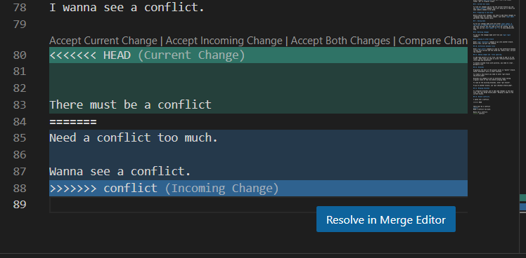
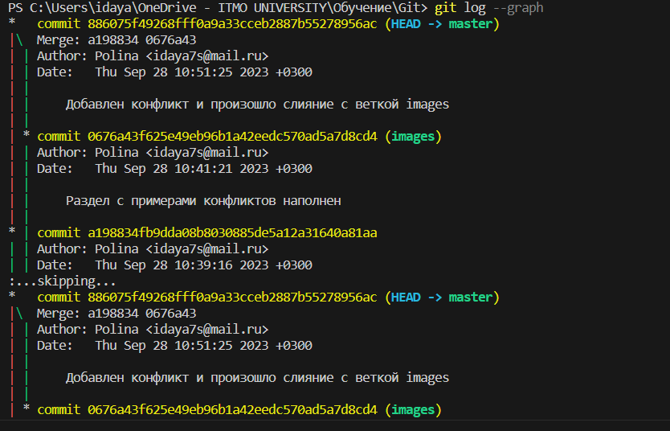
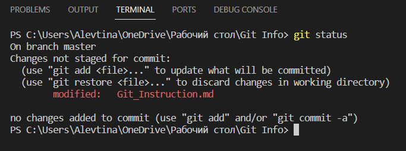

# Git instruction

## 1. Git installation checkout.

Enter **git version** command in terminal. 
If Git is installed, a file version message will appear.
Otherwise error message will show up. 

## 2. Git installation. 

Download the latest version from official site https://git-scm.com/ and install on your PC. 

## 3. Git settings. 

While using Git for the first time, you need to introduce yourself. There are two commands you'll have to enter: 

**git config --global user.name**

**git config --global user.email** 

To ensure the registration is okay, enter the command: 

**git config --list**

## 4. Repository initiallization.

Enter command **git init**. You will find a new hidden folder .git in original folder. 

## 5. Current Git state

To find all changes and to see the current branch you cab use **git status** command. This will help you if there are some commits needed to be saved. 

## 6. Preparing to save data 

Before saving your changes, you need to add these changes to "staging area" for the next commit. Just enter **git add** and press *TAB* buttom twice. 

## 7. Saving data 

To fix all changes made with file enter **git commit -m "Your sort of comment here what you've done with file"**. The next "branch" you can jump in will be created. By the way, you can use **git commit -am ""** to skip adding data step. 

## 8. Watching changes 

To see all the changes made with file use **git log** command. 

## 9. Jumping to other branch

Enter **git checkout** command to go into another branch. Before this, use git log command.

## 10. Difference between files 

Enter **git diff** command to look at the difference between current file version and the saved one. Before this, use git log command.

## 11. Adding images and  files ignoring. 

To add some picture in our file, you need to add it to the folder. After that you need to write . 

To delete tracked files with pictures, you need to creat .gitignore file. 

## 12. Branches 

Originally the host of the project works in "master" branch. Casual developers work in other branches. 

To create a new branch you need to enter "git branch new_branch_name".

Branches are needed to work on different tasks saving original state of the file before merging them. 

To look at the existing branches, enter "git branch".

To go to another branch, use "git checkout branch_name". 

## 13. Merging branches

To integrate branches and to add some changes in the main file, use "git merge branch_name". Merging is made to the current branch. 

## 14. Branch conflicts. 

I wanna see a conflict. 

When merging few branches in one conflicts appearing. One string of the file is changed. Conflict is look like: 

## 15. Deleting branches.

To delete branch you need to enter next command: *git branch -d **branch_name***

## 16. Cleaning terminal 

To clean terminal while working, you just needed to write **clear**. This is the only one word used without *git* before. Hooray! 

## 17. Graphics view 

There is one more interesting function in Git called *git log --graph*. It will show all your branches in a stylish way.  

## Errors

The most popular error, while using Git is forgetting "commiting". If you don't commit your changes, the programm will not be able to work probably. Luckily Git helps you to understand that, just enter git status from time to time: 

