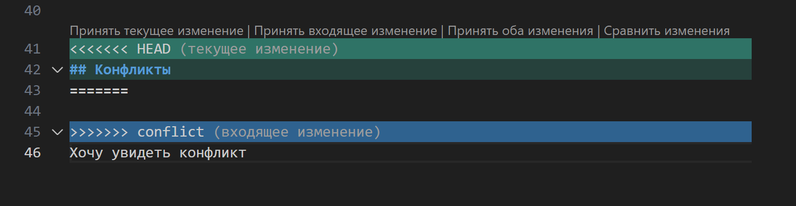

# Инструкция по Git

## 1. Проверка наличия установленного Git

В терминале выполняем команду Git version.

Если Git установлен, то появится сообщение с информацией о версии файла. 
Иначе будет сообщение об ошибке.

## 2. Установка Git

Загружаем ссылку с сайта https://git-scm.com/downloads

Для работы с языками программирования загрузить редактор исходного кода https://code.visualstudio.com/download

## 3. Настройка Git

При первом использовании Git необходимо представиться, для этого нужно ввести две команды:

git config --global user.name

git config --global user.email

Для того, чтобы проверить прошла ли регистрация нужно ввести команду:

git config --list

## 4. Инициализация репозитория

В терминале прописать команду git init.

В папке основной появится скрытый файл '.git'

## 5. Git status

Позволяет получить от Git данные о его текущем состоянии: ветка, есть ли коммиты и команды для их добавления и пр.

## 6. Git add

Необходима для добавления изменений в коммиты. Вид: git add+имя файла через Tab

## 7. Git commit

Фиксирует все сделанные изменения в файле

в терминале имеет вид: git commit -m

## 8. Сочетание add и commita 

Позволяет одновременно добавлять коммит и фиксировать изменения

Имеет вид git commit -am "..." 

## 9. Git log

Выводит внесенные изменения с указание кода операции и комментария к нему

git log --oneline  сокращенный вариант кода

giit log  номер код без сокращений 

## 10. Git diff

Выводит версию актуальную и после последнего коммита

## 11. Git checkout

Необходима для переключения между коммитами.

Имеет вид git checkout + 4 знака кода операции 

## 12. Добавление картинок и игнорирование файлов.

Чтобы разместить картинку в нашем файле нужно добавить ее в папку и затем в нужном месте пишем следующее: 

Чтобы удилить файлы с изображениеми из отслеживания нужно создать файл .gitignore

## 13. Ветвление.

Для создания новой ветки нужно ввести в терминале команду git branch "имя_ветки".

Ветвление необходимо для работы с файлами в отдельной ветке, сохраняя при этом исходное состояние файла до их слиния.

Чтобы отобразить созданные ветки, используется команда git branch.

Чтобы перети на другую ветку, используем команду git checkout "имя_ветки".

## 14. Слияние веток.

Для слияния веток и внесения изменения в наш основной файл используется команда git merg "имя_ветки".

Слияние делается в ту ветку, в которой мы находимся сейчас.

***

# КОНФЛИКТЫ

Хочу увидеть конфликт

тут должен быть конфликт
очень нужен конфликт
хочу увидеть конфликт

Конфликты возникают при слиянии двух веток в одну. При этом должна быть изменена одна и та же строка файла.
Конфликт выглядит вот так:

# Выход из конфликта изменений.
# Выход из конфликта.

При возникновении конфликта изменений Git предлагает 4 варианта принятия конфликта.

Выбрав один из вариантов, достаточно нажать на него для записи изменений.

Скрин конфликта к ДЗ:

15. Скриншоты.

С помощью скриншотов можно сохранить отдельные рабочие моменты.

Для этого можно использовать:

1. графический редактор Paint, 

2. инструмент "Ножницы" в Windows и некторые другие.

Местом сохранения должна быть рабочая папка git для работы в Visual Studio.

Независимо от расширения картинки, само обозначение расширения указываем в файле 
  ".gitignore."