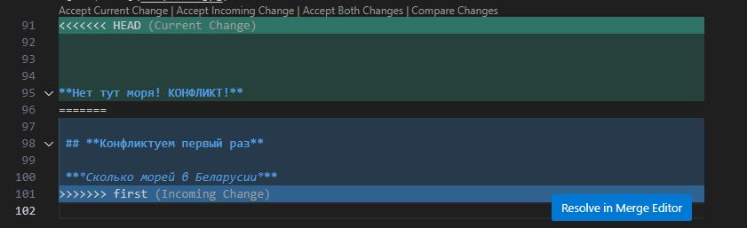

# Инструкция к Git

## 1. Проверка наличия установленного Git

В терминале выполняем команду git version.
Если Git установлен, то появится сообщение с информацией о версии файла. 
Иначе будет сообщение об ошибке.

## 2. Установка Git

Загружаем последнюю версию с сайта - https://git-scm.com/

## 3. Настройка Git

При первом исползовании Git необходимо представиться, для этого надо ввести две команды.

git config -- global user.name
git config -- global user.email

Для того, чтобы проверить прошла ли регистрация нужно ввести команду: git config --list

## 4. Инициализация Репозитория 

Для создания нового репозитория используется команда git init. Команду git init выполняют только один раз для первоначальной настройки нового репозитория. Выполнение команды приведет к созданию нового подкаталога .git в вашем рабочем каталоге. Кроме того, будет создана новая главная ветка.

## Команды для домашней работы

**Описать git status/ git commit / git log / git diff / git checkout, дописать второй пункт**

## 5. Основные команды Git

Чтобы получить информацию от git о его текущем состоянии вводим команду git status

Чтобы сохранить изменения в Git вводим команду git commit

Для вывода на экран истории всех коммитов с их хеш-кодами git log

Чтобы увидеть разницу между текущим файлом и закоммиченным файлом вводим команду git diff

Для переключения между коммитами используем команду git checkout

## 6. Добавление картинок и игнорирование файла

Для того чтобы разместить картинку в нашем файле, надо добавить ее в папку и после этогов нужнем месте пишем следущее 

Для того чтобы удалить файлы с изображением из отслеживания, надо создать файл .gitignore

## 7. Ветвление

Для создания новой ветки надо ввести в терминале команду: git branch name

Ветвление необходимо для работы с файлами в отдельной ветке, сохраняя при этом исходное состояние файла до их слияния

Чтобы отбразить созданные ветки, используется команда: git branch

Чтобы перейти на другую ветку используем команду: git checkout name_branch

## 8. Слияние веток

Для слияния веток и внесения изменений в наш основной файл используется команда: git merge name_branch. Для слияния веток и внесения изменений в наш основной файл используется команда: git merge name_branch

Слияние делается в ту ветку, в которой мы находимся сейчас

## 9. Конфликты

Конфликтом в Git называют ситуацию, когда, в ходе слияния изменений (например git pull/push/merge) в одном файле, система контроля версий не может автоматически решить, какие изменения необходимо сохранить. Чаще всего конфликт происходит в ситуациях, когда из одного состояния (коммита) создано несколько веток и в каждой из них внесены изменения в один файл без синхронизации с прочими ветками.

Конфликты возникают при слиянии двух веток в одну, при этом должна быть изменена одна и та же строка файла

Конфликт выглядит вот так

## Домашка

Создать четыре ветки и слить их с основной, ветки не удалять
Дополнить инструкцию своими скринами
Сделать и решить еще один конфликт

## Работа с удаленными репозиториями

**git clone** <url-адрес репозитория> – клонирование внешнего репозитория на
локальный ПК

**git pull** – получение изменений и слияние с локальной версией

**git push** – отправляет локальную версию репозитория на внешний