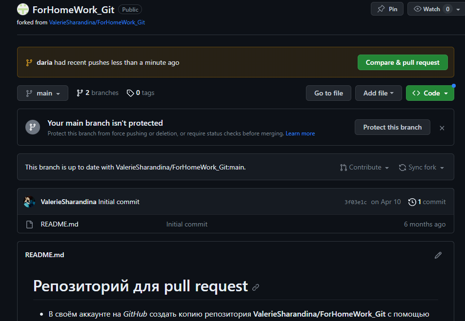

## Работа с удаленными репозиториями

Копировать внешний репозиторий на свой ПК можно командой *git clone*

Команда git clone составная: она не только загружает все изменения, но и пытается слить все ветки на локальном компьютере и в удаленном репозитории.

Скачать все изменения из измененного репозитория на свой пк поможет команда *git pull*

Для того, чтобы отправить изменения в удаленный репозиторий, понадобится команда *git push*.
Но при первом её использовании нужна авторизация.

При помощи команды *git clone* мы можем сделать локальную копию удаленного репозитория.

## pull request

Pull reqest это запрос на интеграцию изменений из одной ветки в другую.

Как сделать pull reqest:
    1. Делаем Fork репозитория
    2. Создаем git clone СВОЕЙ версии репозитория
    3. Создаем новую ветку и в НЕЕ вносим свои изменения
    4. Делаем коммиты
    5. Отправляем свою версию на свой GitHub
    6. На сайте GitHub нажимаем кнопку pull request

