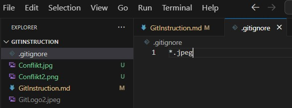
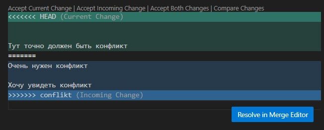
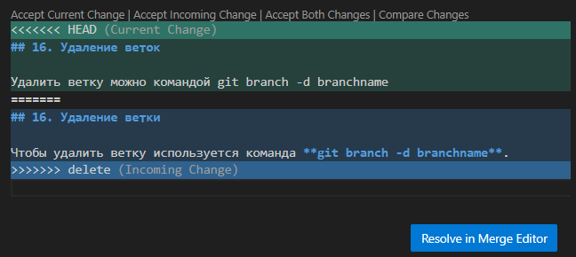
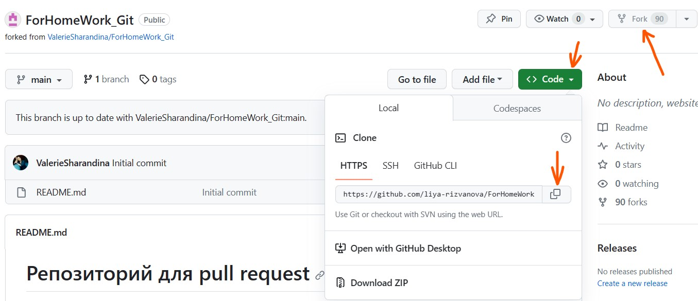
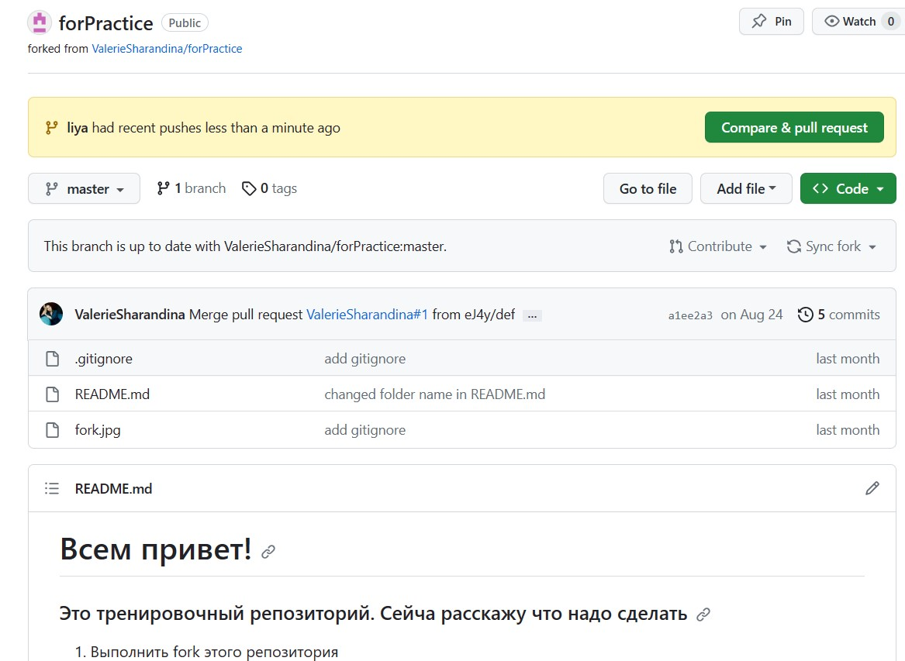

# Git Instruction

## 1. Проверка наличия установленного Git

В терминале выполняем команду **git --version**.

Если Git установлен, появится информация с версией файла, иначе появится сообщение об ошибке.

## 2. Установка Git

Загружаем последнюю версию Git по ссылке https://git-scm.com/ .

## 3. Настройка Git

При первом использовании Git необходимо представиться.

Для этого необходимо ввести команды:

**git config --global user.name "Name"**

**git config --global user.email "Email"**

Для того, чтобы проверить прошла ли регистрация: **git config --list**.

## 4. Инициализация репозитория

Прописываем команду в терминале **git init**.

В исходной папке появится скрытая папка **.git**.

## 5. Проверка статуса Git

Для проверки текущего состояния документа, т.е. чтобы узнать есть ли измения, которые необходимо сохранить используем команду **git status**.

Если все изменения сохранены, то появится сообщение: 'On branch master nothing to commit, working tree clean'.

Если же изменения не сохранены: 'Changes not staged for commit:<> modified: filename.md, no changes added to commit'.

## 6. Добавить содержимое рабочего каталога в индекс для последующего коммита

Команда **git add** используется после добавления и изменения файла. Писать название целиком не обязательно, для автозаполнения названия файла после команды **git add** нажимаем **tab** до тех пор, пока не появится необходимое название файла.

## 7. Сохранить содержимое рабочего каталога

Команда **git commit** работает в паре с **git add**. **Git commit** берет все данные, добавленные в индекс с помощью **git add** и сохраняет их во внутренней базе данных.

Данная команда используется в формате **git commit -m "Text"**, где **" "** в названии изменения обязательны.

* Примечание: если во время работы с файлом изменения были сохранены при помощи команды **git add** и **git commit**, то в дальнейшем можно использовать только одну команду, вместо двух **git commit -am "Text"**.

## 8. Журнал изменений

Чтобы открыть журнал изменений и увидель все сохранения используется **git log**.

Для более компактного отображения используется **git log --oneline**.

## 9. Посмотреть разницу между текущим файлом и сохраненным

Для этого используем команду **git diff**.

## 10. Переключение между версиями

Чтобы просмотреть предыдущие версии документа используем **git checkout**. Для того, чтобы выбрать необходимую версию используем **git log** и далее из появившегося списка выбираем интересующий документ при помощи **git checkout 19d1**, где **19d1** начало кодировки сохраненного документа.

Чтобы вернуться к текущему документу используется команда **git checkout master**.

## 11. Добавление картинок и игнорирование файлов

Для того, чтобы разместить картинку в нашем файле, нужно добавить ее в папку и после этого в нужном месте пишем следующее:
****.

Для того, чтобы удалить файлы с изображениями из отслеживания, надо создать файл **.gitignore**.

После того, как файл **.gitignore** создан, в нем необходимо указать расширения документов, которые будут игнорироваться системой при отслеживании в формате: ***.jpg**, ***.jpeg**, ***.png** и т.д.

Пример удаленного из отслеживания файла представлен ниже:

Если файл удален из отслеживания (когда мы уже внесли информацию в файл .gitignore), он подсвечивается серым, остальные же, еще не добавленные файлы светятся зеленым.

## 12. Ветвление

Для создания новой ветки необходимо ввести команду **git branch branchname**

Ветвление необходимо для работы с файлами в отдельной ветке, сохраняя при этом исходное состояние файла до их слияния.

Чтобы отобразить созданные ветки, используется команда **git branch**.

Чтобы перейти на другую ветку, используем команду **git checkout branchname**.

## 13. Слияние веток

Для слияния веток и внесения изменений в основной файл используется команда **git merge branchname**. Слияние производится в ту ветку, в которой мы находимся сейчас.

## 14. Конфликты

Хочу увидеть конфликт

Тут точно должен быть конфликт
Очень нужен конфликт

Хочу увидеть конфликт

Конфликты возникают при слиянии двух веток в одну, при этом должна быть изменена одна и та же строка файла. 

Конфликт выглядит вот так:

## 15. Переименовать commit

Если вы хотите переименовать последний commit используется команда **git commit --amend - m "комментарий"**.

Данная команда позволяет переименовать только последний сохраненный комментарий, если по какой-либо причине вы решил его измениять.

## 16. Удаление ветки

Чтобы удалить ветку используется команда **git branch -d branchname**.

Решение конфликта в данном разделе представлено на данном скрине:

## 17. Визуализация имеющихся коммитов

Чтобы посмотреть имеющиеся коммиты на других ветках, вводится команда **git log --graph**.

Чтобы выйти из журнала **git log** и вернуться в терминал, необходимо нажать **q**.

## 18. Очистка поля терминала

Для того, чтобы очистить поле терминала необходимо ввести команду **clear**.

Если же мы нажмем значок корзины (kill terminal) в вверхнем левом углу терминала, то терминал полностью закроется и придется вызывать его заново.

## 19. Git Hub

Данный сервис позволяет организовать работу удаленных репозиториев, которые находятся не на локальной машине, а на другой, например, на сервере.

Расположен по адресу https://github.com

## 20. Копирование внешнего репозитория на свой ПК

Данное действие производится командой **git clone *linkaddress***.

## 21. Удаленная работа с репозиторием

С репозиторием можно работать не только с локального компьютера, но и с сервера, в связи с чем версии на ПК и на сервере могу отличаться.

Для того, чтобы сделать update версий используются следующие команды:

**git push** - отправляет нашу версию репозитория на внешний репозиторий.

**git pull** - позволяет скачать все из текущего репозитория и автоматически сделать merge с нашей версией.

## 22. Совместная работа с удаленным репозиторием

Для того, чтобы предложить изменение создается **pull request**. Предлагать изменения нужно в отдельной ветке.

Сначало необходимо скопировать репозиторий к себе при помощи кнопки **fork**, затем клонирует версию на своем ПК, далее создается ветка с предлагаемыми изменениями, после чего изменения отправляются командой **git push** в свой аккаунт на GitHub, где появляется **pull request**.

Наглядная последовательность действий представлена здесь:

## Поменять местоположение репозитория

Для этого используем команду **cd *foldername***.
