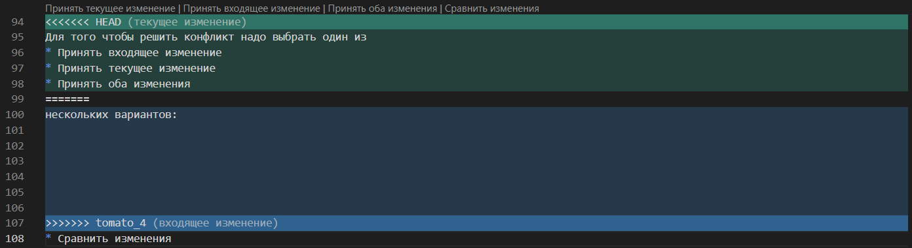

# Инструкция по Git

## 1. Проверка наличия установленного Git

В терминале выполняем git version.
Если git установлен, то появится сообщение с информацией о версии файла.
Иначе будет сообщение об ошибке.

## 2. Установка Git

Загружаем последнюю версию с сайта - https://git-scm.com/

## 3. Настройка Git

При первом использовании Git необходимо представиться, для этого надо ввести две команды.

* git config --global user.email <_____________>
* git config --global user.name  <_______>

Для того чтобы проверить прошла ли регистрация надо ввести команду git config --list

## 4. Инициализация Репозитория

Прописываем команду в терминал git init.

В исходной папке появится скрытая папка .git

## 5. Отображение статуса

Для отображения статуса прописать команду *git status* она выведет на экран были ли обновления, восстановления, отказы от предыдущих изменений. 

## 6. Добавление изменений в коммит

Для добавления изменений в коммит прописать команду *gid add <name_file>*.

## 7. Добавление коммита

Для отправки добавлений коммита в локальный репозиторий прописать команду *git commit -m <*comment*>*

## 8. Отображение изменений коммита

Для отображения предыдущих изменений коммита прописать команду *git log*

## 9. Отображение разницы

Для отображения разницы между ветками, директориями, индексами, коммитами прописать команду *git diff*

## 10. Возврат изменений

Для возвращения к предыдущим изменениям прописать команду *git checkout<*hash-code*>*

# 11. Добавление картинок и игноривание файлов

Для того чтобы разместить картинку в нашем файле надо добавить её в папку и после этого пишем следующее:

 

Для того чтобы удалить файлы с изображениями с остлеживаниями надо создать файл gitignore

# 12. Ветвление

Для создания новой ветки надо ввести в терминале команду git branch name_branch

Вветвление необходимо для работы с файлами в отдельной ветке, сохраняя при этом исходное состояние файла до их слияния.

Чтобы отобразить созданные ветки, используется команда git branch.
Чтобы перейти на другую  ветку используем команду git checkout name_branch.

# 13. Слияние веток

Для слияния веток и внесения изменений в наш основной файл используется команда git merge name_branch.

Слияние делается в ту ветку в который мы находимся сейчас.

# 14. Конфликты

Тут должен быть конфликт

Очень нужен конфликт
Хочу увидеть конфликт
Делаю попытку вызвать конфликт
Посмотреть конфликт 

Конфликты возникают при слиянии двух веток в одну при этом должна быть изменена одна и та же строка

Конфликт выглядет вот так

Для того чтобы решить конфликт надо выбрать один из нескольких вариантов:
* Принять входящее изменение
* Принять текущее изменение
* Принять оба изменения
* Сравнить изменения

# 15. Удаленные репозитории

Для работы с удаленными репозиториями необходимо завести аккаунт на специальной платформе GitHub

Через кнопку "fork" мы копируем репозиторий из ветки <*master*> в свой аккаунт для дальнейших манипуляций:

* git clone <*repository link*> клонирует репозиторий
* git pull origin вытягивает репозиторий из платформы
* git push origin отправляет репозиторий на платформу

Теперь после отправки в удаленный репозиторий мы используем кнопку "pull request" на платформу