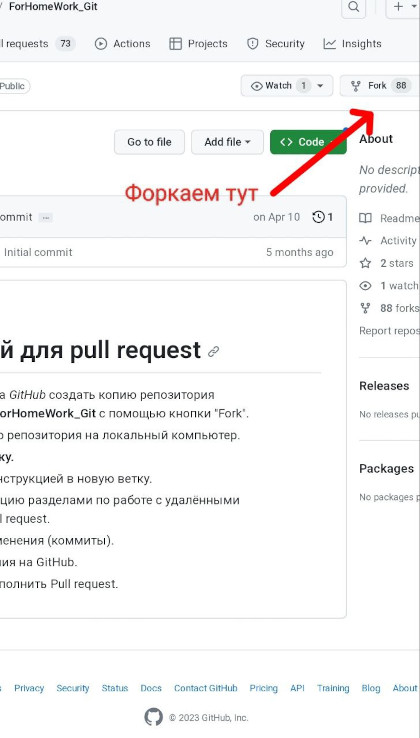
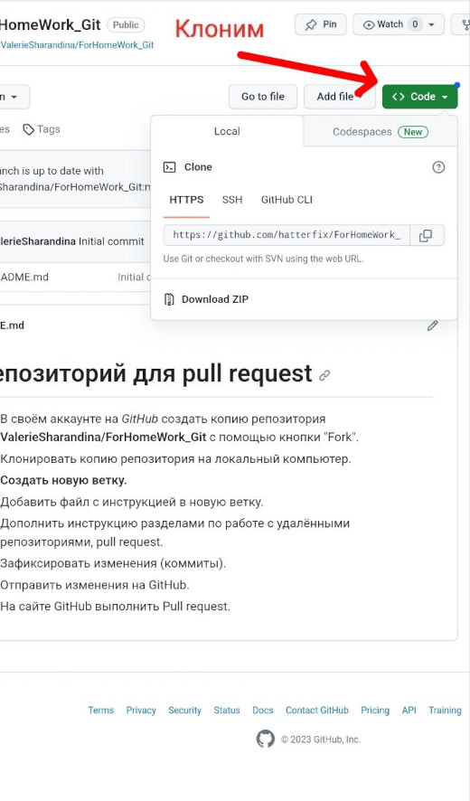

# Репозиторий для pull request

* В своём аккаунте на *GitHub* создать копию репозитория **ValerieSharandina/ForHomeWork_Git** с помощью кнопки "Fork".
* Клонировать копию репозитория на локальный компьютер.
* **Создать новую ветку.**
* Добавить файл с инструкцией в новую ветку.
* Дополнить инструкцию разделами по работе с удалёнными репозиториями, pull request.
* Зафиксировать изменения (коммиты).
* Отправить изменения на GitHub.
* На сайте GitHub выполнить Pull request.

### Секция по контролю версий:

* Основы git:

```sh
git init
#инициализируем репу git в директории.

```

```sh
git status
#Проверить есть ли файлы с изминениями.

```


```sh
git add .
#Добавить файл[все] с изминениями.

```

```sh
git commit -m "some comments"
#Сохранить[закоммитить] изменения в файлах с комментарием.

```

```sh
git push origin master
#Запушить изменения в ветку master.

```

```sh
git pull
#Синхронизировать локальную ветку с удаленной репой.

```

```sh
git restore filename
#Дрорнуть локальные изменения в файле.

```

```sh
git log
#Вывести лог коммитов.

```

```sh
git diff
#Вывести изменения в локальных файлах.

```

```sh
git checkout <commit hash>
#Переключиться на коммит.

```

```sh
git checkout -b newbranch
#Создать ветку newbranch со всем содержимым исходной ветки.

```

* Работа с изображениями

 - Изначально работаем в новой ветке - pract2
 - Все изображения кладём в дирректорию img
 - Ниже пример с добавлением img от git :


Для того, чтобы не учитывать файлы определённого типа / расширения  - описываем их в .gitignore

Например, исключим *.jpg


При пуше в удалённый репозиторий github.jpg ожидаемо не попал в удалённый репо


- Для демонстрации конфликта создал ветку conflict
- Результат слияния confict в main ниже


 - Чтобы отменить merge в ветке main используем команду:

```sh
git merge --abort

```

* Базовый Pull Request в GitHub

 - **У меня уже есть действующий аккаунт в GitHub - описывать процедуру  регистрации не стоит - гугл знает )**
 
 - **Форкаем репо:**
 
 
 
  - **Наш форк появится в списке репо:**
 
 
 
   - **Ссылку для git clone берем тут:**
 
 

  - **Формируем Pull Request:**

 

 
  - 
