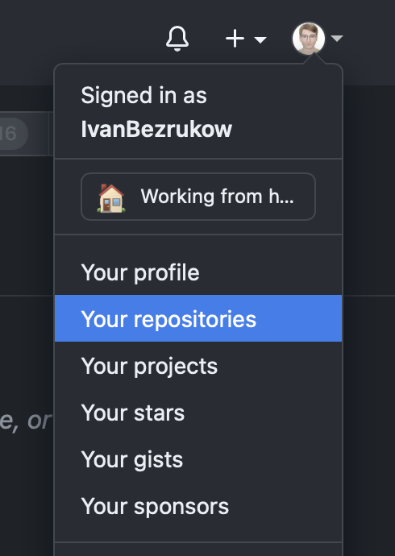
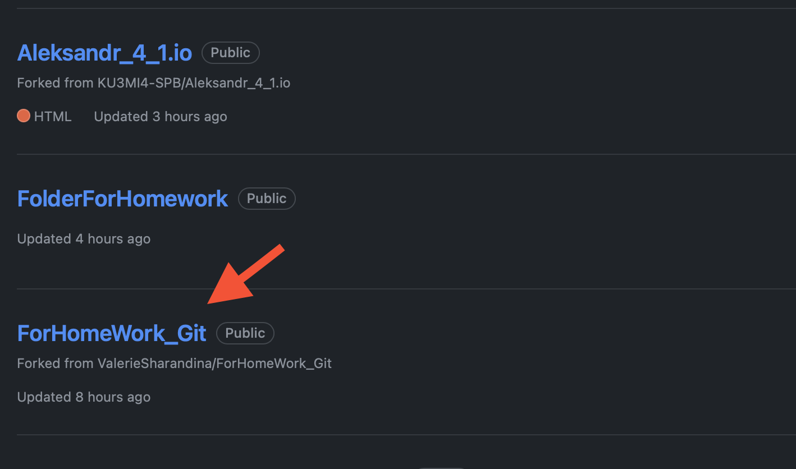
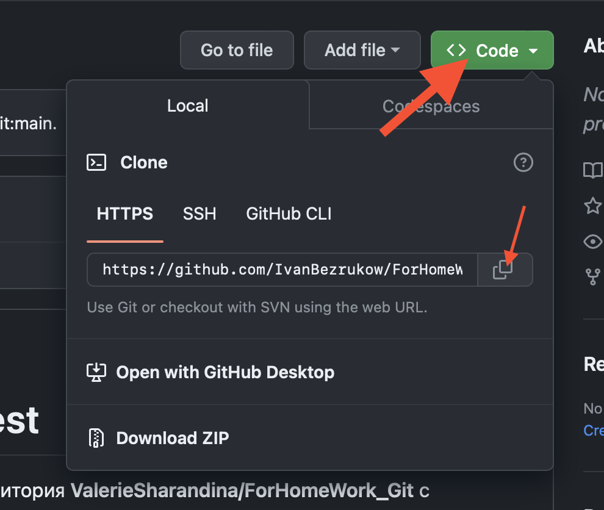

# Работа с удаленными репозиториями 

 ## Что такое удаленный репозиторий? 

 + Удаленные репозитории представляют собой версии проекта, хранимые где-то в сети. 
 
 ## Начало работы

 1. На сайте [Github](https://github.com) переходим на страницу с интересующем репозиторием и fork'ем его (то есть создаем вилку).
 2. Открываем страницу с Your repositories, находим нужный и жмем на него. Смотри фото ниже:

 + 
 + 
 + 
 
 3. Кликаем на кнопку Code и копирует URL-адрес удаленного репозитория.

 + 

 ## Основыне команды

 + Команда для "клонирования" чужого репозитория используется команда __*git clone <URL-адрес удаленного репозитория>*__.

 + Просмотр уже настреонных удаленных серверов осуществляется командой __*git remote*__; парамерт __*-v*__ позволяет увидеть URL-адреса, которые Git хранит для сокращенного имени. 

 ## Непосредственно работа с удаленным репозиторием

 1. Перейти в клонированный репозиторий при помощи команды __*cd <название папки с расширением, где хранится клонированный репозиторий>*__. 
 2. __ВАЖНО__: внесения измений в файл необходимо делать только в отдельной ветке. 
 3. Добавить модифицированные файлы и сделать необходимые коммиты. 

 ## Отправка данных в удаленный репозиторий

 + Отредактированные файлы отправляют на удаленный репозиторий с помощью команды __*git push <название удаленного сервера> <ветка>*__.
 1. 