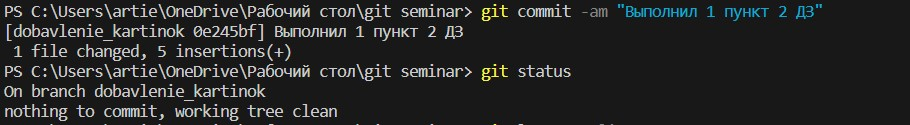
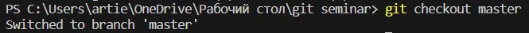

# Работа с git
## Проверка наличия установленного git
В терминале выполняем команду git version. Если git установлен, появится сообщение с информацией о версии файла. Иначе будет сообщение об ошибке.
## Настройка git
При первом использовании git необходимо представиться. Для этого надо ввести 2 команды: git config --global user.@mail, git config --global user.name.
Для того, чтобы проверить прошла ли регистрация, надо ввести команду git config --list.
## Инициализация репозитория
Для того, чтобы получить репозиторий из папки, выполняем команду git init. В исходной папке появится скрытая папка ".git"

### Домашка 1
Описать команды:
"git status";
"git add";
"git commit"
"git log";
"git diff";
"git checkout".

# Описание команд
* **"git status"** - показывает состояния файлов в рабочем каталоге и индексе: какие файлы изменены, но не добавлены в индекс; какие ожидают коммита в индексе. Вдобавок к этому выводятся подсказки о том, как изменить состояние файлов. 

* **"git add"** - добавляет содержимое рабочего каталога в индекс (staging area (Промежуточной зоны)) для последующего коммита. По умолчанию git commit использует лишь этот индекс, так что вы можете использовать git add для сборки слепка вашего следующего коммита.

* **git commit** - берёт все данные, добавленные в индекс с помощью git add, и сохраняет их слепок во внутренней базе данных, а затем сдвигает указатель текущей ветки на этот слепок.

* **git log** - После того, как вы создали несколько коммитов или же клонировали репозиторий с уже существующей историей коммитов, вероятно вам понадобится возможность посмотреть что было сделано — историю коммитов. Одним из основных и наиболее мощных инструментов для этого является команда git log.

* **git diff** - используется для вычисления разницы между любыми двумя Git деревьями. Это может быть разница между вашей рабочей копией и индексом (собственно git diff), разница между индексом и последним коммитом (git diff --staged), или между любыми двумя коммитами (git diff master branchB). Простым языком, показывает отличие текущего сохранённого файла от того, что уже сохранено ("закомичено").

* **git checkout** - спользуется для переключения веток и выгрузки их содержимого в рабочий каталог.

Ссылка на источник - <https://git-scm.com/>

## Конец первого ДЗ

# Семинар 2

## Добавление картинок и игнорирование файлов

* __Для того, чтобы разместить картинку в нашем файле, необходимо её добавить в папку, после чего она должна отобразиться в проводнике.__

* __В нужном месте в файле прописываем следующую команду:__

            

* __Для того, чтобы удалить файлы с изображениями из отслеживания, надо создать файл .gitignore.__

* __Чтобы убрать все файлы формата .png или .jpg в файле .gitignore на 1 строчке пишем *.png или *.jpg соответственно.__

## Ветвление

Для создания новой ветки нужно ввести команду git branch имя_ветки.

Ветвление необходимо для работы с файлами в отдельной ветке, сохраняя при этом исходное состояние файла до их слияния.
Чтобы отобразить созданные ветки, используется команда git branch.

Чтобы перейти на другую ветку, вводим в терминале команду git checkout имя_ветки.

Тут должен быть конфликт

## Конфликты

Хочу увидеть конфликт

* Конфликты возникают при слиянии двух веток в одну и когда в этих ветках была изменена одна и та же строка (строки) файла.

Разрешения конфликтов возможно путём следующих методов:
1. Принять текущее изменение
2. Принять входящее изменение
3. Принять оба изменения
4. Сравнить изменения

Выглядит это так:

# Домашка 2: дополнить инструкцию своими скринами:
* С сайта: (Продолжить работу с файлом, начатую на Семинаре 1. Создать и слить как минимум 4 ветки. Обязательно создать конфликт и разрешить его. Архив с репозиторием и проделанной работой приложить к уроку.)
1. Добавление картинок
2. Ветвление
3. Слияние веток
4. Разрешение конфликтов
5. Удаление веток
Создать и слить минимум 4 ветки! Скрин этих веток добавить в инструкцию!

##  Ход выполнения 2 ДЗ

* __1.1 Добавил новую ветку, перешёл в неё__

* __1.2 Отредактировал файл в новой ветке и сохранил его__

* __1.3 Перешёл в главную ветку и склеил новую ветку с главной__

* __1.4 Удалил ветку "добавление картинок"__

* __1.5 Сохранил изменения и проверил все коммиты__

* __2 Создаю конфликт__
* __2.1 Создаю новую ветку k1__

Перехожу в неё

Создаю новую информацию в ветке k1 на 116 строке

Новая информация для конфликта

* __2.3 Сохраняю изменения в ветке k1__

Другая информация

* __2.4 Перехожу в ветку master и создаю Другую информацию на 116 строке__

* __2.5 Сохраняю изменения в ветке master__

## Прибавил к ветке master ветку k1. Склейка прошла успешно, т.к. при создании другой информации в ветке master я поставил много пустых строк. Конфликт не образовался.

* __2.6 Удалил ветку k1__

* __3 Попытка создать конфликт 2__

* __3.1 Создаю новую ветку k2__

Создаю конфликт. Ветка: k2.

Сохраняю изменения в ветке k2

Вернулся в ветку master.

Вернулся в ветку master

Сохраняю изменения.

Объединил ветку k2 с веткой master

* Конфликта не было. Объединение прошло нормально.

* __4 Попытка создать конфликт 3__

1. Создал ветку k3. Написал рандомные цифры, закоммитил.
2. Перешёл в master. На той же строке написал другой набор цифр, закоммитил.
3. Объединил ветку k3 с master.

## Получилось! ##

4. Разрешил конфликт нажав на кнопку  _ACCEPT BOTH CHANGES_.

5. Закоммитил "Выполнил дз 2".

Удалил все лишние ветки.

Сохранил последние изменения.

# Прикрепляю рабочее дерево (было)

# Стало

## Конец второго дз!

