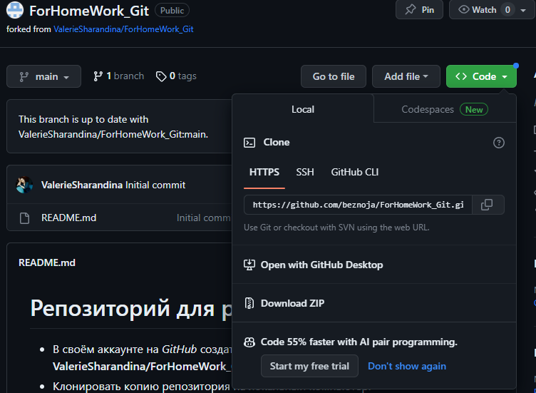

# Инструкция по **Git**

## 1. Проверка наличия установленного **Git**

В терминале выполняем команду *git version*. Если **Git** установлен, то появится сообщение с информацией о версии файла, иначе будет сообщение об ошибке.
## 2. Установка **Git**

Установка **Git** в операционной системе Windows.

Достаточно зайти на сайт http://git-scm.com/download/win, и загрузка начнется автоматически. После этого программу необходимо установить обычным способом.

## 3. Настройка **Git**

При первом использовании **Git** необходимо представиться. Для этого надо ввести 2 команды:
* *git config --global user.name "username"*
* *git config --global user.email "email"*

Для того, чтобы проверить прошла ли регистрация надо ввести команду:
* *git config --list*

Затем найти строчки, которые в случае удачной регистрации будут выглядеть примерно вот так:\

## 4. Инициализация Репозитория

Прописываем команду *git init*. В исходной папке появится скрытая папка **.git**

## 5. Проверка состояния файлов

Основным инструментом определения состояния файлов является команда *git status*. Если в рабочей папке остуствуют отслеживаемые и измененные файлы эта команда дает примерно такой результат:

> 

   Кроме того, система **Git** не обнаружила неотслеживаемых файлов, в противном случае они были бы перечислены в выводимых командой данных. Наконец, команда сообщает имя ветки, на которой вы в данный момент находитесь, и информирует о  совпадении состояний этой ветки и аналогичной ветки на сервере.

## 6. Слежение за новыми файлами

Чтобы начать слежение за новым файлом, воспользуйтесь командой *git add*. К примеру, для файла gitInstraction.md она будет выглядеть так:
* *git add .\gitInstraction.md*

Теперь команда *status* покажет, что этот файл является отслеживаемым и проиндексированным.

Все проиндексированные файлы перечисляются под заголовком Changes to be committed. Если в этот момент произвести фиксацию, версия файла, существовавшая на момент выполнения команды *git add*, попадет в историю снимков состояния.

Для отмены индексирования используется команда *git reset HEAD file_name*

## 7. Просмотр индексированных и неиндексированных изменений

Если команда *git status* дает недостаточно подробный, с вашей точки зрения,  результат, например если вы хотите не только получить список отредактированных файлов, но и узнать, что именно изменилось, воспользуйтесь командой *git diff*. Чаще всего вы будете пользоваться ею для ответа на два вопроса: что вы отредактировали (но пока не проиндексировали) и что из проиндексированного готово к фиксации? Команда *git status* отвечает на эти вопросы в общей форме, перечисляя имена файлов, а вот команда *git diff* показывает добавленные и удаленные строки — то есть все вставки в программу.

## 8. Фиксация изменений

Теперь, когда область индексирования настроена нужным вам образом, можно зафиксировать внесенные туда изменения. Помните, что все, оставленное неиндексированным, в том числе любые созданные или измененные файлы,  для которых после редактирования не была выполнена команда *git add*, в текущий коммит не войдет. Все эти файлы останутся на вашем диске как измененные. Впрочем, в рассматриваемом сейчас примере мы будем считать, что последний запуск команды *git status* показал все файлы как проиндексированные и все готово к фиксации изменений. Проще всего осуществить фиксацию командой:
* *git commit -m "комментарий"*
* *git commit -am "комментарий"* - для индексирования и фиксации одной командой.

Если вы ошиблись и внесли неправильный комментарий, то исправить его можно командой:
* git commit --amend -m "Правильный комментарий"

## 9. Просмотр истории версий

После сохранения нескольких версий файлов или клонирования уже имеющего содержимое репозитория вы, скорее всего, захотите взглянуть на то, что было сделано ранее. Базовым и самым мощным инструментом в данном случае является команда:
* *git log*

По умолчанию при отсутствии параметров команда *git log* выводит в обратном хронологическом порядке список сохраненных в данный репозиторий версий. То есть первыми показываются самые свежие коммиты.  Рядом с каждым коммитом указывается его контрольная сумма SHA-1, имя и электронная почта автора, дата создания и сообщение о фиксации.

У команды *git log* существует великое множество параметров, позволяющих вывести именно ту информацию, которая вам требуется. Одним из самых полезных является параметр *-p*, показывающий разницу, внесенную каждым коммитом. А дополнительный параметр *-2* ограничивает выводимый результат последними двумя записями. Параметр *oneline* выводит каждый коммит в одну строку, что весьма удобно при просмотре большого числа коммитов.

## 10. Получение старых коммитов и навигация по существующим веткам репозитория

Основная функция *git checkout* это перемещать указатель HEAD, т.е. то куда смотрит ваша локальная копия. Вы можете переместить его на вершину ветки: *git checkout <branch>* или на отдельный коммит: *git checkout <sha>*. Ну а вспомогательные это создание веток: *git checkout -b*, отмена изменений в файле: *git checkout -- <file>*

## 11. Добавление картинок и игнорирование файлов

Для добавления картинки в наш файл необходимо добавить ее в папку с репозиторием и после этого в нужном месте пишем следующее:\
 

Для того, чтобы удалить файлы с изображениями из отслеживания, надо создать файл *.gitignore*

## 12. Ветвление

Для создания новой ветки необходимо ввести в терминале команду *git branch branch_name*.

Ветвление необходимо для работы с файлами в отдельной ветке, сохраняя при этом исходное состояние файла до их слияния.

Чтобы отобразить созданные ветки, используется команда *git branch*.

Чтобы перейти на другую ветку используется команда *git checkout branch_name*.

Для удаления ветки используется команда *git branch -d branch_name*

## 13. Слияние веток

Для слияния веток и внесения изменений в наш основной файл используется команда *git merge branch_name*. Слияние делается в ту ветку, в которой мы находимся сейчас.

## 14. Конфликты

Хочу увидеть конфликт

Тут точно должен быть конфликт
Сто пудова
Очень нужен конфликт
Хочу увидеть конфликт

Конфликты возникают при слиянии двух веток в одну, при этом должна быть изменена одна и таже строка файла.\
Конфликт выглядит вот так:

## 15. Псевдонимы в Git

Есть способы как сделать работу с **Git** проще, удобнее и привычнее. Речь идет о псевдонимах (aliases).

При неполном вводе команды Git не пытается догадаться, что за команду вы имели в виду. Но если мысль о вводе длинных команд вас не привлекает, команда git config позволяет легко создать псевдоним для любой из них. Вот пара примеров ее применения:\
git config --global alias.co checkout\
git config --global alias.br branch\
git config --global alias.ci commit\
git config --global alias.st status\
Теперь вместо команды *git commit* достаточно будет ввести *git ci*. По мере освоения **Git**, скорее всего, придется часто пользоваться и другими командами.\
Кроме того, эта техника позволяет создавать команды, которых, с вашей точки зрения, не хватает. К примеру, чтобы отменить индексирование файла, можно добавить псевдоним unstage:\
git config --global alias.unstage 'reset HEAD --'\
После этого следующие команды станут эквивалентными:\
* git unstage fileA
* git reset HEAD fileA

В таком виде все выглядит понятнее. Также пользователи частенько добавляют команду, выводящую последние коммиты:\
git config --global alias.last 'log -1 HEAD'\
Теперь для просмотра последнего коммита достаточно написать:\
git last

## 16. Работа с удаленными репозиториями

Удаленный (иногда говорят "внешний") репозиторий – это версии вашего проекта, сохраненные на удаленном сервере. Доступ к репозиторию на таком сервере может осуществляться по интернету или по локальной сети.

Необходимость подключить удаленный репозиторий к уже существующему локальному возникает в ситуациях, когда вы решаете выгрузить уже написанный код на удаленный сервер. Это нужно, чтобы другие разработчики смогли получить к нему доступ или чтобы вы сами могли заниматься разработкой с нескольких компьютеров (например, домашнего и рабочего).

### Настройка подключения удаленного репозитория. Группа команд git remote.

Для управления подключением удаленных репозиториев в **Git** предусмотрена целая группа команд – *git remote*.
* git remote add <название удаленного репозитория> <ссылка на удаленный репозиторий>

Перед тем как применить данную команду мы должны создать удаленный репозиторий на GitHub. Со ссылкой на удаленный репозиторий тоже все просто. Эту ссылку можно взять, нажав на большую зеленую кнопку Code на странице репозитория на GitHub.

Иногда возникает необходимость забыть удаленный репозиторий. Для этого существует команда *git remote remove*.
* git remote remove <название удаленного репозитория>

Иногда возникает необходимость переименовать удаленный репозиторий. Для этого существует команда *git remote rename*.
* git remote rename <старое имя удаленного репозитория> <новое имя удаленного репозитория>

### Клонирование удаленного репозитория. Команда git clone.

Необходимость клонировать существующий удаленный репозиторий возникает в ситуациях, когда вы решаете поработать над уже существующим кодом. Для выполнения этой операции в Git предусмотрена команда *git clone*.

* git clone <ссылка на удаленный репозиторий>

Ссылку на удаленный репозиторий можно получить тем же способом, что мы разбирали выше. Нужно нажать на зеленую кнопку Code на главной странице репозитория на GitHub.

> Кстати
Вместо git clone можно было бы создать пустой локальный git-репозиторий, выполнив команду git init. Затем подключить наш удаленный репозиторий командой git remote add origin https://github.com/smartiqaorg/geometric_lib.git. После чего вручную загрузить изменения с удаленного репозитория командой git pull, которую мы рассмотрим ниже. Но зачем делать что-то вручную, если для этого есть автоматизированный инструмент из коробки.

### Получение изменений из удаленного репозитория. Команда git fetch

Теперь, когда мы научились подключать удаленный репозиторий к локальному и клонировать его к себе на компьютер, пора узнать, как же получить изменения из удаленного репозитория.  
Итак, чтобы получить изменения из удаленного репозитория, в Git предусмотрена команда *git fetch*.
* git fetch [ключи] [имя удаленного репозитория]

<u>Что делает?</u>  
Получает изменения из переданного удаленного репозитория. Если не было передано ни одного удаленного репозитория, ни ключа --all, команда пытается получить изменения из репозитория с именем origin.

Команда *git fetch* используется для синхронизации локальных ссылочных объектов с этими же объектами в удаленном репозитории. Рабочую копию она не меняет.
Чтобы синхронизировать локальную рабочую копию с удаленным репозиторием, нужно слить удаленные ветки в локальные. Сделать это можно уже знакомой командой *git merge*.

### Получение изменений из удаленного репозитория. Команда git pull

Связкой *git fetch* и *git merge* мы получили изменения из удаленного репозитория и обновили свою рабочую копию. Часто вместо этого хочется получать изменения и сразу обновлять рабочую копию так, чтобы она соответствовала удаленному репозиторию. И для этого в **Git** существует отдельная команда. Называется она *git pull*.

* git pull [ключи] [имя удаленного репозитория]

<u>Что делает?</u>   
Получает изменения из переданного удаленного репозитория и обновляет рабочую копию в соответствии с удаленным репозиторием. По умолчанию слияние удаленной ветки с локальной происходит именно в fast-forward режиме, так что включать его специально не требуется

Команда *git pull* используется для синхронизации локальной рабочей копии и всех ссылочных объектов с удаленным репозиторием.
По сути, *git pull* - это то же самое, что *git fetch* + *git merge*.

### Отправка изменений в удаленный репозиторий. Команда git push

Мы знаем почти все про удаленный репозиторий. Осталось изучить, как загружать в него свои локальные изменения. Для этого в **Git** существует команда *git push*.

* git push [ключи] [имя удаленного репозитория] [имя ветки]

<u>Что делает?</u>  
Загружает изменения в удаленный репозиторий. Если слияние изменений в удаленном репозитории нельзя сделать в режиме fast-forward, и при этом не был передан ключ force, выполнение закончится с ошибкой.

### GitHub. Работа с репозиторием, создание форков и пулл-реквестов

#### Создание репозитория на GitHub

Прежде всего вам необходимо зарегистрироваться на **GitHub**, но это довольно тривиальный процесс, так что его мы здесь опустим. После регистрации вы попадете на главную страницу. На ней будут отображаться действия людей, на которых вы подписались и обновления в репозиториях, которые вы добавили в избранное.

Чтобы создать свой репозиторий, нажмите на зеленую кнопку ***New***, как показано на скриншоте.

Перед вами откроется страница создания репозитория. Давайте разберем, что за поля нам предлагают заполнить.

1. Итак, первое поле Repository name – имя репозитория. Здесь все просто, вам нужно придумать имя, которое будет отображаться на странице вашего репозитория. Здесь нет никаких ограничений, но старайтесь давать как можно более содержательные имена своим репозиториям.
2. Второе поле – Description – описание. Его заполнять необязательно. Но другим пользователям, которые попали на страницу вашего репозитория, будет проще понять, что перед ними, если вы заполните графу описания.
3. Затем вы можете выбрать, будет ли репозиторий открытым, то есть доступным абсолютно всем пользователям GitHub, или закрытым, то есть доступным только вам и людям, которым вы предоставите доступ.
4. Последние три поля предлагают нам добавить, соответственно, README-файл, .gitignore файл и выбрать лицензию для нашего проекта.

Заполняем поля и завершаем процесс создания репозитория, нажав кнопку ***Create repository***.

#### Страница репозитория на GitHub.

После создания репозитория, мы попадем на его страницу на GitHub. В нашем случае эта страница будет выглядеть так.

В верхнем меню мы видим 9 разных вкладок. Давайте разберем их по порядку.

1. Вкладка ***Code***. Сейчас открыта именно она. В ней содержится рабочая копия нашего репозитория (по центру), описание (справа), вывод файла README (под рабочей копией), история коммитов, а также кнопки для клонирования репозитория и просмотра файлов.
2. Вкладка ***Issues***. В этой вкладке будут отображаться все запросы, сделанные другими пользователями. Как правило, пользователи используют запрос, чтобы сообщить о найденном баге, либо чтобы задать какой-то вопрос о вашем приложении.
3. Вкладка ***Pull-requests***. На этой вкладке будут отображаться все пулл-реквесты, сделанные другими пользователями. О том, что такое пулл-реквесты, мы поговорим ниже.
4-5. Вкладки ***Actions*** и ***Project*** относятся скорее к системе CI/CDI, которую предоставляет GitHub, в этом курсе мы не будем затрагивать их.
6. Вкладка ***Wiki*** открывает вам доступ к созданию и размещению документации о собственном проекте.
7. На вкладке ***Security*** содержатся различные настройки безопасности вашего проекта. Там же можно включить инспекцию вашего кода, чтобы узнать, если вы случайно загрузите какой-нибудь секретный токен на GitHub.
8. Вкладка ***Insight*** содержит различную информацию и статистические данные об активности репозитория. Там вы сможете посмотреть на зависимость количества коммитов в репозитории от времени или на процент коммитов, сделанных вами.
9. Последняя вкладка – ***Settings***. В ней находятся различные настройки вашего репозитория. Там вы можете поменять видимость репозитория, сделав его частным, или вовсе удалить репозиторий.

#### Создание форка репозитория на GitHub. Пулл-реквесты.

Итак, одной из самых важных частей GitHub является создание форков.

Форк (от англ. fork – вилка) – точная копия репозитория, но в вашем аккаунте. Форки нужны, чтобы вносить свои изменения в проект, к репозиторию которого у вас нет прямого доступа.

Пулл-реквест (от англ. pull-request – запрос pull) – функция GitHub, позволяющая попросить владельца репозитория, от которого мы сделали форк, загрузить наши изменения обратно в свой репозиторий.

Если коротко, форки и пулл-реквесты нужны, чтобы любой пользователь мог внести свой вклад в любой открытый проект, репозиторий которого есть на GitHub. Кроме того, перед тем как влить ваши изменения в основной репозиторий, ответственные обязательно проверят ваш код на наличие ошибок и уязвимостей. Таким образом, даже если ваши изменения не примут, вы получите первоклассный code-review с указанием всех неточностей.

Теперь давайте рассмотрим пайплайн контрибуции (англ. contribution – внесение вклада) на примере реального репозитория. То есть научимся вносить свой вклад в разработку проектов с открытым исходным кодом на GitHub.

1. Для начала зайдем на страницу репозитория проекта. 
  
Нажимаем на кнопку ***Fork***, как показано на картинке. После этого **Git** создаст точную копию этого репозитория в вашем аккаунте.  

2. Клонируем репозиторий к себе на компьютер командой *git clone*. Bыполняем задание из файла Readme.
3. Сделаем коммит и выполним *git push*, чтобы загрузить наши изменения в удаленный репозиторий.
4. Теперь **GitHub** предлагает сделать пулл-реквест.  

5. Нажимаем на кнопку ***Compare*** на подсказке GitHub, либо переходим на вкладку ***Pull Requests*** и нажимаем ***New pull request***.
6. Перед нами откроется страница создания пулл-реквеста.  

Здесь мы можем просмотреть внесенные изменения и выбрать две ветки: одну в исходном репозитории, на нее будут залиты наши изменения, вторую – в нашем репозитории, с нее будут скачаны изменения. Как только мы выбрали ветки и убедились, что не внесли никаких лишних изменений, нажимаем кнопку ***Create pull request***.
7. Теперь мы попадаем на страницу описания наших изменений.  
  
Здесь необходимо описать, что за изменения вы внесли и почему они были необходимы. Как только мы закончили с описанием, можно нажимать кнопку ***Create pull request***.
8. Теперь мы попадаем на страницу уже созданного пулл-реквеста в изначальном репозитоии.

> Таким образом, вы можете вносить свой вклад в абсолютно любые приложения с открытым программным кодом. Даже репозиторий самого Git хранится на GitHub, и вы в любой момент можете сделать форк и придумать новую команду (правда не факт, что ответственный примет ваш пулл-реквест). Вы можете внести свой вклад в разработку ядра Linux, в популярный редактор Visual Studio Code, в ядро криптовалюты Bitcoin, в языки программирования Python, Go, Ruby – все эти проекты имеют открытые репозитории на GitHub.