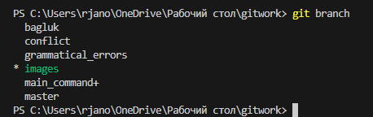

# Скрин с гита

# Работа с git

## Начало работы с Git

1. Устанавливаем сам Git на ПК (как любую другую программу на вашей ОС).
2. В консоли указываем свое имя, чтобы потом его содержал каждый комит: git config --global user.name "Vasya Pupkin"
3. Указываем также свою почту: git config --global user.name "vaspupkin@gmail.com"
4. Можно посмотреть теперь наш config: git config --list
5. Можно посмотреть список всех команд git help либо описание отдельной команды: git [имя команды] --help

## Основные команды для работы с Git

1. Импортировать в Git существующий текущий каталог: git init
2. Проверить статус файлов: git status

Красным показывет те файлы, которые еще не проиндексированы (не помечены для дальнейшего комита). Зеленым – уже проиндексированные.

3. Добавить файлы в индекс (пометить для коммита): git add .

Точка означает “все файлы”. Т.е. будут проиндексированы все возможные файлы, которые изменились в данной директории (папке). Какие файлы были проиндексированы можно проверить через вышеупомянутую коману для проверки статуса.

4. При необходимости можно удалить ненужные файлы из индекса (стейджа): git restore --staged [name file]
5. Закомитить: git commit -m [name of commit]

## Заливка созданных версий приложения на удаленный репозиторий

1. Зарегистрироватьсян на GitHub или войти в аккаунт.
2. Создать новый репозиторий, нажав на плюсик в верхнем правом углу и “New repository”. Приватный являетяс платным.
3. Определяем удаленный репозиторий через консоль git remote add origin [url нашего созданного репозитория]
4. Заливаем: git push -u origin master, где origin – название нащешл ремоута (удаленного репозитория), а master – имя ветки. Если история коммитов отличается, то гит не даст их запушит просто так. Нужно тогда сделать это принудительно – git push --force origin master
   5.GitHub запросит наш логин и пароль поочередно, после чего произойдет заливка локального репозитория на удаленный со всеми созданными ранее комитами.

## Копирование на ПК уже созданного на GitHub проекта

1. Клонирование репозитория с GitHub: git clone [url проекта]

## Получаем конфликт

1. Клонирование репозитория с GitHub: git clone [url проекта]

## Делаем конфликт

## Создал 3 ветку

тестовая ветка

## Отмены

1. git stash – убирает все изминения, котоыре не были закоммичены с файлов.
2. git stash pop – возвращает изменения, убранные предыдущей командой.
3. git reset HEAD~ 1либо git reset name commit – отменяет изменения, перенося ссылку на ветку назад, на более старый коммит, как будто некоторых коммитов вовсе и не было. Это своего рода “переписывание истории”. Проблема в том, что этот метод работает отлично только локально и не подойдет для отмены / удаления коммитов удаленно в тех ветках, где работают другие пользователи. Для этого нужен git revert.

## git log

## Ещё тестовый конфликт

Ух ты, конфликт

Добавляю тестовую запись

## Несколько скринов

## Клонировал репозиторий

## Новая ветка
