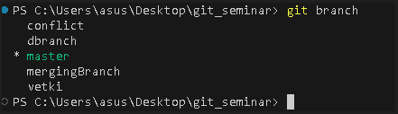
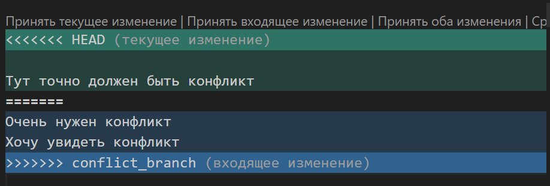
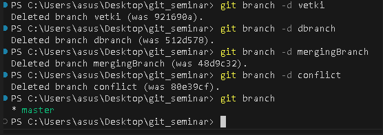

## Работа с Git

## Проверка наличия установленного GIT

В терминале выполняем команду git version. Если GIT установлен, то появится сообщение с информацией о версии файла, иначе будет сообщение об ошибке.

## Настройка GIT 

При первом использовании GIT необходимо представиться. Для этого надо ввести две команды: git config --global user.email, git config --global user.name " ".
Для того, чтобы проверить прошла ли регистрация, надо ввести команду: git config --list.

## Инициализация репозитория

Для того, чтобы получить репозиторий из папки, выполняем комаанду git init. В исходной папке появится скрытая папка .git

## Проверка репозитория

Для того, чтобы проверить индексацию изменений и увидеть файлы, которые не отслеживаются GIT, нужно ввести команду: git status.

## Фиксация изменений 

Для того, чтобы фиксировать новые изменения, используется команда: git commit -m.

## Просмотор истории коммитов 

Чтобы вывести историю всех коммитов нужна команда: git log.

## Сравнение с последним коммитом 

Для вывода изменений в файлах по сравнению с последним коммитом, используется команда  git diff.

## Отмена подготовленных и неподготовленных изменений

Восстановить файлы рабочего дерева, не подготовленные к коммиту, можно параметром checkout. Для проведения операции требуется указать путь к файлу. Если путь не указан, параметр git checkout изменит указатель HEAD, чтобы задать указанную ветку как текущую.

## Добавление картинок и игнорирование файлов 

Для того, чтобы разместить картинку в нашем файле необходимо добавить ее в папку. После чего она должна отобразиться в проводнике. Внужном месте в файле прописываем следующую команду: 
Для того, чтобы удалить файлы с изображениями из отслеживания, надо создать файл .gitignore.
Чтобы убрать все файлы формата png в .gitignore пишем *.png

## Ветвление 

Для создания новой ветки нужно ввести команду git branch и имя новой ветки.Ветвление необходимо для работы с файлами в отдельной ветке, сохраняя при этом исходное состояние файла до их слияния. Чтобы отобразить созданные ветки используется команда git branch. Чтобы перейти на другую ветку вводим в терминале команду git checkout и имя ветки.

## Конфликты 
Конфликты возникают при слиянии двух веток в одну и когда в этих ветках была изменена одна и та же строка (строки) файла. Разрешение конфликта возможно путем следующих методов: принять входящие изменения, текущие, оба изменения, сравнить изменения. Выглядит это так:

## Слияние веток 
 
 Процедура объединения веток называется слияние (merge). Для слияния текущей ветки с какой-либо другой используется команда git merge имя_ветки. В результате выполнения этой команды в текущей ветке появится новый коммит. 

## Удаление веток 

Для того чтобы удалить ветку необходимо использовать ту же команду branch с опцией -d. git branch -d и имя ветки.

# Работа с удаленными репозиториями в git
Для начала создадим папку на нашем рабочем
столе. Назовём её ... и откроем в редакторе VS Code. Теперь поступим несколько
иначе, не будем создавать свой репозиторий, а возьмём готовый. Для этого перейдём на сайт
github.com. На этом сайте есть поиск. Вы можете находить здесь разных авторов и проекты. Посмотрим на
один из готовых репозиториев.
есть зелёная кнопка Code. Если мы нажмём на
неё, появится строка с адресом. Здесь написано Use Git or checkout with SVN. Скопируем эту строку и перейдём в код. Выберем строку HTTPS, нажмём «Копировать», и
после этого нам понадобится новая команда внутри VS Code. Откроем терминал. В терминале
дадим новую команду Git: скажем git clone и укажем тот адрес, который скопировали.

## Команда git clone 

Команда git clone копирует существующий репозиторий Git.Полученная «рабочая копия» представляет собой полноценный репозиторий Git с собственной историей и файлами, полностью обособленный от исходного репозитория.
Для удобства в процессе клонирования автоматически создается удаленный доступ к исходному репозиторию.

## Команда cd
 Команда cd меняет местоположение директории.

 ##  Команда git push

 Команда git push выполняет отправку недавних коммитов c компьютера локального репозитория на сервер с удаленным репозиторием. Благодаря ей разработчики могут обновлять основную ветку, добавляя новые функции или внося изменения в уже существующие.

 ## Команда git pull 

 Команда git pull используется для извлечения и загрузки содержимого из удаленного репозитория и немедленного обновления локального репозитория этим содержимым. Слияние удаленных вышестоящих изменений в локальный репозиторий — это обычная задача рабочего процесса, возникающая при совместной работе на основе системы Git. Команда git pull на самом деле представляет собой комбинацию двух других команд: git fetch и git merge.