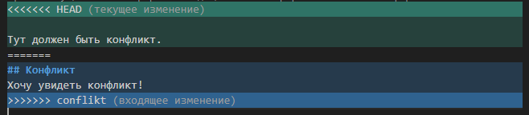

# Работа с git

## Проверка наличия, установленного git

В терминале выполняем команду: "git version". Если git установлен, появится сообщение с информацией о версии файла. Иначе будет сообщение об ошибке.

## Настройка git

При первом использовании git, необходимо представиться. Для этого надо ввести две команды: 1. git config --global "User.email". 2. git config --global "User.name"
Для того, чтобы проверить прошла ли регистрация надо ввести команду: "git config --list"

## Инициализация репозитория
Для того, чтобы получить репозиторий из папки, выпонляем команду: "git init". В исходной папке появится папка ".git"

## Домашнее задание
Описать команды: git status, git add, git commit, git log, git diff, git checkout

## Добавление картинок и игнорирование файлов
Для того, чтобы разместить картинку в нашем файле, необходимо добавить ее в папку, после чего она должна отобразиться в проводнике. В нужно месте в файле прописываем следующую команду ""
Для того, чтобы удалить файлы с изображениями из отслеживания, нужно создать файл ".gitignore" 
Чтобы убрать все файлы формата png/jpeg, в гитигнор пишем .png/jpeg

## Ветвление
Для создания новой ветки в терминале, нужно ввести комануд "git branch branch_name".
Ветвление необходимо для работы с файлами в отдельной ветке, сохраняя при этом исходное состояние файла до их слияния.
Чтобы отобразить созданные ветки, исползуется команда "git branch"
Чтобы перейти на другую ветку, вводим в терминале команду "git checkout branch_name"

Тут должен быть конфликт
## Конфликты
Хочу увидеть конфликт

Конфликты возникают при слиянии двух веток в одну и, когда в этих ветках была изменена одна и та же строка(строки) файла. Разрешение конфликта возможно путем следующий методов: 1. Принять текущие изменения 2. Принять входящие изменения. 3. Принять оба изменения. 4. Сравнить изменения.
Выглядить это так:

## Домашнее задание №2
Дополнить инструкию своими скринами:
1. Добавление картинок
2. Ветвление
3. Слияние веток
4. Разрешение конфликтов
5. Удаление веток
6. Создать и слить минимум 4 ветки

## Решение домашнего задания №1

**Описание команды** "git status". Команда git status отображает состояние рабочего каталога и раздела проиндексированных файлов. С ее помощью можно проверить индексацию изменений и увидеть файлы, которые не отслеживаются Git.

**Описание команды** "git add". Команда git add добавляет изменение из рабочего каталога в раздел проиндексированных файлов. Она сообщает Git, что вы хотите включить изменения в конкретном файле в следующий коммит.

**Описание команды** "git commit". Git commit - это команда для записи индексированных изменений в репозиторий Git.
Прежде чем создавать очередной коммит, необходимо проиндексировать файлы в рабочей области с помощью команды git-add. Новый коммит будет включать текущие состояния индексированных файлов плюс последние сохраненные состояния неиндексированных (но отслеживаемых) файлов.

**Описание команды** "git log". Команда git log отображает отправленные снимки состояния и позволяет просматривать и фильтровать историю проекта, а также искать в ней конкретные изменения. С помощью git status можно просматривать рабочий каталог и раздел проиндексированных файлов, в то время как git log показывает только историю коммитов.

**Описание команды** "git diff". Команда git diff используется для вычисления разницы между любыми двумя Git деревьями. Это может быть разница между вашей рабочей директорией и индексом (собственно git diff), разница между индексом и последним коммитом (git diff --staged), или между любыми двумя коммитами (git diff master branchB).

**Описание команды** "git checkout". Команда git checkout позволяет переключаться между последними коммитами (если упрощенно) веток: checkout some-other-branch. Создаёт ветку, в которую и произойдет переключение: git checkout -b some-other-new-branch. Если в текущей ветке были какие-то изменения по сравнению с последним коммитом в ветке (HEAD), то команда откажется производить переключение, дабы не потерять произведенную работу.

## Решение дз №2

**Описание команды для удаления веток**.
Для того чтобы удалить ветку, которая выполнила свою фунцию, необходимо использовать команду "git branch -d branch_name". Эту команду стоит использовать только после того, как все действия с веткой завершены и информация точно не пропадет.

**Добавим описание следующей команды**. Следующая команда, которая удостоится нашего внимания, является команда для слияния веток. Для того, чтобы можно было корректно работать с проектом неободимо саздание сторонних веток, на который будут производиться все изменения проекта. Только после того, как изменения доведены до необходимого вида их можно внести на основную ветку с помощью команды "git merge branch_name". Важное уточнение, что эту команду, нужно использовать только с той ветки на которую хотите перенести изменения. Например, если применить команду на основной ветке, то все изменения стянутся на нее.

При слиянии веток произошел конфликт, выглядел он следующим образом  
Разрешил конфликт путем принятия входящих изменений.

Теперь необходимо удалить лишние ветки. То сколько веток перед удалением: 
Количество веток после удаления: 
Удалил ветку "boris"

## Вполнение дз №3

**Работа с чужим, удаленным репозиторием**.

Для того, чтобы начать работу с чужим репозиторием, необходимо для начала сделать копию этого репозитория на свой аккаунт в Github. Для этого нужно нажать кномку "Fork" на том репозитории, в который хотите внести изменения. Вы глядит это следующим образом: 
Важным дополнением является, то что при копировании чужого репозитория нужно убрать галочку с пункта, который копирует только основную ветку.

После, проделанных действий, репозиторий появится в списке Ваших репозиториев 
Далее необходимо создать локальную копию репозитория из удаленного.

**Создание локального репозитория**

Для того, чтобы создать копию удаленного репозитория на своем ПК, необходимо воспользовать командой "git clone", так же понадобится сслыка на удаленный репозиторий, ее можно найти на github по кнопке code, выглядит следующим образом: 
