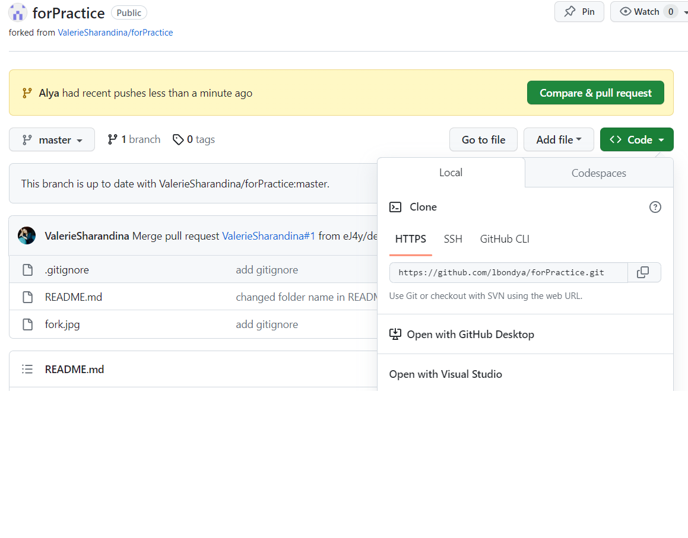

# Инструкция по  работе с Git

## Установка и первоначальная настройка Git

### 1. Установка Git

Для того чтобы установить программу необходимо загрузить последнюю версию Git с официального сайта по ссылке
<https://git-scm.com/> и произвести установку.  

### 2. Проверка наличия установленного Git

В терминале выполняем команду: 

    git version  
Если Git установлен, то появится сообщение с информацией о версии файла, иначе появится сообщение об ошибке.

### 3. Первоначальная настройка Git

При первом использовании Git небходимо представиться, для этого необходимо ввести две команды:

    git config --global user.name "your name"

    git config --global user.email " your email"

Для того чтобы проверить прошла ли регистрация необходимо ввести команду:

    git config --list

## Создание и нициализация репозитория
Для инициализации репозитория необходимо ввести команду:

    git init

В исходной папке появится скрытая папка .git 

## Внесение и сохранение изменений

### 1. Проверка состояния файла

Для проверки состояния файла необходимо ввести команду:

    git status

После этого в терминале отобразятся все новые или изменённые файлы, которые нуждаются в фиксации

### 2. Добавление файла для индексации и последующего создания коммита

Для этого вводим команду:

    git add .название файла

Для быстрого выбора файла можно воспользоваться клавишей **Tab**. Произойдет добаление файла для индексации.

### 3. Создание коммита

Для создания коммита необходимо ввести команду:

    git commit -m "текст с описанием именений"

Произойдет фиксация изменений и сохранение их в историю версий.

 Также можно использовать команду:

    git commit -am "текст с описанием именений"

Это позволит не использовать пред этим команду _git add_

### 4. Отображение различия по внесённым изменениям 

Для этого необходимо ввести команду:

    git diff

После этого отобразятся все различия в ещё не проиндексированных файлах.

### 5. Просмотр истории изменений файла

Чтобы просмотреть историю коммитов для текущей ветки небходимо ввести команду:

    git log

Отобразится история коммитов с индивидуальным именем каждого сохранения.

Также можно просматривать историю в сокращенном виде, для этого нужно ввести команду:

    git log --oneline

### 6. Переход к предыдущей версии файла

Для перехода к предыдущему сохранению необходимо ввести команду:

    git checkout (первые четыре символа из имени сохранения)

Если команда и имя сохранения введены верно, то произойдет переход к той версии файла, которая была заданна. В противном случае появится сообщение об ошибке.

Для возврата обратно к текущей версии, небходимо ввести команду:

    git checkout master

## Добавление изображений и игнорирование файлов

Для того чтобы разместить изображение в нашем файле, надо добавить его в папку где хранится файл и после этого в нужном месте пишем следущее:

    

Для того чтобы удалить файлы с отслеживания необходимо создать файл ".gitignore" в котором необходимо указать имя файла если он один или расширение файла для того чтобы исключить все файлы с таким расширением.

## Ветвление

### 1. Создание веток

Для создания новой ветки надо ввести в терминале
команду:

    git branch (имя ветки)

Ветвление необходимо для работы с файлами в отдельной ветке, сохраняя при этом исходное состояние файла до их слияния.
Чтобы отобразить созданные ветки используется команда:

    git branch

### 2. Перемещение по веткам
Чтобы перейти на другую ветку необходимо ввести
команду:

    git checkout (имя ветки)

### 3. Слияние веток

Для слияния веток и внесения изменений в наш основной файл используется команда:

    git merge (имя ветки)

Слияние делается в ту ветку в которой мы находимся.

## Конфликты

Хочу увидеть конфликт

надо конфликт
очень нужен конфликт
хочу увидеть конфликт

Конфликты возникают при слиянии двух веток в одну при этом должна быть измененена одна и та же строка файла

Конфликт выглядет вот так

и вот так

## Работа с удаленными репозиториями

Для работы с удаленными репозиториями необходимо зарегистрироваться на сайте [Git.Hub](https://github.com). После регистрации на сайте мы можем начать работу с удаленными репозиториями.

### 1. Перенос чужого репозиторя к себе в акаунт и на свой компьютер.

Для переноса чужого репозитория и дальнейшей работой с ним на своем компьютере необходимо перейти на страницу разработчика и выполнить действие **Fork**, чтобы добавить его к себе на страницу.

Далее чтобы продолжить работу, но уже на своем компьютере необходимо скопировать ссылку на этот репозиторий,

создать пустую папку у себя в компьютере, открыть её в своем редакторе и не выполняя команду *git init* выполнить команду:

    git clone (ссылка которую скопировали)

Произойдет клонирование репозиторя в эту папку. Для работы с файлом всегда рекомендуется создать отдельную ветку и все действия производить непосредственно в ней и **НИКОГДА НЕ В ВЕТКЕ MASTER**.

### 2. Отправка всех обновленных комитов из локальной ветки в удаленную.

Чтобы отправить определенную ветку на удаленный сервер со всей историей изменений вводим команду:

    git push

Чтобы отправить все ветки, которые были созданы в процессе работы используется команда:

    git push --all

### 3. Получение данных из удаленного репозитория.

Для связи с удаленным репозиторием и получения данных, которых у нас ещё нет, вводим команду:

    git fetch (имя удаленного репозиторя)

Команда fetch просто забирает данные и не сливает их светкой в которой вы находтитесь. Если необходимо не просто забрать данные а ещё и слить их с вашей веткой используется команда:

    git pull

После этого произойдет скачивание и слияние.

### 4. Просмотр удаленных подключений к другим репозиториям

Для этого необхдимо ввести команду:

    git remote

Чтобы просмотреть удаленные подключения их URL-адрес, вводим команду:

    git remote --v

### 5. Отправка доработанного проекта обратно к его владельцу

После того как внесены изменения в проект и готовы отправить свой вариант вводим команду:

    git push

После этого Git выведет сообщение с подсказкой из которой копируем команду и вводим её в терминал.

После этого переходим GitHub и нажимаем кнопку **compare&pull request**,

 затем нажимаем **create pull request**.

После этого появится сообщение, что все прошло успешно.

# **THE END :)**
