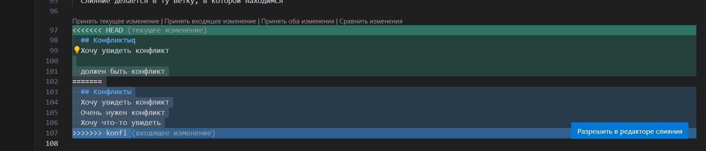
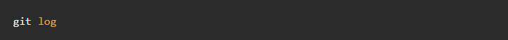

# Работа с git
## Проверка наличия установленного git
В терминале выполняем команду: git version. Если git устонолен, то появится сообщение с информацией о версии файла. Иначе будет сообщение об ошибке.
## Настройка git
При первом использовании git необходимо представиться. Для этого надо ввести две команды: git config --global user.email, git config --global user.name
Для того, что бы проверить прошла ли регистация надо ввести 
команду: git config --list.
## Инициализация репазитория
Для того, что бы получит репазиторий из папки выполняем команду: git init. В исходной папке появится скрытая папка .git
## Просмотр состояния файлов
Для просмотра состояние файлов в рабочей дериктории воспользуйтесь командой: git status
## Добавление содержимого в репозиторий
Для добавления содержимого в рабочий репозиторий для последующего коммита используй команду: git add
## Создание коммитов
Для создания фиксации текущего изменения файла используй команду: git commit. 
## Просмотр истории
Для просмотра коммитов в репозитории используй команду: git log. Последние коммиты находятся вверху
## Состояние файлов в дериктории
Для просмотра файлов в рабрчей дериктории используй команду: git diff
## Перелючение веток репозитория
Для переключения веток и вгрузки их содеожимого в рабочую деректоию используй команду: git checkaut
## Добавление картинок и игнорирование файлов
Для того что бы разместитиь картинку в нашем файле, необходимо добавить ее добавить ее в папку после чего она должна отобразится в проводнике. В нужном месте в файле прописываем команду 
Для того, что бы удалить файлы с изображением из отслеживания, надо создать файл .gitignore
Чото бы убрать все файлы формата png в .gitignore пишем *png
## Ветвление
Для создания новой ветки необходимо ввести команду git branch и имя новой ветки. Ветвление необходимо для работы с файлами в отдельной ветке, сохраняя при этом исходное состояние файла до их слияния. Чтобы отобразить созданные ветки используется команда git branch. Чтобы перейти на другую ветку вводим в терминале команду git checkout и имя ветки

Тут должен быть конфликт
## Конфликты
Хочу увидеть конфликт
Конфликты возникают при слиянии двух веток в одну и когда в этих ветках была изменена одна и та же строка (строки) файла. Разрешение конфликта возможно путем следующих методов: принять текущее изменение, принять входящее изменения, принять оба изменения и сравнить изменения

## Слияние веток
Для слияния текущей ветки с какой-либо другой, используется команда git merge (имя ветки). В результате выполнения этой команды в текущей ветке появится новый коммит.
 
## Удоление веток
Для того, чтобы удолить одну из имеющихся веток  из локального рипозитория необходимо ввести команду git branch -d (имя ветки).
## Просмотр коммитов
Для того, чтобы просмотреть коммиты в нашем локадбном репозитории необходимо ввести команду git log

Для более компактоного и вместительного способа используется команда  git log --oneline

