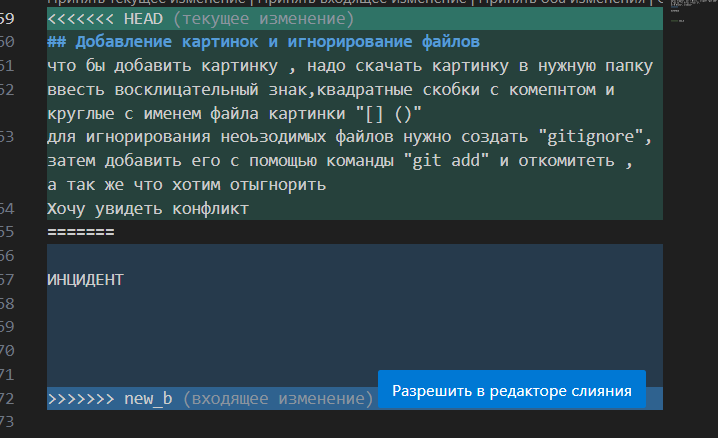

# GIT Инструкция

# Работа с гит

## Проверка наличия установленного гит

в терминале git version

## Установка гит 

Загрузка последней версии с сайта 
https://git-scm.com/
устанавливаем все по умолчанию

## НАСТРОЙКА ГИТ

1.GIT CONFIG -- GLOBAL USER.NAME "USER NIME"

2.git config --global user.email "своя почта"

3.что бы проверить , запомнил  гит наши данные , можно ввести команду git config-- list

4.ЧТобы инициализировать git, нужно в папке с проектом ввести комнаду git init

## Необходимые команды для изучения
1.проверка состояния программы - git status

2.добавление новых файлов - git add (имя программки)

3.автозаполнение тут- tab

4.оставить свой коментарий - git commit -m "свой коментарий"

5.узреть список коммитов с коментами (измененеия)- git log

6.главная ветвь , где мы работаем - git checkout master

7.переход к нужному сохранению - git checkout  <первые 4 символа >

8.сравнить версии файлов -git diff

9.откатить изменения из файла, еще не добавленного в индекс, к последнему коммиту - git checkout -- < filenime >

10.вывод списка доступных веток - git branch 

 11.создать новую ветку - git branch < nime >

12.загрузить для работы последнее сохранение- git stash apply

13.очистить терминал -clear

14.что бы произвести слияние веток , нужно зайти в мастер, а затем прописать команду -git merge <название ветки которую хотим перенести>

15.удаление ветки - git branch -d <имя ветки>

16.что бы увидеть древо/граф(историю) - git graph

## фишки в МД

1. ## выделение текста

что бы выделить текст курсивом необходимо обрамить его звездочками (*) например *вот так*

Чтобы выделить текст полужирным необходимо обрамить его двойными здездочками (**) . например : **вот так**
Знаком нижнего подчеркивания(_) или _вот так_
двойной нижний подчеркивание : __вот так__. 

2.Альтернативные способы выделение текста жирным или курсивом нужны для того что бы мы могли совмесщать оба этих способа . НАПРИМЕР: 
_Текст может быть выделен курсивом и быть **полужирным**_

3.Что бы сделать точку перед словом "*"

4."#" и пробел-заголовок

## СПИСКИ

Чтобы добавить ненумерованные списки необходимо пункты выделить звездочкой(*) или знаком +.
Что бы выделить ненумерованный список используйте например звездочку 
что бы добавить ненумерованные списки , необходимо пункты выделить звездочкой (*) например:
* Элемент 1
* Элемент 2
+ Элемент 3
Чтобы добавить нумерованные списки необходимо пункты просто пронумеровать например
1. пункт
2. второй пункт

## Добавление картинок и игнорирование файлов
Что бы добавить картинку , надо скачать картинку в нужную папку , ввести восклицательный знак , квадратные скобки с коментиком и круглые скобочки с именем файла картинки ""

Для игнорирования необходимых файлов нужно создать "gitignire",затем добавить его с помощью команды "git add" и откомитить , а так же что хотим отыгнорить .

создаю , переношу и удаляю ветку номер 3

фокусы с веткой номер 4 

Создал еще одну ветку , т.к. другие поудалял семинарские и с которыми баловался в домашке !