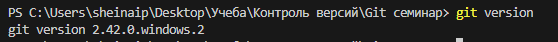
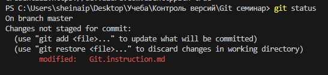
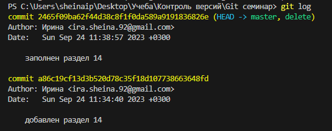
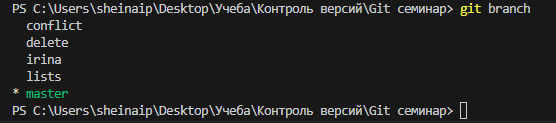
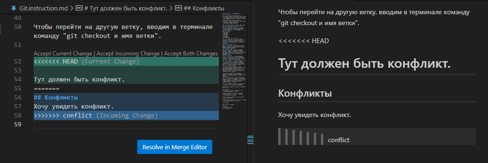
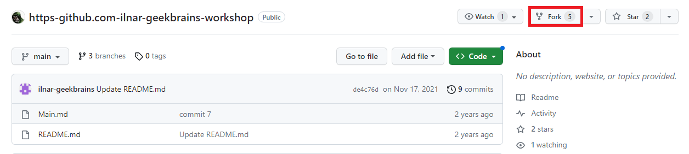
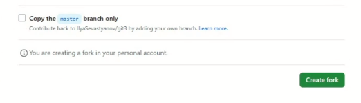

# Работа с Git
## Проверка наличия установленного Git
В терминале выполняем команду "Git version". Если Git установлен, появится сообщение с информацией о версии файла. Иначе будет сообщение об ошибке.

_Версия файла_:

## Настройка Git
При первом использовании Git необходимо представиться. Для этого надо ввести две команды: 
* git config --global user.email;
* git config --global user.name.

Для того чтобы проверить прошла ли регистрация, надо вывести команду "git config --list".
## Инициализация репозитория
Для того чтобы получить репозиторий из папки, необходимо выполнить команду "git init". В исходной папке появится скрытая папка .git.

## Просмотр состояния репозитория
Для того чтобы проверить состояние репозитория, необходимо выполнить команду "git status". Отобразится информация о внесенных изменениях в файл, а так же об изменениях которые пока не сохранены.

_Статус репозитория_:

## Фиксация изменений
### Включение файлов в фиксацию
Для того чтобы начать отслеживание изменений в файлах, необходимо выполнить команду "git add (указать наименование файла)". 
### Добавление коммитов
Для того чтобы создать коммит (сохранение), необходимо выполнить команду "git commit -m "Ввести сообщение о сохранении". Отобразится информация о внесенных сохранениях (о количестве измененных файлов, количестве добавленных и удаленных строк).
## Журнал изменений
Для того чтобы посмотреть журнал изменений (события, которые были сохранены), необходимо выполнить команду "git log". Отобразится список сохранений с текстовыми комментариями к ним.

_Список сохранений_:

## Просмотр разницы состояний файла
Для того чтобы понять отличаются ли файлы от того что сохранено в коммит, необходимо выполнить команду "git diff". Если после ввода команды ничего не отобразилось, значит сохраненный файл полностью идентичен текущему состоянию. 
## Переход по версиям файла
Для того чтобы перейти к какой-то версии (сохранению) файла. необходимо выполнить команду "git checkout (указать название сохранения целиком, либо первые четыре символа)".  После выполнения данной команды происходит переход к выбранной версии сохранения. 

Для возврата к актуальной версии файла, необходимо выполнить команду "git checkout master (master - это название ветки в которой мы находимся)".
## Добавление картинок и игнорирование файлов
Для того чтобы разместить картинку в нашем файле, необходимо добавить ее в папку. После чего она должна отобразиться в проводнике. В нужном месте в файле прописываем следующую команду: .

Для того чтобы удалить файлы с изображениями из отслеживания надо создать файл .gitignore.

Чтобы убрать все файлы формата png в .gitignore пишем: *.png.

## Ветвление
Для создания новой ветки, необходимо ввести команду "git branch и имя ветки".

Ветвление необходимо для работы с файлами в отдельной ветке, сохраняя при этом исходное состояние файла до их слияния.

Чтобы отобразить созданные ветки, используем команду "git branch". 

Чтобы перейти на другую ветку, вводим в терминале команду "git checkout и имя ветки".

_Отображение веток_:

## Конфликты
Конфликты возникают при слиянии двух веток  в одну, и когда в этих ветках была изменена одна и та же строка (строки) файла.

Разрешение конликта возможно путем следующих методов:
* принять входящие изменения;
* принять текущие изменения;
* принять оба изменения;
* сравнить изменения.

_Отображение конфликта_:
 

## Слияние веток
Для слияния веток, необходимо перейти на ветку master, ввести команду "git merge и имя ветки которую необходимо добавить".

## Удаление веток
После слияния веток, ненужные ветки можно удалить. Для удаления веток используем команду "git branch -d и имя ветки, которую необходимо удалить".

## Копирование репозитория
Для того чтобы копировать репозиторий на свой аккаунт в GitHob, необходимо открыть репозиторий, и нажать на кнопку "Fork". 

_Расположение кнопки Fork_:
 

Убираем флаг "Copy the master branch only" и нажимаем на кнопку "Create fork".
 
Выполнение данных действий приведет к копированию репозитория со всеми его ветками.

## Клонирование копии репозитория на локальный компьютер
Для того чтобы скопировать репозиторий, находящийся на сервисе GitHub, в наш локальный репозиторий, необходимо выполнить команду "git clone и вставить копию кода, который был скопирован с GitHub".

## 