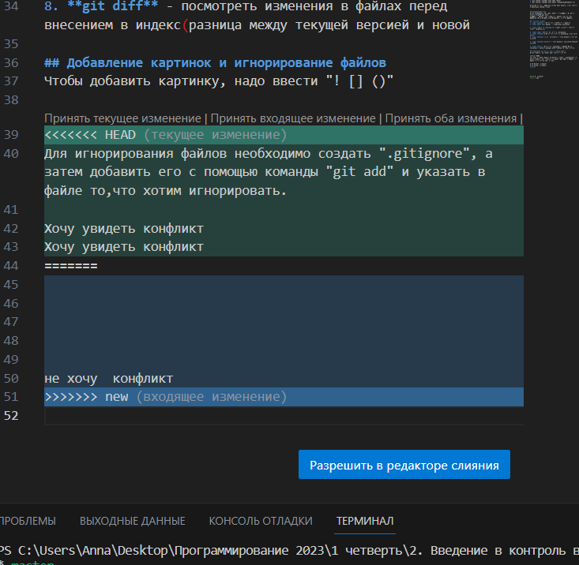

# Работа с Git
Git - это система контроля версий
## Проверка наличия установленного git

В терминале выполняем команду git version - она выводит версию программы git, если выдает ошибку- git не установлен

## Установка Git
Загружаем последнюю версию git с сайта https://git-scm.com/download/win , устанавливаем с настройками по умолчанию.

## Настройка Git
1. git config --global user.name "Anna"
2. git config --global user.email "annakarpun@rambler.ru"

Чтобы посмотреть. запомнил ли Git наши данные, можно ввести команду git config --list

## Инициализация Git
Чтобы инициализировать git, нужно в той папке с проектом ввести команду git init
В папке с репозиторием создаться репозиторий (скрытая папка-ее лучше показать(вид-показывать скрытые папки))

## Основные команды
1. **git status** - посмотреть статус(что с файлом)
2. **git add** <имя файла>  - добавление изменений 

3. **git commit -m "message"**- создать коммит с текстом (текст обязательно)

4. **git log** - посмотреть историю изменений
5. **git reflog** – посмотреть историю изменений, если много логов
6. **git checkout <номер коммита>** - возвращение к старому коммиту

7. **git checkout master** - возвращение к самому последнему коммиту

8. **git diff** - посмотреть изменения в файлах перед внесением в индекс(разница между текущей версией и новой

## Добавление картинок и игнорирование файлов
Чтобы добавить картинку, надо ввести "! [] ()"

Для игнорирования файлов необходимо создать ".gitignore", а затем добавить его с помощью команды "git add" и указать в файле то,что хотим игнорировать.

## Хочу увидеть конфликт
Хочу увидеть конфликт

не хочу  конфликт

## Функции второго урока
Создать ветку можно командой *git branch*
Делать это надо в папке с репозиторием: 
git branch
git branch <название новой ветки>

Если потребуется переключиться с одной ветки
на другую, вызовем команду 
*git checkout <имя ветки>*

Чтобы слить любую ветку с текущей, вызываем
*git merge <имя ветки для слияния с текущей>*

Если ветка больше не нужна, ее можно удалить
*git branch -d*

*git log --graph*
Ключ -graf в связке с командой log позволяет отобразить коммиты в виде дерева.

## *Полный набор команд- обобщение*
## Начало работы

`git --version` - посмотреть версию

`git config --global [user.name](http://user.name/) "username"` - указать имя

`git config --global.email [email@something.com](mailto:email@something.com)` - указать имейл

`git config --list` - посмотреть имя и имейл в конфиге

`git config --list --show-origin` - показать путь к конфигурационному файлу

## Основные команды

`git init` - создать гит репозиторий в дериктории

`git add .` - добавить все файлы директории в индекс

`git add <file>` - добавить файл в индекс

`git status` - посмотреть индекс

`git status -s` - компактный вывод

`git commit` - создать коммит (указать текст в редакторе) фиксирует изменения и сообщ. О появ новых версий

`git commit -m "message"` - создать коммит с текстом

## Просмотр изменений и откат

`git diff` - посмотреть изменения в файлах перед внесением в индекс(разница между текущей версией и новой

`git diff --cached` - посмотреть изменения в файлах в индексе

`git checkout -- <file>` - откатить изменения из файла, еще не добавленного в индекс, к последнему коммиту

`git restore <file>` - откатить изменения из файла, еще не добавленного в индекс, к последнему коммиту

`git reset HEAD <file>` - убрать файл из индекса

`git restore --staged <file>` - убрать файл из индекса

## Вывод истории

`git log` - посмотреть историю изменений

`git log -<n>` - вывести последние n коммитов

`git log -p` - детальные изменения для каждого из коммитов

`git log --stat` - статистика для каждого из коммитов

`git log --pretty=oneline` - компактный вывод истории

`git log --since=year-month-day/n.week` - история с определенного момента

`git log --until=year-month-day/n.week` - история до определенного момента

`git log -S<string>` - найти коммиты, где упоминается заданная строка

`git log --author="author name"` - найти коммиты, принадлежащие определенному разработчику

`git blame <file>` - вывести авторов изменений в файле построчно

## Ветки

`git branch` - вывод списка доступных веток

`git branch <name>` - создать новую ветку

`git branch -r` - список удаленных веток

`git checkout <branch name>` - переключение на ветку (перемнщение между сохранениями)

`git checkout -b <branch name>` - создание и переключение на ветку

`git branch -m <last name> <new name>` - переименование ветки

`git branch -D <branch name>` - удаление ветки

`git merge <name>` - слияние ветки name в текущую ветку