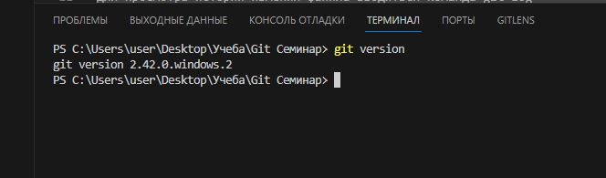
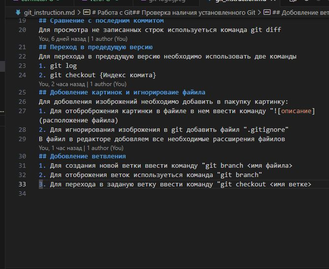
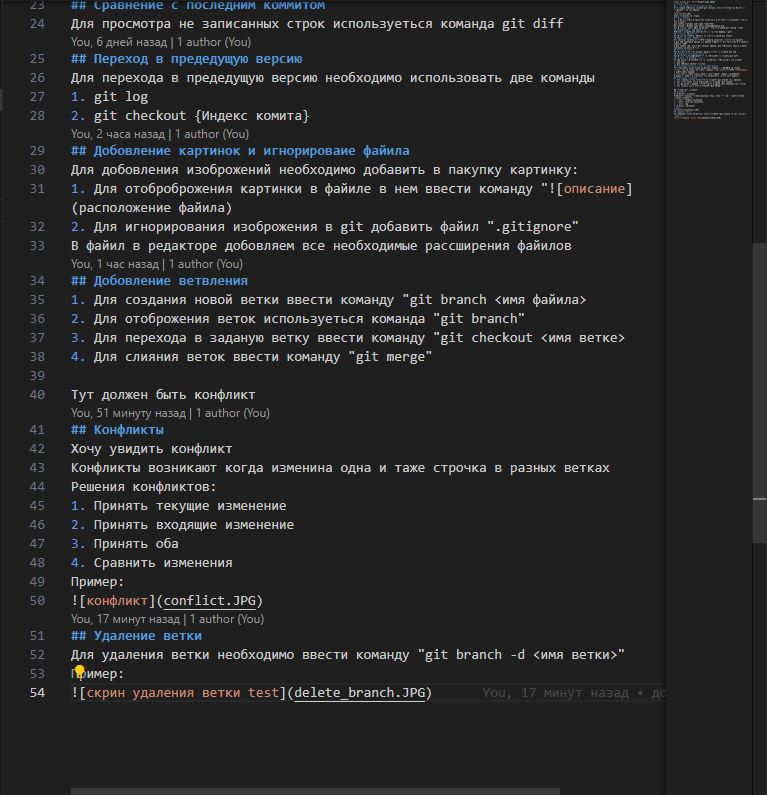
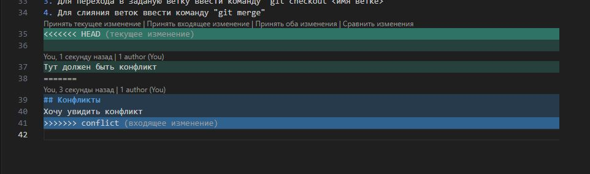
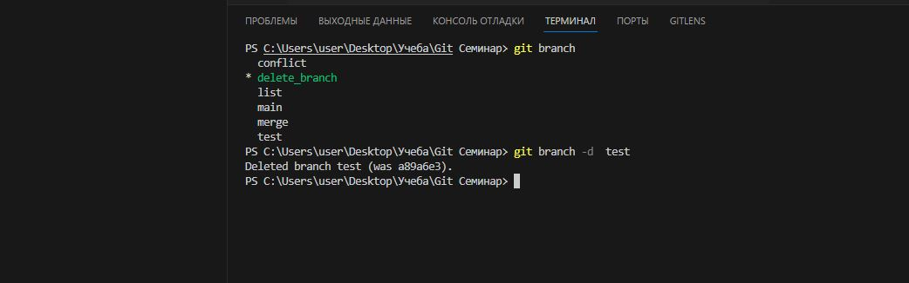

# Работа с Git
## Проверка наличия установленного Git
В терменале выполняем команду git version. Если гит установле появиться сообщение о версии файила. 
Пример:

Иначе сообщение об ошибке.
## Настройка Git
1.При первом использовании Git необходимо представиться.Необходимо ввести две команды:
git config --global user.name "John Doe"
git config --global user.email johndoe@example.com
Для проверке регестрации необходимо  ввести команду git config --list
## Инициализация репарепазитория
Выполнить команду git init появиться скрытая папака ".git" 
## Проверка репозитория
Для проверки статуса репозитория ввести команду git status
## Запись измений репазитория 
Для внесения измений в структуру файила необходимо ввести две каманды 
1.git add [название файла] имя файила добавиться автоматически при нажатии клавиши "TAB"
2.git commit -am  фиксирует измения файила, без выполнения данной команды изменения не фиксируються.
## истории коммитов
Для просмотра истории измения файила вводиться команда git log
## Сравнение с последним коммитом
Для просмотра не записанных строк используеться команда git diff 
## Переход в предедущую версию 
Для перехода в предедущую версию необходимо использовать две команды 
1. git log 
2. git checkout {Индекс комита}
## Добовление картинок и игнорироваие файила 
Для добовления изоброжений необходимо добавить в пакупку картинку:
1. Для отоброброжения картинки в файиле в нем ввести команду "
2. Для игнорирования изоброжения в git добавить файил ".gitignore"
В файил в редакторе добовляем все необходимые рассширения файилов
## Добовление ветвления 
1. Для создания новой ветки ввести команду "git branch <имя файила>
2. Для отоброжения веток используеться команда "git branch"
3. Для перехода в заданую ветку ввести команду "git checkout <имя ветке>
4. Для слияния веток ввести команду "git merge"
Пример:
Слияние ветки list=>main

До

После 

Тут должен быть конфликт 
## Конфликты 
Хочу увидить конфликт 
Конфликты возникают когда изменина одна и таже строчка в разных ветках 
Решения конфликтов:
1. Принять текущие изменение 
2. Принять входящие изменение 
3. Принять оба 
4. Сравнить изменения 
Пример:

## Удаление ветки 
Для удаления ветки необходимо ввести команду "git branch -d <имя ветки>"
Пример:
