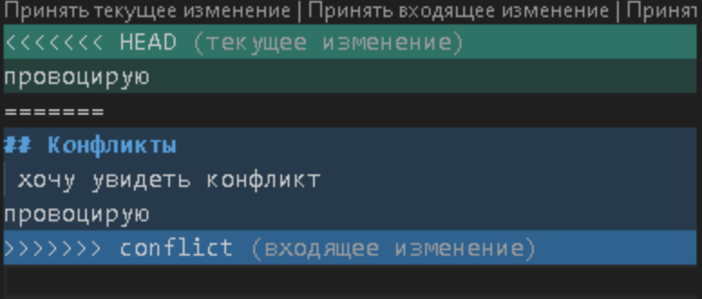

# Работа с Git

## Проверка наличия установленного Git

В терминале выполняем команду **git version** - она выводит версию установленной программы git. Если выдает ошибку,значит git не установлен.

## Настройка Git

1. git config **--global user.name "username"**
2. git config **--global user.email "useremail"**

Чтобы проверить, запомнил ли Git наши данные,можно ввести команду **git config --list**

## Инициализация Git

Чтобы инициализировать git,необходимо в папке с проектом ввести команду **git init**

## Git status

Команда Git status проверяет состояние текущей ветки.

## Добавления файлов к отслеживанию

Чтобы добавить файл к коммиту, нужно ввести команду git add "file name" (с расширением), либо "git add .", чтобы добавить к коммиту все файлы в папке

## Фиксация изменений

Чтобы сделать коммит, нужно ввести команду git commit -m "$message". Сообщение к коммиту обязательно, без него коммитить нельзя. Также важно, что файлы к коммиту предварительно нужно добавить.

Если в процессе работы нам нужно делать много коммитов с одними и теми же файлами, можем использовать команду git commit -am "$message"

## Информация об истории коммитов

Для проверки логов можно использовать команду git log - она откроет полный список всех коммитов, но это может быть трудночитаемо. Чтобы посмотреть краткий список коммитов, используется команда git reflog

Для более удобного просмотра можно использовать git log --graph

Когда лог слишком большой, он может отображаться не полностью, тогда в терминале нужно будет зажать кнопку Enter

## Просмотр различий между текущей и последней сохранённой версиями

Чтобы посмотреть различия в разных версиях файла используется команда git diff

## Переключение между версиями

Чтобы перейти к более раннему коммиту, используется команда git checkout "$commit_id"; перейти в другую ветку git checkout branch_name; чтобы вернуться к самой последней версии - команда git checkout master (или другое название главной ветки)

## Добавление картинок
 * Что бы добавить картинку , нужно скачать нашу картинку в нашу папочку . 
Далее прописать в ВСкоде  !(наш коментарий)[имя картинки]. Ву-а-ля , вот она!

## .gitignore
* Для того что бы сдлеать gitignire ,нам понадобиться в нашей же папочки создать файл - .gitignore.
Не забыть прописать git add nime , комитнуть. Далее в этом файле прописать - .png .После этого , все файлы с данным расширением будут отправляться в игнор!
Что бы создать Новую ветку , воспользуемся командой -git branch nime

## Работа с ветками
* Что бы слить ветки - зайдем в главную ветку с помощью команды git checkout name 
затем воспользуемся командой git merge name - и все готово!
При слиянии веток , может произойти -ИНЦЕНДЕНТ!

Программа сама предложит решить вам данную проблему . И даст выбор между тем , что было и что стало.

В следующей серии будет вот это - 