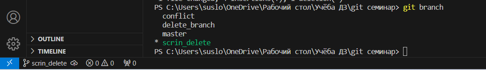
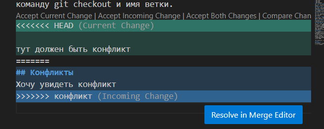
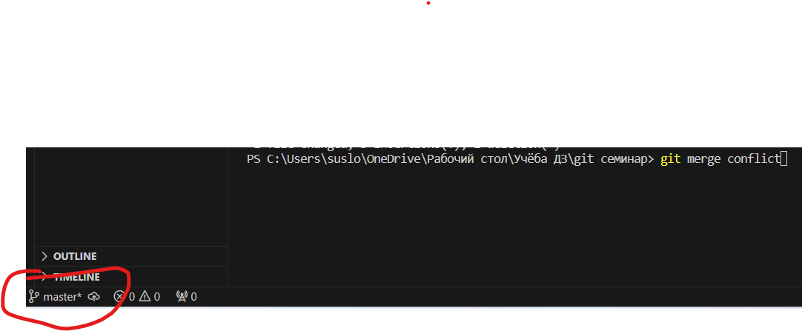
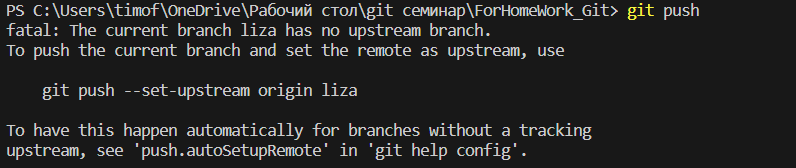
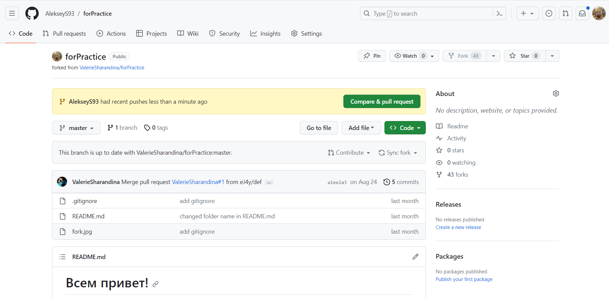

# Работа с git
## Проверка наличия установленного GIT
В терминале выполняем команду git version. Если git установлен, то появится сообщение с информацией о версии файла. Иначе будет сообщение об ошибке.
## Настройка GIT
При первом использовании git необходимо представиться. Для этого надо ввести две команды: git config --global user.email, git config --global user.name.
Для того, чтобы проверить прошла ли регистрация надо ввести команду git config --list.
## Инициализация репазитория
Для того, чтобы получить репазиторий из папки выполняем команду git init. В исходной папке появится скрытая папка .git
## Домашка
Описать команды:
* git status
* git add
* git commit
* git log
* git diff
* git checkout

# ДЗ №1 Семинар №1

## Проверка статуса репозитория

Просмотреть статус нужного репозитория можно командой git status. Её действие распространяется на подготовленные, неподготовленные и неотслеживаемые файл

## Добавление отдельных файлов или всех файлов в область подготовленных файлов

* Добавить отдельный файл в область подготовленных файлов можно командой git add с указанием имени файла. Например вот так: *git add git_ instruction*.
* Кроме того, можно добавить все файлы и папки в эту область, указав (.) вместо имени файла. Например вот так: **git add .**.
## Просмотр истории коммитов с изменениями

Просматривать изменения, внесённые в репозиторий, можно с помощью команды git log. Она отображает список последних коммитов в порядке выполнения. Кроме того, добавив флаг -p, вы можете подробно изучить изменения, внесённые в каждый файл.
Тут должен быть конфликт
хочу увидеть конфликт
## Внесение изменений однострочным сообщением или через редактор
* При создании коммита в репозитории можно добавить однострочное сообщение с помощью команды git commit с флагом -m. Само сообщение вводится непосредственно после флага, в кавычках. НАпример вот так:

__*git commit -m "комментарий"*__

* Также можно открыть текстовый редактор в терминале для написания полного сообщения коммита. Оно может состоять из нескольких строк текста, в котором подробно характеризуются изменения, внесённые в репозиторий. Команда выглядит вот так:

__*git commit*__

* Также, чтоб не прибегать перед каждым коммитом к команде _git add_, достаточно добавить флаг **-am**. Вот так:

__*git commit -am "комментарий"*__

## Просмотр изменений до коммита

* Можно просматривать список изменений, внесённых в репозиторий, используя команду **git diff**. По умолчанию отображаются только изменения, не подготовленные для фиксации.

* Для просмотра подготовленных изменений необходимо добавить флаг **--staged**.

_git diff --staged_

* Также можно указать имя файла, чтобы просмотреть изменения, внесённые только в этот файл.

_git diff git_instruction_

## Команда перехода

Для того чтобы перейти на нужный коммит или ветку нужно использовать команду **git checkout**. 

Например вот так:
1. _git checkout master_ - переход на ветку master
2. _git checkout fe34_ - переход на коммит, начинающийся с символов **fe34**

## __*Конец дз*__

## Добавление картинок и игнорирование файлов

* Для того, чтобы разместить картинку в нашем файле, необходимо добавить ее в папку, после чего она должна отобразиться в проводнике.

* В нужно месте прописываем следкующую команду 

* Для того, чтобы удалить файлы с изображениями из отслеживания, нужно создать файл .gitignore

* Чтобы убрать все файлы формата png, в .gitignore напишем *.png

Пример добавления картинки есть в начале нашей инструкции и выглядит так:

## Ветвление

Для создания новой ветки необходимо ввести команду git branch и имя новой ветки. Ветвление необходимо для работы с файлами в отдельной ветке, сохраняя при этом исходное состояние файла до их слияния. Чтобы отобразить созданные ветки используется команда git branch. Чтобы перейти на другую ветку вводим в терминале команду git checkout и имя ветки.

Пример списка веток:

Пример визуализации ветвления с помощью флажка *--graph* в команде git log:

## Конфликты

Конфликты возникают при слиянии двух веток в одну и когда в этих ветках была изменена одна и та же строка (строки) файла. Разрешение конфликта возможно путем следующих методов: принять входящие изменения, текущие, оба изменения, сравнить изменения

Выглядит это так:

## ДЗ №2 
Дополнить инструкцию своими скринами:
* ~~добавление картинок;~~
* ~~ветвление;~~
* ~~слияние веток;~~
* ~~разрешение конфликтов;~~
* ~~удаление веток.~~
* ~~Создать и слить минимум четыре ветки. Скрин этих веток должен быть в инструкции.~~

# ДЗ №2 Семинар №2

## Слияние веток

Для того, чтобы слить одну ветку в другую, нужно, находясь в той ветке куда сливаешь другую **(ЭТО ВАЖНО!!!)** выполнить команду _git merge имя_сливаемой_ветки_. 

Например как показано на скриншоте:

## Разрешение конфликтов.

Разобрали на семинаре - см. инструкцию выше.

## Удаление веток

Для того, чтобы удалить ветку, достатодно к команде *git branch* добавить флажок *-d* и *имя удаляемой ветки*

Например вот так, как показано на скриншоте:

## _**Конец ДЗ №2**_

## Домашнее задание №3

Нужно дополнить инструкцию следующими пунктами о работе с _удалёнными репозиториями_ и запушить Валерии:

* ~~git push~~
* ~~git pull~~
* ~~git clone~~
* ~~fork~~
* ~~pull request~~

# Домашняя работа №3
## Работа с удалёнными репозиториями.

### Отправление локального репозитория в удалённый на github.

Для того чтобы отправить наш репозиторий, который мы взяли на github и поработали с ним, достаточно ввести команду **git push**, git предложит ввести команду, например такую:
, копируем и вводим.

### Стягивание удалённого репозитория в локальный и слияние.

Такую манипуляцию можно произвести с пощью команды **git pull**

_Git pull_ — это команда, которая загружает изменения из удалённого репозитория и интегрирует их с текущей веткой.

Если текущая ветка отстаёт от удалённой, то по умолчанию будет выполнено слияние с удалённой.

### Создание локальной копии удалённого репозитория.

Для создании такой копии нужно ввести команду **git clone _адрес удалённого репозитория_**. Выглядит это например вот так:

**НО!!!!!!** перед этим, если мы работаем на проектом, в котором участвуют несколько людей, и нам поручено выполнить часть работы в своей ветке нам перед командой *git clone* нужно на github сделать копию чужого удалённого репозитория в свой удалённый репозиторий, выполнив *fork* (вилка). Вот эта кнопка:

## Pull request — это запрос (англ. request — «запрос») на интеграцию изменений из одной ветки в другую.

Выглядит вот так: 

### FINISH