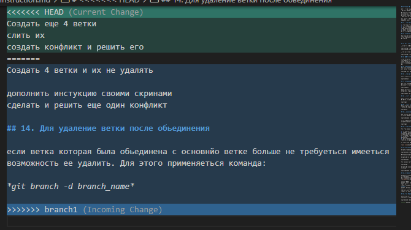
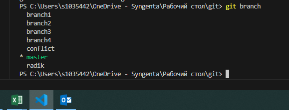

# Инструкция по GIT

GIT - это программа которая позволяет сохранять изменения и контролировать версии рабочего файла (в текстовых форматазх?)

В отличие от возможности сохранения каждой отдельной версии как отдельного файла на компьютере она сохраняет  лишь изменения сделаные над первичным файлом что повзоляет намного экономить место на компьютере и быстро перемещаться между различными версиями файла.

Для работы с GIT необходимо первично его установить. Далее следовать инструкции указаной ниже.

## 1. Проверка наличия установленного *GIT* 

1. Открываем терминал
2. В терминале прописываем команды *git version*
3. Если терминал выведет сообщение о версии установленной программы все в порядке - GIT установлен
4. Иначе система покажет ошибку о том что система не установлена. Попробуйте проверить написание запроса или переустановить программу

## 2. Установка *GIT*

Загружаем последнюю версию файла с сайта https://git-scm.com/downloads
После скачивания установочного файла необходимо его запустить и установить программу

## 3. Настройка *GIT*

При первом использование необходимо представиться командами указанными ниже

*git config --global user.name*
*git config user.email*

Проверим прошла ли регистрация - -вводим команду:

*git config --list*

## 4. Запуск (инициализация репозитария) *GIT*

После установки программы необходимо иницилизировать GIT командой *git init* в той папке в которой хотим фиксировать изменения
Можно проверить все ли в порядке если просмотрим скрытые файлы в той папке в которой инициализировали GIT - там должна появиться скрытая папка с расширением .git

## 5. Добавление отслеживание файла в *GIT*
Для того чтобы добавить файл в отслеживаемые программой необходимо отправить его имя через терминал командой:

*git add (имя файла)*

## 6. Проверка состояния папки в программе "GIT"

Для проверки состояния сохранения применяеться команда: 

*git status*

## 7. Сохранение изменений в новую версию файла в программе *GIT*

Для того чтобы программа сохранила в качестве версию сделаные изменения применяеться команда :

*git commit*

Также для того чтобы в дальнейшем иметь понимание что изменилосб в файле необходимо добавить в строку команды комментарий дополнение 

*get commit -m "Комментарий"*

## 8. Просмотр изменений в файле в программе *GIT*

Для просмотра подробной информации об изменениях произошедшей в файле необходимо прописать команду:

*git log*

## 9. Просмотр изменений в файле 
Для просмотра произошедших изменений между последней сохраненной версией файла и текущей передаем в терминал команду:

*git diff*

## 10. Перемещение между версиями файла

В программе *GIT* имееться возможность перемещания между ранее сохраненными версиями файла делаеться это с помощью команды:

*git checkout (версия файла)*

версию файла можно узнать и распознать прочитав коменнтарии и ее название через команду описаную ранее:

*git log*

## 11. Отображение и вставление картинок в markdown

Для отображение картинки в тексте необходимо:

1. Переместить (сохранить) понравившуюся фото в отслеживаемую папку
2. Создать новый файл юпшешптщку в корнеой папке через Visual studio 
в файле прописать название файла или расширения этих изображений - чтоы система не выдавала ошибку по отслеживанию
3. необходимо добавить .gitignore в не отслеживаемые с помощью команды *пше add .gitignore*
4. Для вставления изображения в текст необходимо дать в тексте прописывать следующую комбинацию:

*! [текст или описание картинки] (название файла )

## 12. Ветвление

Команда создание новой ветки:

*git branch branch_name*

Ветвление необходимо для сохранение изменений не изменяя основную (корневой файл)

Команда проверки всех веток

*git branch*

Для слияния веток и переноса изменений в текущую используеться команда:

*git merge

Команда перемещения между ветками такая же как и команда по перемещению между версиями

*git checkout brnach_name*

## 13. Конфликты версий в ветках

Конфликты возникают при слияние веток при этом должна быть изменена одна и та же строка файла.
при возниккновение конфликта пояаляеться следующее сообщение:

Создать еще 4 ветки
слить их
создать конфликт и решить его
Создать 4 ветки и их не удалять

дополнить инстукцию своими скринами
сделать и решить еще один конфликт

## 14. Для удаление ветки после обьединения

если ветка которая была обьединена с основнйо ветке больше не требуеться имееться возможность ее удалить. Для этого применяеться команда:

*git branch -d branch_name*

**__Фото конфликта с домашнего задания__**

**__Фото созданых веток по домашнему заданию__**

## Работа с удаленными репозитариями.

Программа GIT позволяет работать с удаленными репозитариями которые были созданы другими участниками команды.

Для этого необходимо:

1. Зарегистрироваться и создать аккаунт на одном из сайтов созданных дляхранеения и обмена репозитариями, например: github.com

2. Иметь ссылку на открытый репозитарий на которым ведеться работа. Должна быть ссылка на репозитарий.

3. В окне репозитария имееться кнопка **FORK** - которая позволяет _скопировать_ рабочий репозитарий в собственный аккаунт.

4. Далее работа может проводиться в собственном аккаунте в на сайте github через нажатие кнопки **CODE**.

5. Для работы удаленно на собственной машине необходимо "скачать" репозитарий на собственный компьютер тем самым создав удаленную копию. Удаленная копия создаеться через команду 

**__git clone (ссылка на репозитарий)__**

6. Для того чтобы обновить файл сохраненнф   на сайте необходимо отправить отправить его на сайт через команду

**__git push__**

## Отправка запроса на добавление ветки на репозитарий автора файла (у кого файл был скопирован через команду **FORK** ранее):

Сайт github позволяет отправить изменения совершенные пользователем автору файла. Это совершаеться через команду 

**__pull request__**

Эта команда должна появиться в окне репозитария на сайте github

