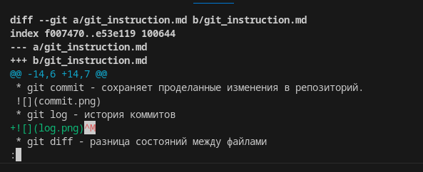
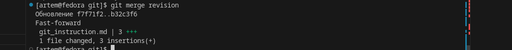

# Работа с git
## Проверка наличия установленного git
В терминале выполняем команду git version. Если git установлен, появится сообщение с информации о версии файла, иначе будет сообщение об ошибке.
## Настройка git
При первом использовании git необходимо представиться. Для этого надо ввести две команды: git config --global user.email, git config --global user.name.
Для того, чтобы проверить, прошла ли регистрация, надо ввести команду git config --list.
## Инициализация репозитория
Для того, чтобы плолучит репозиторий из папки, выполняем команду git init. В исходной папке появится скрытая папка .git

Команды:
* git status - статус отслеживания файлов

* git add - добавление изменений в отслеживание
* git commit - сохраняет проделанные изменения в репозиторий.

* git log - история коммитов

* git diff - разница состояний между файлами

* git checkout - переход между ветками репозитория.

Добавление картинок и игнорирование файлов. 
Для того, чтобы разместить картинку, необходимо добавить ее в папку, после чего она должна отобразиться в проводнике. В нужном месте прописываем команду: 
Для того, чтобы удалить файл из отслеживания, нужно создать файл .gitignore.
Чтобы убрать все файлы формата .png, в .gitignore пишем *.png.

## Ветвление
Для создания новой ветки нужно набрать в терминале команду git branch и имя новой ветки.
Четыре ветки, созданные для дз:
* Ветка screeanshotes:

* Ветка decoration:

* Ветка cleaning:

* Ветка revision:

Действия с ветками подробнее описаны в коммитах.

Ветвление необходимо для работы с файлами в отдельной ветке, сохраняя при этом исходное состояние файла до их слияния.
Чтобы отобразить созданные ветки, использвуется команда git branch.\
ЧТобы перейти на другую ветку, вводим в терминале команду git checkout имя ветки. 

## Конфликт

Конфликты возникают при слиянии двух веток в одну, и когда при слиянии этих веток была задействована одна и та же строка. 
Пути разрешения:
1. Приянть входящее изменение
2. Принять текущее изменение
3. Сравнить изменения.

Конфликт из д/з:

Был разрешён посредством сохранения Изменений.

## Слияние веток:
Для слияния веток необходимо перейти в основную ветку и написать git merge "ветка, которую вливаем"

## Удаление веток:
Для удаления пишем git branch -d "ветка"

# Работа с удаленными репозиториями:
## Непосредственно в терминале
git clone - клонирование репозитория

git pull - "стянуть репозиторий" (клонирование с учетом имеющихся на компьютере данных)

git push - "толкнуть" удаленный репозиторий на Github

Для выполнения команды push, нужно представиться владельцем удаленного репозитория. 

## На GitHub:

Для того, чтобы сделать форк репозитория (копию уже в своем аккаунте на github), необходимо в чужом репозитории нажать кнопку "fork"

 Чтобы сделать pull-request, необходимо также нажать одноименную кнопку в интерфейсе GitHub. 