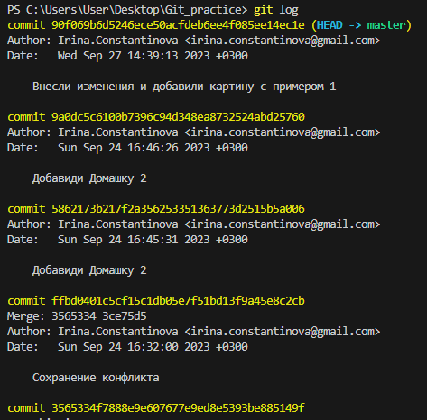

# Работа с Git

## Проверка наличия установленного Git
В терминале выполняем команду *git version*. Если Git установлен, то появится сообщение с информацией о версии файла. Иначе будет сообщение об ошибке.
## Настройка Git
При первом использовании Git необходимо представиться. Для этого надо ввести две команды : *git config --global user.email* и вводим email пользователя, *git config --global user.name* и в "" вводим имя пользователя.
Для того чтобы проверить пррошла ли регистрация надо ввести команду *git config --list.*
## Инициализация репозитория
Для того, чтобы получить репозиторий из папки выполняем команду *git init.*
В исходной папке появится скрытая папка с названием .git.
## Домашка 
Описать команда Git :
* git status
* git add
* git commit
* git log
* git diff 
* git checkout
## Добавление изменений
Для того, чтобы внесённые в файл изменения добавить в отслеживание Git, выполняем команду *git add*. Эта команда добавляет содержимое рабочего файла в индекс для последующего коммита.
## Фиксация изменений 
Команда *git commit -m " Коментарий "* позволяет зафиксировать изменения и записать коментарий к данным изменениям. Эта команда берёт все данные, добавленные в индекс с помощью команды *git add*, и сохраняет их образ во внутренней базе данных.
## Проверка статуса файла
Команда *git status* показывает текущее состояние файлов в рабочей директории и индексе. Эта команда показывет какие изменения добавлены в файл, но не добавленны в индекс ( *git add* ) и ожидают коммита ( *git commit* ). В добавок к этому выводятся подсказки о том, как изменить состояние файла. Пример : 
## Просмотр истории коммитов
Команда *git log* используется для просмотра истории коммитов начиная с самого последнего и уходит вниз к самому первому, при этом история отображается в виде списка коммитов, которые содержат в себе индек (хэш) каждого коммита, имя и email автора, а также дату внесённого коммита.
 Пример :

Также для более удобного просмотра коммитов используют команду *git log --oneline*. Пример :

## Проверка разницы 
Команда *git diff* вычисляет и выводи в терминал разницу между внесёнными изменениями и коммитами.
## Переключатель между коммитами и ветками
Для того чтобы перемещаться между коммитами и ветками, необходимо ввести команду *git checkout* далее написать или скопировать первые 4-5 символов индекса (хэша) того коммита на который надо переместиться и нажать *Enter*. Чтобы переключаться между ветками используем также команду *git checkout*, далее пишем название ветки на которую хотим переключиться. Для того чтобы вернуться обратно на основную ветку и продолжить работу на ней, достаточно ввести команду *git checkout master*.
## Добавление картинок и игнорирование файлов
Для того чтобы разместить картинку в нашем файле, необходимо добавить её в папку, после чего она долна отобразиться в проводнике. В нужном месте в файле прописываем следующую команду . Для того чтобы удалить файлы с изображениями из отслеживания надо создать файл *.gitignore*. 

Пример :

Чтобы убрать все файлы в формате *png* в файле *.gitignore* пишем _*.png._

Пример: 

## Ветвление
Для создания новой ветки, необходимо ввести команду *git branch* и имя новой ветки.
Ветвление необходимо для работы с файлами в отдельной ветке, сохраняя при этом исходное состояние файла до их слияния. Чтобы отобразить созданные ветки используется коминда *git branch*. Чтобы перейти на другую ветку вводим в терминале команду *git checkout* и имя новой ветки. Пример : 

## Конфликт
Тут должен быть конфликт!
Хочу увидеть конфликт

Конфликты возникают при слиянии двух веток в одну и когда в этих ветках была изменена одна и таже строка (строки) файла. Разрешение конфликта возможно путём следующих методов : 
* принять текущие изменения
* принять входящие изменения
* принять оба варианта изменений
* сравнить изменения

Выглядит это так : 

## Домашка 2 
Дополнить инструкцию своими скринами :
* добавление картинок
* ветвление
* слияние веток
* разрешение конфликтов
* удаление веток

Создать и слить минимум 4 ветки. Скрин этих веток обязательно должен быть в инструкции.

## Слияние веток
Команда *git merge* используется для того чтобы слить одну или несколько веток в текущую. Чтобы перенести изменения которые были сделанны в новой ветке ( *new branch* ), необходимо перейти на главную ветку ( *master* ) и при помощи команды *git merge new branch* перенести эти изменения в главную ветку. Важно помнить, что слияние веток всегда просходит в той ветке куда необходимо перенести информацию, а не с той, гда эта информация записана! Пример создания новой ветки и дальнейшего слияния её с главной:

## Удаление веток 
Команда для удаления локальной ветки в Git : *git branch -d local_branch_name*. *git branch* - команда для обозначения ветки, флаг *-d* - опция команды для удаления, сокращённый вариант записи *--delete*. *local_branch_name* - имя удаляемой веткию. При использовании команды на удаление нужно быть очень внимательным и писать флаг *-d*, а не *-D*! Так как флаг *-D* принудительно удаляет локальную ветку, вне зависимости от её статуса мержа. Использовать эту команду можно, но с большой осторожностью, так как после её ввода Git не попросит подтверждения удаления и если ветка не была слита с главной, то все изменения, которые были на этой ветке будут утеряны.

### Рассмотрим подробнее процесс удаления ветки.
Для этого создадим новую ветку и перейдём на неё

Далее внесём необходимые изменения, создадим *git commit -am "Коментарий"* и сольём данную ветку *DeletingBranches* с главной *master*

Далее, прежде чем удалять ненужные ветки проверим какие ветки на данный момент существуют в файле

И вот теперь можно удалять все ненужные в файле ветки

Делее, таким же образом удаляем оставшиеся, ненужные ветки.

После удаления всех ненужных веток, останется только одна главная ветка *master* со всеми, внесёнными в неё изменениями из других слитых с ней веток.

# Работа с удалёнными репозиториями

Для того чтобы начать работу с удалёнными репозиториями, первым делом необходимо создать свой аккаунт на GitHub.com

После регистрации можно будет перейти на страничку своего аккаунта и тут откроется доступ ко всем функциям для работы с удалёнными репозиториями. На этой же страничке можно в строке поиска ввести имя аккаунта любого интересующего нас пользователя и перейти к нему на страничку. Делее, если у него есть публичный репозиторий, который мы хотим склонировать себе, находим этот репозиторий и нажымаем на него. Нажав на имя данного файла, мы сможем посмотреть его содержимое, а также скачать его к себе на страничку (тоесть сделать клон).

## Что такое Fork? 

В работе в удалёнными репозиториями существует такое понятие как "форкнуть" репозиторий.Что же это значит? А вот что. Само слово "форкнуть" происходит от английского слова *fork*, что означает *вилка*.Когда мы хотим склонировать чужой репозиторий себе, на свою страничку аккаунта в GitHub, мы переходим в аккаунт того человека и забираем нужный нам репозиторий нажав на кнопку *Fork*. Мы как-бы "стягиваем вилкой" к себе то что нам нужно.

После этого в нашем аккаунте появится копия этого репозитория со всеми включёнными в него файлами и ветками. Но это пока только копия на нашем аккаунте, а вот чтоб начать работу с данным репозиторием и внести в него какие-то свои изменения, необходимо нажать на зелёную кнопку *Code* и скопировать ссылку.

## Команда git clone

После того как мы скопировали на свой аккаунт чужой файл и скопировали ссылку на него, теперь нам необходимо перейти в VSCode и в командной строке ввести команду  *git clone* и вставить ссылку. Нужно помнить о том что команда *git clone* составная и она не только загружает все изменения, но и пытается слить все ветки как на локальном ПК так и на удалённом.

_**Важно запомнить то, что когда мы сделали *git clone* на локальный ПК, мы никогда не работаем в ветке master или main! НИКОГДА!!! Поэтому, прежде чем вносить какие-либо изменения, создаём свою отдельную ветку и работаем только там!**_

## Команда git push

Данная команда отправит свою версию изменений на удалённый репозиторий. При первом использовании команды *git push*, GitHub попросит авторизоваться. Необходимо будет ввести тот пороль, который мы вводили при регистрации аккаунта на GitHub. Далее GitHub даст все необходимые инструкции и шаги, которые требуется ввести в строке терминала.

Выглядит это так :

Если всё прошло хорошо, то никаких ошибок быть не должно и в терминале git выдаст следуюшее сообщение :

Все внесённые нами изменения появятся автоматически на удалённом репозитории.
Также на страничке нашего аккаунта на GitHub, в файле возможно будет просмотреть све новые ветки и тут же внести (если необходимо) изменения, создать новый коммит, или написать коментарий.

## Команда Pull request

Данную команду на GitHub используют чтобы предложить и отправить свои изменения в проект. Когда в больших компаниях много людей работают над одним проектом, необходимо разделять задачи. Для этого назначается один человек ответственный за этот проект (Project manager) и далее он создаёт главнй репозиторий с проектом, а остальные пользователи делают *fork* репозитория к себе на аккаунт, копируют его на свои ПК (clone), создают новую ветку, вносят туда прелогаемые изменения, отправляют изменения обратно на свой аккаунт на GitHub (push) и делают команду *pull request*.

Команда выглядит так :

Нажав на зелёную кнопку *Compare & pull request* мы предлагаем свои изменения и отправляем их.

## Команда Pull

Чтобы из удалённого репозитория скачать актуальные изменения на локальный ПК вводим в терманале команду *git pull*. Эта команда скачает всё из текущего репозитория и автоматически сделает *merge* с нашей версией.

Выглядит это так :

