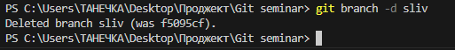

# Работа с Git
## Проверка наличия установленного Git
В терминале выполняем команду git version. Если git установлен, появится сообщение с информацией о версии файла. Иначе будет сообщение об ошибке.
## Настройка Git
При первом использовании Git неоюходимо представиться. Для этого надо ввести две команды: git config --global user/email, git config --global user/name.
Для того, чтобы проверить регистрацию нужно ввести команду git config --list.
## Инициализация репазитория
Для того, чтобы получить репазиторий из папки, выполняем команду git init. В исходной папке появится скрытая папка .git
## Сохранение информации в репазитарии 
Чтобы сохранить текущее состояние проекта в истории коммитов, мы используем, при первом внесении, последовательно две команды: git add + название файла, затем  команду git commit -a "",(в скобочках указывается уточняющая информация) в дальнейшем для сохранения текущего состояния проекта вводится команда git commit -am ""
## Проверка изменений 
Для проверки текущего состояния репозитария набирается команда git status.
## Разница между текущим состоянием проекта и репозитарием
Если в строку ввести команду git diff, можно увидеть какая информация не была ввнесена в репозитарий. 
## Переход от одной версии файла к другой версии файла
Для того, чтобы увидеть какие версии файла существуют вводится команда git log
## Переход к определенному сохранению в файле
Чтобы перейти к какому-то конкретному сохранению в файле, нужно набрать команду gid checkout и далее, после пробела, указать первые четыре цыфры сохранения. 
## Добавление картинок и игнорирование файлов
Для того, чтобы разместить картинку в нашем файле, необходимо добавить ее в папку, после чего она должна отобразиться в проводнике.
В нужном месте в файле прописываем следующую команду:

Для того, чтобы удалить файлы из отслеживания, нужно создать файл .gitignor
Чтобы убрать все файлы png d .gitignor пишем *.png
## Ветвление
Для создания новой ветки вводим git branch (имя новой ветки). Ветвление необходимо для работы с файлами в отдельной ветке, сохраняя при этом исходное состояние файла до их слияния. Чтобы отобразить созданные ветки, используется команда git branch. Чтобы перейти на другую ветку, вводим в терминале команду git checkout (имя ветки).
## Конфликты
Хочу конфликт. Здесь.!!!!
## Ветвление
Для создания новой ветки вводим git branch (имя новой ветки). Ветвление необходимо для работы с файлами в отдельной ветке, сохраняя при этом исходное состояние файла до их слияния. Чтобы отобразить созданные ветки, используется команда git branch. Чтобы перейти на другую ветку, вводим в терминале команду git checkout (имя ветки).

Тут должен быть конфликт.
## Конфликт
Хочу увидеть конфликт!
Конфликт возникает при слиянии двух веток в одну, и когда в этих ветках была изменена одна и таже строка (строки) файла. Разрешение конфликта возможно путем следующих методов. Принять текущие изменения, принять входящие изменения, оба изменения и сравнить изменения. Выглядит это так:

## Изображение ветвлений

## Слияние веток
Чтобы перенести информацию из вспомогательной ветки в основную ветку, в терминале вводится команда git merge (название ветки). Для этого сначала нужно перейти в основную ветку и из нее делать слияние веток.
В терминале это выглядит так:

## Удаление веток
После переноса информации в основную ветку, вспомогательную ветку можно удалить. Ветка удалится, если ввести в терминале команду git branch -d (название ветки).
Выглядит эта команда так:

## Отправка своей версии репозитария на внешний репозитарий 
Команда git push позволяет отправить нашу версию репозитария на внешний репозитприй. Также требуется авторизация на внешнем репозитарии.
## Скачивание информации из текущего репозитария 
Команда git pull позволяет скачать все из текущего репозитария и автоматически сделать merge с нашей версией.
## Скачивание из текущего репозитария и слияние со своей версией
Копировать внешний репозитарий на свой ПК можно командой git clone.
## Запрос на вливание изменений в репозитарий
Отправить изменения командой git push в свой аккаунт на GitHab и дать команду pull request.
## Создание ответвления репозитария
Для создания ответвления репозитария нажимаем команду fork.

