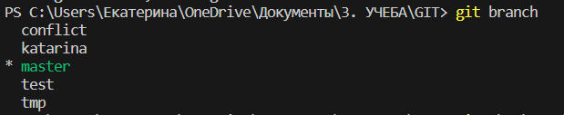

# Работа с GIT 
## проверка наличия установленного GIT

в терминале выполняем команду git version. Если GIT установлен, появится информация о версии файла, иначе появится сообщение об ошибке. 
## Настройка гид
При первом использовании GIT необходимо представиться. Для этого надо ввести 2 команды git config --global user.email и git config --global user.name.
Для того, чтобы прошла регистрация необходимл ввести команду git config --list
## Инициализация репозитория
для того, чтобы получить репозиторий из папки выполняем команду git init. В исходной папке появится папка .git

## Домашнее задание 1: описать команды 
* используем команду git status, чтобы проверить статус репозитория, она показывает, сколько изменений было сделано с последнего сохранения и файлы, который GIT не отслеживает. Чтобы использовать команду, напишите "git status"
* Команда git add добавляет или изменяет файлы в рабочей области, без нее нельзя сохранить изменения (возможна замена на git commit -am, которая одновременно и добавляет файлы и сохраняет изменения).Чтобы использовать команду, напишите git add "имя файла". Для автозаполнения имени файла используем Tab.
* Команда git commit позволяет сохранить изменения, используется после git add, альтернатива - git commit -am. Чтобы использовать команду, напишите git commit -m "комментарий" или git commit -am "комментарий"
* Используем команду git log, чтобы увидеть количество сохранений. Чтобы использовать команду, напишите git log.
* Команда git diff используется для сравнения изменений, зафиксированных в Git. С помощью этой команды  можно вывести изменения, сделанные в соответствующем коммите. Чтобы использовать команду, введите git diff + 4 первые символа соответсвующих изменений, полученных с помощью git log. Используй ESC или PQ чтобы вернуться к основной ветке.
* Команда git checkout позволяет переключаться между различными версиями файлов, сохранений и ветвей. для этого вводим команду git checkout.
* Команда git commit позволяет сохранить изменения, используется после git add, альтернатива - git commit -am.
* Используем команду git log, чтобы увидеть количество сохранений.
* Команда git diff используется для сравнения изменений, зафиксированных в Git. С помощью этой команды  можно взять два входных набора данных и вывести изменения между ними. Используй ESC или PQ чтобы вернуться к основной ветке.

## Добавление картинок и игнорирование файлов
Для того, чтобы разместить картинку в нашем файле, необходимо добавить ее в папку, после чего она должна отобразиться в проводнике. В нужном месте в файле прописыаем следующую команду . Имя файла должно быть без пробелов.
для того, чтобы удалить файлы с изображениями из отслеживания, нужно создать файл .gitignore.md. Чтобы убрать все фалы формата png в .gitignore.md пишем *.png.
Для того, чтобы добавить файл-картинку к отслеживанию используем команду git add <имя_файла>.
## Ветвление
* Создание веток. Для создания новой ветки нужно ввести команду git branch <имя_ветки>. Ветвление необходимо для работы с файлами в отдельной ветке, сохраняя при этом исходное состояние файла до их слияния. Чтобы отобразить созданные ветки используется команда git branch. Чтобы перейти на другую ветку используем команду git checkout <имя_ветки>.
* Удаление веток. Для того, чтобы удалить уже слитую ветку, вводим команду git branch -d <имя_ветки>. 
* Слияние веток. Для того, чтобы слить ветки, вначале переходим в ту ветвь, в которую хотим включить информацию из другой ветки, используя команду git checkout <имя_ветки>. После этого вводим команду git merge <имя_ветки, из которой хотим слить информацию>.
Так это выглядит в терминале

Для вывода перечея веток используем команду git branch.

В случае, если ветки уже были слиты, появится сообщение

## Конфликты
здесь конфликт!
здесь изменения.
Конфликты возникают при слиянии двух веток в одну и когда в этих ветках была изменена одна и та же строка (строки) файла. Разрешение конфликта возможно путем следующих методов (принять текущие изменения, входящие изменения, оба изменения, сравнить изменения). Выглядит это так.

или так

напротив имени файла появляется восклицательный знак

## Домашнее задание 2
дополнить инструкцию своими скринами 
* добавление картинок
* ветвление
* слияние веток
* разрешение конфликтов
* удаление веток
* создать и слить минимум 4 ветки (всего)скрин в инструкциии

Создаем конфликт с веткой test

Конфликт с веткой tmp (а мы на мастер сейчас)

Слияние с веткой katarina

## Работа с удаленным репозитарием
Для работы с удаленным репозитарием необходимо зарегистрироваться на платформе GitHub.

Для копирования файлов в свой удаленный репозиторий используем команду *Fork* в удаленном репозитории автора, откуда скачиваем.
Копировать внешний репозиторий на свой ПК можно командой git clone. Для использования команды вводим в терминале git clone <ссылка из GitHub в разделе Clone>.

Команда *git pull*  позволяет скачать все из текущего репозитория и автоматически сделать merge с нашей версией (в случае, если в репозитории на GitHub происходили изменения и нам нужна актуальная версия).

Команда *git push* позволяет отправить нашу версию репозитория на внешний репозиторий.

Команда *pull request* отправляет запрос владельцу репозитория на вливание изменений в репозиторий. Команда выполняется через сайт GitHub - Pull request - New pull request - выбираем branch - Creatr pull request.