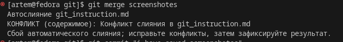

# Работа с git
## Проверка наличия установленного git
В терминале выпонляем команду git version. Если git установлен появится сообщение с инфорацией о версии файла. Иначе будет сообщение об ошибке.
## настройка git
При первом использовании git необходимо представиться. Для этого надо ввести две команды git config --global user.email, git config --global user.name
Для того, чтобы проверить прошла ли регистрация надо ввести команду git config --list.
## Инициализация репозитория 
Для того, чтобы получить репозиторий из папки выпонляем команду git init. В исходной папке появится скрытая папка .git
## Домашняя работа
Описать команды 
* git status
* git add
* git commit
* git log
* git diff
* git chekout
## Проверить статус 
Для того, чтобы проверить нам, в какой ветке мы находимся необходимо прописать git status.
## Выбор нужного файла
Для того, чтобы выбрать файл с которым мы хотим в дальнейшем работать, нужно прописать команду git add, далее выбрать сам файл. 
## Общие команды с git
Для того, чтобы добавить комментарий нужно воспользоваться командой git commit. Так же, чтобы провреить кол-во наших коменнатрий, можем прописать комнаду git log. Чтобы проверить отличия наших файлов нужно просписать команду git diff. Команда git checkout нужна для того, чтобы мы без проблем могли перемещаться в любой commit.
## Добавление картинок и игнорирование файлов 
Для того, чтобы разместить картинку в нашем файле, необходимо добавить ее в нашем файле, после чего она должна отобразиться в проводнике. В нужном месте в файле прописываем следующую команду 
Для того, чтобы удалить файлы с изображениями из отслеживания, нужно создать файл .gitignore.
Чтобы убрать все файлы в формате .png в .gitignore пишем *.png

Конфликт
Тут должен быть конфликт!!!
## Ветвление
Для создания новой ветки нужно ввести команду git branch и название ветки. Ветвление необходимо для работы с файлами в отдельной ветке, сохраняя при этом исходное состояние файла до их слияния. Чтобы отобразить созданные ветки используется команда git branch. Чтобы перейти на другую ветку вводим в терминале комнаду git checkout и имя ветки.
## Конфликт
Хочу увидеть конфликт!!!

Конфликты возникают при слиянии двух веток в одну, и когда в этих ветках была изменена одна и та же строка(строки) файла. Разрешение конфликта возможно путем след. методов: Принять входящее, текущее изменение, оба изменения и сравнить изменение. Выглядит это так:

## Домашка
Дополнить инструкцию своими скринами:
Добавление картинок.
Ветвление.
Слияние веток.
Разрешение конфликтов.
Удаление веток.
Создать и слить минимум 4 ветки.

## Выполнение дз
Для того чтобы произвести слияние веток нужно воспользоваться командой git merge название ветки.. Создали дополнительную ветку fox.  
## Выполнение домашнего задания.
Для начала создадим ветку images, чтобы в дальнейшем добавить туда картинку.
Для того чтобы мы могли добавить картинку, нужно прописать команду .
Чтобы удалить ветку images, нужно прописать команду git branch -d и имя ветки.. Наша ветка удалена, так как всяинфорация, которая там хранилась была перенесена в ветку fox.
## Разрешение конфликтов
После того как произошел конфлик программа предлагает несколько вариантов событий, которые прописаны сверху. Выбираем нужный нам варинт..
Слили ветку panda c веткой fox, поэтосу ветку panda удаляем так как она нам больше не нужна.
## Ветвление 
Для того, чтобы мы могли перемещаться с одной ветки на другую, нужно воспользоваься командой git checkout и имя ветки..
## Конфликт 
Конфликты возникают при слиянии двух веток в одну, и когда в этих ветках была изменена одна и та же строка(строки) файла. Разрешение конфликта возможно путем след. методов: Принять входящее, текущее изменение, оба изменения и сравнить изменение.
## Последнее слияние.
Ветка fox, в которую мы переносили информацию от прошлых веток, теперь сливаем с основной веткой master.
И так же её удаляем, так как все данные перенесены в ветку master. 
## Домашнее задание 
git pull - используется для извлечения и загрузки содержимого из удаленного репозитория и немедленного обновления локального репозитория этим содержимым.
git clone - благодаря данной команде, мы просим Git создать копию репозитория, который находится по ссылке (<ссылка на репозиторий>), и можем указать название новой папки, в которую Git скопирует репозиторий (<название папки>). Если его не указать, папка будет называться так же, как и сам репозиторий.
git push -  консольная команда, которая передаёт в удалённый репозиторий изменения, сделанные в локальном репозитории.
pull reques - запрос на вливание изменений из вашей ветки в основную ветку исходного репозитория.
fork - создание ветвления проекта в собственном пространстве имён, что позволяет вносить публичные изменения и делать свой собственный вклад в более открытом виде.
##Конец