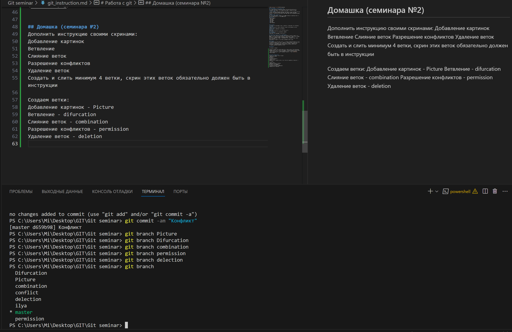

# Работа с git
## Проверка наличия установленного Git
В терминале выполняем команду Git version. Если Git установлен появится сообщение с информацие о версии файла. Иначе будет сообщение об ошибке.
## Настройка Git
При первом использовании Git необходимо представиться. Для этого надо вести две команды: git config --global user.email, git config --global user.name.
Для того, чтобы проверить прошла ли регистрация надо вести комманду git config --list
## Инициализация репозитория
Для того, чтобы получить репозиторий из папки выполняем команду git init. В исходной папке появится скрытая папка .git
## Домашка
Описать команды:
* git status
* git add
* git commit
* git log
* git diff
* git checkout

## Git status 
Отображает состояние файла в каком он находится, используется для определния.
## Git add
Добавляет содержимое рабочего каталога в индекс для последущего коммита.
## Git commit
Создает коммит и указывает его описание.
## Git log
Используется для просмотров истории всех коммитов.
## Git diff
Это команда для просмотра изменений в файлах.
## Git checkout
Используется для навигации среди коммитов.

## Добавление картинок и игнорирование файлов
Для того, чтобы разместить картинку в нашем файле не обходимо добавить ее в папку. После чего она должна отобразиться в проводнике. в нужном месте в файле прописываем следущую команду: 
Для того, чтобы удалить файлы с изображениями из отслеживания, надо создать файл .gitignore
Чтобы убрать все файлы в формате png в gitignore  пишем *.png

## Ветвление
Для создания новой ветки надо ввести  в терминале команду git branch "имя ветки". ветвление не обходимо для работы с файлами в отделной ветке, сохраняя при этом  исходное состояние файла до их слияния. Чтобы отобразить созданные ветки используется команда git branch. Чтобы перейти на другую ветку вводим в терминале команду git checkout имя ветки. Команда git checkout branch -b "имя ветки" создает и переводит вас на эту ветку.

## Конфликты

Хочу увидеть конфликт

Конфликты возникают при слиянии двух веток в одну и когда в этих ветках была изменина одна и таже строка (строки) файла. Разрешение конфликта возможно путем следущих методов: Принять текущее изменение, Принять входящие изменение, Принять оба изменения, сравнить изменения. Выглядит это так: 

## Домашка (семинара №2)
Дополнить инструкцию своими скринами: 
Добавление картинок
Ветвление
Слияние веток
Разрешение конфликтов
Удаление веток
Создать и слить минимум 4 ветки, скрин этих веток обязательно должен быть в инструкции

Создаем ветки:
Добавление картинок - Picture
Ветвление - difurcation
Слияние веток - combination
Разрешение конфликтов - permission
Удаление веток - deletion

Вот так: 

Для создания конфликта переходим на ветку permission и там вставляем скрин ветки. После делаем слияние веток.

В файле gitignore можно прописать типы файлов. Например *.png , *.jpg, *.dng и т.д. , где под * - будут пониматься любое название файла.

Создадим два скрина до удаления веток и после для сравнения: Difurcation и Picture 

*Все удаления веток проходят на ветке master!!!*

## Работа с удаленными репозиториями

Заходим на сайт Github.com и регистрируемся, создаем свой аккунт.

Создаем репозитории на локальном диске и сохраняем на Github. Командой git push для отправки и синхронизации (только первый раз).

В дальнейшем если мы хотим свой файл добавить на Github так же используем команду git push. Если в нашем файле есть ветка то испоьзуем команду git push --set - upstream origin имя файла  

Команда git pull выполняет синхронизацию файла с Github нас локальным диском, при этом записывая файл на локальный диск. Так же этой командой можно  Получать изменения из удалённого репозитория.

Командой git clone "ссылка на репозиторий" "название папки". Таким образом мы создаем копию репозитория, котороый находится по ссылке "ссылка на репозиторий" и можем указать название новой папки куда его и скопируем. Впротивном случае папка будет иметь имя самого репозитория.

В GitHub кнопка Fork дает возможность создать ответления репозитория для дальнейшего добавления в основной репозиторий. Благодаря кнопке Fork можно скачивать оригинальный репозиторий для дальнейшей его обработки (добавления) изминений, а так же работы команды.

С помощью кнопки Pull request мы делаем предложение для изменения основного репозитория. Владелец репозитория смотрит наше предложение и делает решение о добавлении изминений предложенных нами или нет. 