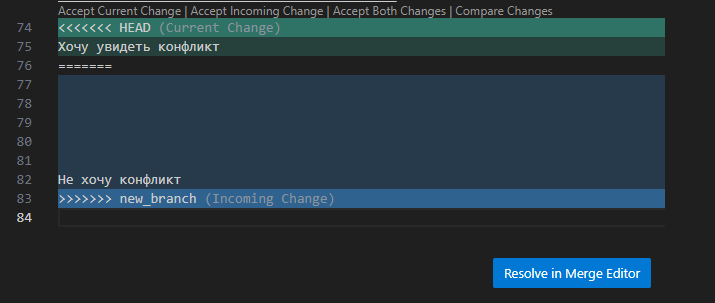

# Инструкция по работе с Git 
***

## Проверка наличия установленного Git

В терминале выполняем команду git version - она выводит версию программы git; если выдает ошибку - git не установлен

## Установка Git

Загружаем последнюю версию Git с сайта <http://git-scm.com/>, устанавливаем с настройками по умолчанию (симулятор нажатия кнопки next)

## Настройка Git

1. git config --global user.name "$user.name"
2. git config --global user.email "$useremail"

Чтобы проверить, запомнил ли Git наши данные, можно ввести команду git config --list

## Инициализация Git

Чтобы инициализировать git, нужно в ПАПКЕ С ПРОЕКТОМ ввести команду git init

# Основные команды Git

- git status
- git add
- git commit
- git log
- git checkout
- git diff
- git reflog

## Команда _**git status**_

Команда *git status* показывает состояния файлов в рабочем каталоге и индексе: какие файлы изменены, но не добавлены в индекс; какие ожидают коммита в индексе. Вдобавок к этому выводятся подсказки о том, как изменить состояние файлов. Необходимо отметить, что файлы, помещенные в .gitignore, данной командой игнорируются.

## Команда _**git add**_

Команда *git add* добавляет содержимое рабочего каталога в индекс для последующего коммита.

## Команда _**git commit**_

Команда *git commit* берёт все данные, добавленные в индекс с помощью *git add*, и сохраняет их слепок во внутренней базе данных, а затем сдвигает указатель текущей ветки на этот слепок.

При использовании опции -a (*git commit -a*) происходит добавление всех изменений в индекс без использования *git add*, что может быть удобным. Опция -m (*git commit -m "сообщение, записываемое в коммит"*) применяется для передачи сообщения коммита без запуска полноценного редактора. В случае применения обоих опций одновременно, команда выглядит следующим образом (*git commit -am "сообщение, записываемое в коммит"*)

## Команда _**git log**_

Команда *git log* используется для просмотра истории коммитов, начиная с самого свежего и уходя к истокам проекта. По умолчанию, она показывает лишь историю текущей ветки. но может быть настроена на вывод истории других, даже нескольких сразу, веток. При спользовании опции --oneline (*git log --oneline*), история коммитов выводится в сокращенном варианте. 
> Пример результата применения команды *git log --oneline*, представлен на фото:

Одна из вещей, которую Git делает в фоновом режиме, является ведение журнала ссылок, в котором сохраняется то, куда указывали **HEAD** и ветки за последние несколько месяцев.

Для просмотра этого журнала используется команда *git reflog*, тем самым являясь альтернативой команде *git log*.
>Пример результата применения команды *git reflog* представлен на фото:

## Команда _**git checkout**_

Команда *git checkout* используется для переключения веток и выгрузки их содержимого в рабочий каталог. Переход от одного коммита к другому. Вариант использвания команды *git checkout master* позволяет вернуться к актуальному состоянию на ветку _**master**_.

## Команда _**git diff**_

Команда *git diff* позволяет увидеть разницу между текущим и закоммиченным файлами. Используется для вычисления разницы между любыми двумя Git деревьями. Это может быть разница между вашей рабочей копией и индексом (собственно *git diff*), разница между индексом и последним коммитом (*git diff --staged*), или между любыми двумя коммитами (*git diff master branchB*).

## Добавление картинок и игнорирование файлов

Чтобы добавить картинку, надо ввести "! [] ()"
Для игнорирования файлов необходимо создать файл ".gitignore", а затем добавить его с помощью команды `git add` и указать в файле то, что хотим игнорировать.

## Чтобы в Git добавить ветку мы используем

git branch <имя создаваемой ветки>

либо командой

git checkout -b <имя создаваемой ветки> - при этом будет осуществлен переход в корень создаваемой ветки.

Ветвление позволяет разделять рабочий процесс.

## Для объединениярабочего процесса в Git предусмотрено слияние веток

Под слиянием веток подразумевается процесс переноса изменений из одной ветки в другую. При этом изначально мы должны находиться на той ветке, в которую принимаем изменения из другой ветки.

Для слияния веток используется команда 
git merge <имя ветки из которой получаем изменения>.

Операция может привести к появлению конфликтов при попытке слить ветки. Это вызвано тем, что изменения удаляют или переписывают информацию в существующих файлах. При попытке некорректного слияния Git останавливает выполнение команды, чтобы вы могли разрешить конфликт.

При возникновении конфликта в процессе слияния веток Git открывает диалоговый процесс разрешения конфликта. Продемонстрировано наглядно ниже.

### Хочу увидеть конфликт (скрин)
 
 
***
***
### ОСНОВНЫЕ КОМАНДЫ, ИСПОЛЬЗУЕМЫЕ ПРИ РАБОТЕ С "УДАЛЕННЫМ" РЕПОЗИТОРИЕМ
***

### Команда git clone <ссылка на удаленный репозиторий>

Команда *git clone* клонирует указанный в ссылке репозиторий на локапльный компьютер.

Клонирование удаленного репозитория осуществляется в случаях, когда возникает необходимость работы над уже существующим кодом, например размещенном на интернет-ресурсе <https://github.com/>.

Для клонирования удаленного репозитория на локальный компьютер выполняем следующие действия:

1. На локальной рабочей станции создаем новую пустую директорию
2. В терминале переходим в указанную выше пустую директорию, и выполняем команду git clone <ссылка на удаленный репозиторий>
3. Убеждаемся в завершении копирования удаленного репозитория в указанную директорию и переходим в директорию клонированного репозитория с помощью команды cd.
4. Создаем новую ветку для дальнейшей работы.

### Команда git fetch <имя удаленного репозитория> и git pull <имя удаленного репозитория>

Команда *git fetch* используется для получения изменений из указанного удаленного репозитория. По умолчанию команда пытается получить изменения из репозитория с именем origin.

Необходимо отметить, что команда не обновляет рабочую копию в соответствии с удаленным репозиторием. Она обновляет только ссылочные объекты (указатели, ветки и теги) и скачивает все необходимые файлы в директорию .git/objects.

Чтобы синхронизировать локальную рабочую копию с удаленным репозиторием, нужно слить удаленные ветки в локальные. Сделать это можно уже знакомой командой *git merge*.

Таким образом команда *git fetch* и *git merge* используются совместно.

Более употребительная команда *git pull*, которая получает изменения из указанного удаленного репозитория и обновляет рабочую копию в соответствии с удаленным репозиторием, при этом команду *git merge* использовать не нужно, слияние происходит автоматически.

### Команда git push <имя удаленного репозитория> <имя ветки>

Команда *git push* загружает изменения в указанный удаленный репозиторий с указанной ветки.

После применения команды git push, git предлагает команду, которую необходимо ввести. 
В предложенном виде она выглядит следующим образом - *git push --set-upstream <имя удаленного репозитория> <имя ветки>* 

В сокращенном виде она выглядит - *git push -u <имя удаленного репозитория> <имя ветки>*

### Что такое fork и pull-request

*fork* нужен для того, чтобы вносить свои изменения в проект, к репозиторию которого нет прямого доступа. Это точная копия чужого репозитория, но в личном аккаунте.

*pull-request* - функция GitHub, позволяющая попросить владельца репозитория, от которого мы сделали форк, загрузить изменения.

Краткая последовательность действий:
1. Делаем *fork* c репозитория проекта
2. Клонируем fork-репозиторий на свою рабочую станцию
3. Создаем новую рабочую ветку
4. Вносим необходимые изменения в проект и делаем коммит
5. Выполняем команду *git push* c указанием своей рабочей ветки
6. После чего в учетной записи на Github появляется кнопка *Compare && pull request*, нажимаем.

На изображении ниже отображен результат применения команды *git push*

Результат после нажатия кнопки *Compare && pull request* ниже

Результат после нажатия кнопки *Create pull request* ниже

***
Более подробная информация по командам Git имеется на сайте [git-scm.com](http://git-scm.com) в раделе [Documentation](https://git-scm.com/book/ru/v2/Приложение-C%3A-Команды-Git-Основные-команды).
***
