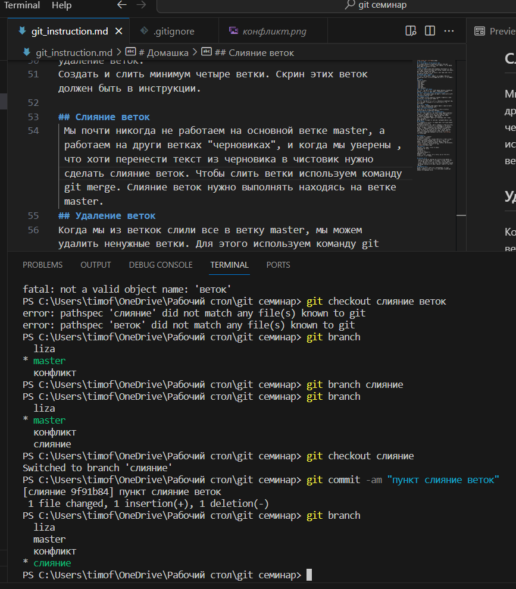
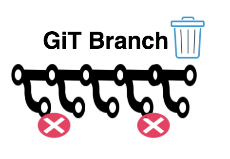

# Работа с GIT 
## Проверка наличия установленного Git
В терминале выполняем команду git version. Если git установлен появится сообщение с информацией о версии файла. Иначе будет сообщение об ошибке.
## Настройка GIT 
При первом использование GIT необхадимо представиться. Для этого надо ввести две команды git config --global user.email,git config --global user.name
Для того чтобы проверить прошла ли регистрация надо ввести команду git config --list
## Инициальзация репазитория 
Для того чтобы получить репазиторий из папки выполняем команду git init. В исходной папке появляестя скрытая папка .git 
# Домашка
Описать команды:
* git status 
* git add
* git commit 
* git log
* git diff
* git checkout 
## Проверяем статус файла 
Для того чтобы посмотреть статус файла выполняе команду git status. Появится вся информация о изменениях в файле.
## Добавить файл или файлы к следующему коммиту
Для того чтобы добавить файл или файлы к следующему коммиту выполняеи команду git add.
## Создание коммита
Для создания коммита выполняем команду и добавляем к нему коментарий в ковычках git commit -m.  
## Посмотреть историю
Для того чтобы посмотреть историю выполняем команду git log.
На экран будет выведена история всех коммитов с их хеш-кодами.
## Просмотр разници 
Чтобы увидеть разницу между текущим файлом и закоммиченным файлом выпоняем команду get diff.
## Переход между коммитами 
Чтобы посмотреть коммит и перейти от одного коммита к другому выпоняем команду git checkout.
## Добавление картинок и игнорирование файлов 
Для того чтобы разместить картинку в нашем файле необходимо добавить её в папку, после чего она должна отобразиться в проводнике. В нужном месте в файле прописываем нужную команду:.
Для того чтобы удалить файлы из отслеживания надо создать файл .gitignore
Чтобы убрать все файлы формата pnj в gitignore пишем *.pnj
## Ветвление
Для созданияновой ветки в терменале нужно ввести git branch и название новой ветки.
Ветвление необходимо для работы с файлами в отдельной ветке, сохраняя при этом исходное состояние файла до их слияния.Чтобы отобразить созданные ветки используется команда git branch.При выполнении команды git branch мы увидем все существующие ветки, ветка, на который мы сейчас работаем, будет отмечена. Чтобы перейти на другую ветку вводим в терминале команду git checkout и имя ветки. 
 
## Конфликты 
тут должен быть конфликт
Хочу увидеть конфликт 
Конфликты возникают при слиянии двух веток в одну и когда в этих ветках была изменена одна и та же строка (строки) файла. Разрешение конфликта возможно путем следующих методов: принять входящие изменения, текущие, оба изменения, сравнить изменения. Выглядит это так:

## Домашка 2
Дополнить инструкцию своими скринами:
добавление картинок;
ветвление;
слияние веток;
разрешение конфликтов;
удаление веток.
Создать и слить минимум четыре ветки. Скрин этих веток должен быть в инструкции.

## Слияние веток 
 Мы почти никогда не работаем на основной ветке master, а работаем на други ветках "черновиках", и когда мы уверены ,что хоти перенести текст из черновика в чистовик нужно сделать слияние веток. Чтобы слить ветки используем команду git merge. Слияние веток нужно выполнять находясь на ветке master.  
## Удаление веток 
Когда ветки слили в ветку master их можно удалить. Для этого испольхуется коменда git branch -d и название ветки, которую нужно удалить.

## Fork 
При работе с репозеториями другого человека нам нужно сделать команду fork на github интересующего нас репозитория из аккаунта другого человека. Вот как это выглядит:

## Git clone 
После того как мы сделали fork нам необходимо сделать clone на наш пк, в этом репозетории создаем свою ветку и работаем там. Команда называется git clone.
## Push 
Когда мы закончили работу в нашей ветке, мы должны отправить это на аккаунт github. Это делается командой git push, после терминал нам выдает ошибку, шде напишет, чего не хватает этой команде. Нужно будет скопировать эту строчку и повторить команду с ней. Это выглядит так: 

## Pull request
После того как мы сделали push, на нашем аккаунте dithub появится кнопка pull request. Нашимая на неё мы оправляем наши изменения на аккаунт человека, который создал изначальный репозеторий. Он сможет посмотреть наши изменения и добавить их к себе или нет. Это выглядит так:
