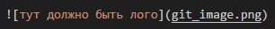

# Инструкция по Git

## 1. Проверка наличия установленного Git

В терминале выполняем команду git version.
    
Если **git установлен**, то появляется **сообщение с информацией о версии файла**. **Иначе** будет **сообщение об ошибке**.

## 2. Установка Git
 Загружаем последнюю версию с сайта - [Скачать Git](https://git-scm.com/downloads)

## 3. Настройка Git
При **первом использовании Git** необходимо **представиться**, для этого надо **ввести две команды**:

- git config --global user.name
- git config --global user.email

Для того чтобы **проверить прошла ли регистрация** надо **ввести команду**:

- git config --list

## 4. Инициализация репозитория 

- Прописываем команду в терминал git init.

В исходной папке **появится скрытая папка** .git

## 5. Проверка репозитория

- Прописываем команду в терминал git status

Если имеются **изменения**, которые **не отслеживаются в git** терминал выдаст следующее сообщение. 

Если же **все изменения сохранены**

## 6. Внесение изменений из рабочего каталога в раздел проиндексированных файлов.

- прописываем команду git add и имя проекта, через пробел, над которым вы работаете. 

Если **изменения сохранены** и никаких **ошибок нет**, **будет выведена рабочая строка** терминала, как на скриншоте выше.

команда git add предшествует команде git commit.

## 7. Сохранение текущего состояния изменений 

- прописываем команду git commit -m "Записываем внесенные изменения"

**git commit** можно рассматривать как команду, которая **создает контрольную точку проекта**.

## 8. Просмотр истории коммитов или журнала изменений проекта 

- прописываем команду git log

В истории мы видим **cохраненные коммиты**, **кто и что сделал**.

Имя коммита или его номер выглядит так, **для открытия коммита достаточно использовать первые четыри символа**.

**Для выхода из команды git log** и возврашения к рабочей строке терминала **наобходимо нажать Q**, что значит quit-выйти.

## 9. Проверка, просмотр и переключение между сохраненными коммитами 

- прописываем команду git checkout и номер коммита 

Как мы видим, нас переключило на коммит под номером 5d87 **switching to 5d87**, это коммит более ранней версии проекта.

**Для возврашения** к основной ветке коммита **прописываем** команду **git checkout master**.

## 10. Вычисление разницы или отличий между коммитами и ветвями

- прописываем команду git diff

Для сравнения коммита из мастер ветви и коммита из лога, достаточно ввести первые четыри символа коммита после diff. Красным указано то, что было удалено а зеленым, что было добавленно.

Для сравнения двух коммитов из лога, нужно ввести первые четыри символа каждого из них после diff.

## 11. Добавление картинок и игнорирование файлов 

Для того, чтобы разместить картинку в нашем файле надо добавить её в папку и после этого в нужном месте пишим следующее:

- 

Для того, __чтобы удалить файлы__ с изображениями __из отслеживания__, надо __создать файл .gitignore__ и **внести** в него **названи картинки с расширением**, если __картинок много__ и они **разного расширения**, нужно **внести используемые расширения через звездочку**.

## 12. Ветвления

Для создания новой ветки, надо ввести в  терминале команду:

- git branch branch_name 

Ветвления необходимо для работы с файлами в отдельной ветке, сохроняя при этом исходное состояние файла до их слияния. Чтобы отоброзить созданные ветки используется команда git branch.

Чтобы перейти на другую ветку, используем команду git checkout имя_ветки.

## 13. Слияние веток

Для слияния веток и внисения изменений в наш основной файл, используется команда:

- git merge имя_ветки 

Слияние делается в ту ветку в которой мы находимся сейчас.

## 14. Конфликты

Тут будет конфликт.

Очень нужен конфликт.
Тут точно должен быть конфликт

конфликты возникают при слиянии двух веток в одну, при этом должна быть изменена одна и таже строка файла.
Конфликт выглядит вот так:

## Домашняя работа второго семинара 

_Создать и слить 4 ветки_

_Спровоцировать конфликт_

Для создания и слияния четырех веток, будут созданы четыре ветки index_15_part1 index_15_part2 index_15_part3 index_15_part4 в них будет расписано, какую команду нужно ввести для удаления ветки. После будет произведено слияние всех частей и создан конфликт с веткой master.

## 15. Удаление ветки

- Для удаления ветки необходимо ввести команду git branch -d имя_ветки.

- Для принудительного удаления ветки без её коммта, необходимо ввести команду git branch -D имя_ветки

Скрин получившегося конфликта в домашней работе:

