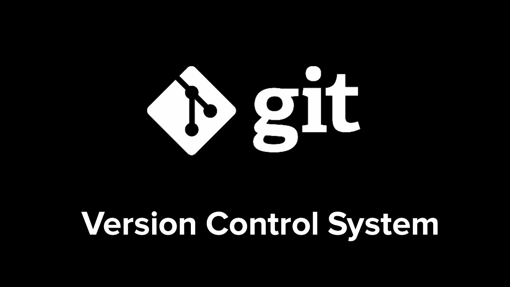
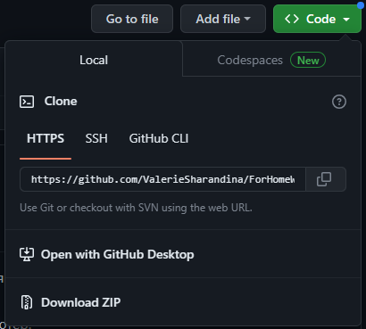
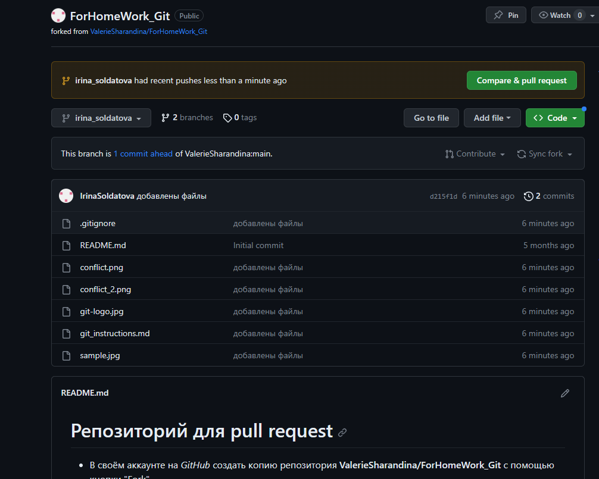

# Инструкция по Git
## 1. Проверка наличия установленного Git
В терминале выполняем команду:
>* git --version

Если Git установлен, то появится информации об актуальной версии приложения. Иначе будет сообщение об ошибке.
## 2. Установка Git
Загрузить последнюю версию с сайта <https://git-scm.com/>
## 3. Настройка Git
После установки необходимо «представиться» системе контроля версий. Это нужно сделать всего один раз, и git запомнит вас. Для этого нужно ввести в терминале 2 команды:
>* git config --global user.name «your_name»
>* git config --global user.email your_email

Чтобы проверить прошла ли регистрация нужно ввести команду:

>* git config --list

## 4. Инициализация репозитория
Для превращения папки в новый Git-репозиторий, в котором можно будет контролировать версии файлов, необходимо ввести команду:
>* git init

В папке появится скрытая папка .git
## 5. Добавление файлов
Чтобы добавить сожержимое рабочей директории в индекс для последующего коммита, необходимо воспользоваться командой:
>* git add name_file

Так же можно добавить все файлы с помощью команды:
>* git add .
## 6. Проверка статуса репозитория
Для того, чтобы узнать состояне файлов в рабочей директории и индексе: какие файлы изменены, но не добавлены в индекс; какие ожидают коммита в индексе. Необходимо ввести команду:
>* git status
## 7. Создание коммитов
Чтобы сохранить все содержимое файлов и его последующие изменения, проиндексированные с помощью команды git add и записать в базу данных новый постоянный снимок состояния, а затем сдвинуть на этот снимок указатель ветки, необходимо воспользоваться командой:
>* git commit -m "message"

Так же можно открыть текстовый редактор в терминале для написания полного сообщения коммита, в котором можно подробно описать изменения внесенные в репозиторий. Для этого используем команду:

>* git commit

Изменить текст последнего коммита, можно с помощью команды:

>* git commit --amend -m "new_message"

Для одновременной команды git add и git commit, можно воспользоваться командой:
>* git commit -am "message"

## 8. Просмотр истории коммитов
Для просмотра истории всех коммитов, начиная с самого свежего и уходя к истокам, надо ввести команду:
>* git log

Для более сокращенного варианта, можно воспользоваться командой:
>* git log --oneline

Для просмотра истории коммитов по всем веткам используется команда:

>* git log --graph

По умолчанию она показывает только историю ветки, в которой вы сейчас находитесь.
## 9. Просмотр изменений до коммита
Для просмотра списка изменений, внесенных в репозиторий до их фиксации, можно воспользоваться командой:
>* git diff

## 10. Переключение между ветками
Для переключения на другую ветку и выгрузки ее содержимого в рабочую директорию, необходимо воспользоваться командой:
>* git checkout name_branch

Чтобы переключиться на состояния файла определенного коммита, необходимо вместо названия ветки указать 4 символа номера(хеша) коммита (номер(хеш) можно узнать через команду git log)

## 11. Добавление картинок и игнорирование файлов
Для того чтобы разместить картинку в нашем файле, надо добавить ее в папку и после этого в нужном месте пишем следующее: ****

  

Для того чтобы удалить файлы с изображениями из отслеживания, надо создать файл **.gitignore** и прописать в нем расширение файлов.
## 12. Ветвление
Для создания новой ветки надо ввести в терминал команду 

>* git branch name_branch

Так же создать новую ветку и одновременно переключиться на нее, можно с помощью команды:
>* git checkout -b name_branch

Ветвление необходимо для работы с файлами в отдельной ветке, сохраняя при этом исходное состояние файла до их слияния.  Чтобы отобразить созданные ветки используется команда: 

>* git branch

Чтобы перейти на другую ветку используем команду:
>* git checkout name_branch
## 13. Слияние веток
Для слияния веток и вненсения изменений в наш основной файл используется команда:

>* git merge name_branch

Слияние делается в ту ветку в которой мы находимся сейчас.
## 14. Конфликты

Хочу увидеть конфликт

Очень нужен конфликт
Хочу увидеть конфликт

Конфликты возникают при слиянии двух веток в одну, при этом должна быть изменена одна  та же строка файла.  
Конфликт выглядит вот так:

## 15. Удаление веток

Если вы завершили работу над веткой и объеденили ее с основной, можно ее удалить без потери истории. Для этого необходи воспользоваться командой:
> * git branch -d branch_name

Если  выполнить команду удаления до слияния, то появится сообщение об ошибке. Для принудительного удаления ветки используется команда:
>* git branch -D branch_name

В этом случаее ветка будет удалена независимо от текущего статуса, без предупреждений.
 ## 16. Работа с удаленными репозиториями.

 Удаленный (иногда говорят "внешний") репозиторий – это версии вашего проекта, сохраненные на удаленном сервере. Доступ к репозиторию на таком сервере может осуществляться по интернету или по локальной сети. 
### Клонирование репозитория.
 Рассмотрим на примере работы с сайтом GitHub.  
 Для работы с удаленными репозиториями необходимо зарегистроваться на сайте <https://github.com/>. После этого появится доступ к необходимым репозиториям.

 Чтобы приступить к работе над каким-либо проектом, необходимо сначала перейти к репозиторию данного проекта на сайте. 
 
 + Далее надо выгрузить проект к себе на страницу, для этого используется кнопка **Fork**

 

 + Далее написать имя репозитория и нажать кнопку Creat Fork. После этого страница сайта обновится, мы окажемся на странице своего аккаунта, где будет отображаться репозиторий добавленного проекта.

 + После этого можно забрать проект на свой компьютер, для этого необходимо нажать на кнопку **Code** и скопировать ссылку.

 

 + Далее создаем рабочую папку в любом удобно месте, чтобы поместить туда проект. И через терминал выполняем клонирование репозитория с помощью команды:

 >+ git clone *ref_name*

 + После этого с помощью команды cd или вручную переходим в необходимую директорию. Создаем свою ветку и только после этого начинаем добавлять свои изменения.

 ### Получение изменений из удаленного репозитория.

 Для того, чтобы получить изменения и сразу обновить рабочую копию так, чтобы она соответствовала удаленному репозиторию, необходимо воспользоваться командой:
 >+ git pull

 Для того, чтобы получить изменения, но не обновлять рабочую копию в соответствии с удаленным репозиторием. А обновить только ссылочные объекты (указатели, ветки и теги) и скачать все необходимые файлы в директорию *.git/objects*. Необходимо воспользоваться командой:

 >+ git fetch name_remote_repository

 ### Отправка изменений в удаленный репозиторий.

 Для того, чтобы загрузить в удаленный репозиторий все свои локальные изменения, необходимо воспользоваться командой:

 >+ git push

 Далее вам будет подсказана точная команда, которая загрузит ваши изменения в конкретный репозиторий с конкректной ветки.

 Для того, чтобы отправить все ветки, необходимо воспользоваться командой:
 >+ git push --all

 Для того, чтобы удалить ветку в удаленном репозитории, необходимо воспользоваться командой:

 >+ git push name_remote_repository name_branch

 ### Pull - request

После того как мы внесли наши необходимые изменения в проект и загрузили их в удаленный репозиторий, мы можем попросить владельца зугрузить их в свой репозиторий. Для этого необходимо сделать pull-request.
Для этого необходимо нажать **Сompare & pull request**

После этого нажимаем **Compare** (название нашей ветки), добавляем комментарий и нажимаем **Create pull request**. И наши изменения будут отправлены.