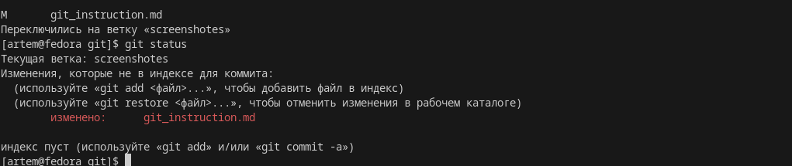
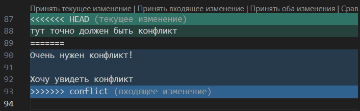

# Работа с GIT
## Проверка наличия установленного GIT
В терминале выполняем команду Git version. Если git установлен, то появится сообщение с информацией о версии файла. Иначе будет сообщение об  ошибке.
## Настройка git
При первом использовании git неоьходимо представиться. Для этошо надо ввести две команды: ***git config --global user.email***, ***git config --global user.name***.
Для того, чтобы проверить прошла ли регистрация надо ввести команду ***git config --list***
## Инициализация репозитория
Для того, чтобы получить репозиторий из папки выполняем команду ***git init***. В исходной папке появится скрытая папка .git
## Домашняя работа
# GIT STATUS
Для того чтобы увидеть текущее положение (статус) созанного нами репозотория используется команда ***git status***.

# GIT ADD
Для того чтобы добавить новый изменяемый файл в рабочий репозиторий используется команда ***git add***.
# GIT COMMIT
Для того чтобы добавить текстовый коментарий(коммит) к измененному файлу версий используется команда ***git commit***
# GIT LOG
При помощи команды ***git log*** на экран терминала выводятся все созданные комментарии (коммиты) созданные для данного файла.
# GIT DIFF
Команда ***git diff*** выводит на экран терминала сравнение изменений между двумя или более версиями файла.
# GIT CHECKOUT
Для того чтобы перемещаться между различными версиями файла (коммитами) используется команда ***git checkout***.

# Домашняя работа №2
Дополнить инструкцию своими скринами
Добавление картинок
Ветвление
Слияние веток
Удаление веток
Разрешение конфликтов

# Выполнение домашней работы №2
# Добавление картинки
Для того чтобы разместить картинку в нашем файле необходимо добавить её в папку, после чего она должна отобразиться в проводнике. В нужном месте в файле прописываем следующую команду 
Для того чтобы удалить файлы с изображениями из отслеживания, нужно создать файл .gitignore
Чтобы убрать все файлы формата png или jpeg в gitignore пишем .png или .jpeg
# Ветвление
Для создания новой ветки необходимо ввести команду git branch имя новой ветки. Ветвление необходимо для работы с файлами в отдельной ветке, сохраняя при этом состояния файла до их слияния. Чтобы отобразить созданные ветки используется команда git branch. Чтобы перейти в другую ветку используют команду git checkout имя новой ветки.
# Cлияние веток
Для слияния веток в одну необходимо ввести команду ***git merge "Название сливаемой ветки"***. 
***ВАЖНО!!!*** Слияние веток происходит сливаемой в активную
# Удаление веток
Для удаления веток необходимо ввести команду в терминал ***git branch -d "Название удаляемой ветки"***.
## Конфликт
Хочу увидеть конфликт!!!
Конфликты возникают при слиянии двух веток в одну и когда в этих ветках была изменена одна и та же строка (строки) файла. Разрешение конфликта возможно путем следующих методов: Принять текущее, Принять входящее изменение, Принять оба изменения, Сравнить изменения. Выглядит это так:

# Работа с удалёнными репозиториями
Для того, чтобы внести вклад в какой-либо Git-проект, вам необходимо уметь работать с удалёнными репозиториями. Удалённые репозитории представляют собой версии вашего проекта, сохранённые в интернете или ещё где-то в сети. У вас может быть несколько удалённых репозиториев, каждый из которых может быть доступен для чтения или для чтения-записи. Взаимодействие с другими пользователями предполагает управление удалёнными репозиториями, а также отправку и получение данных из них. Управление репозиториями включает в себя как умение добавлять новые, так и умение удалять устаревшие репозитории, а также умение управлять различными удалёнными ветками, объявлять их отслеживаемыми или нет и так далее. В данном разделе мы рассмотрим некоторые из этих навыков.
Для того, чтобы просмотреть список настроенных удалённых репозиториев, вы можете запустить команду git remote. Она выведет названия доступных удалённых репозиториев. Если вы клонировали репозиторий, то увидите как минимум origin — имя по умолчанию, которое Git даёт серверу, с которого производилось клонирование
Для того, чтобы добавить удалённый репозиторий и присвоить ему имя, просто выполните команду 
**git remote add <name> <url>**:
Когда вы хотите поделиться своими наработками, вам необходимо отправить их в удалённый репозиторий. Команда для этого действия простая:
 **git push <remote-name> <branch-name>**. 
Чтобы отправить вашу ветку master на сервер origin, вы можете выполнить следующую команду для отправки ваших коммитов 
**git push origin master**
Эта команда срабатывает только в случае, если вы клонировали с сервера, на котором у вас есть права на запись, и если никто другой с тех пор не выполнял команду push. Если вы и кто-то ещё одновременно клонируете, затем он выполняет команду push, а после него выполнить команду push попытаетесь вы, то ваш push точно будет отклонён. Вам придётся сначала получить изменения и объединить их с вашими и только после этого вам будет позволено выполнить push. 
Если хотите получить побольше информации об одном из удалённых репозиториев, вы можете использовать команду 
**git remote show <remote>**.
Для переименования удалённого репозитория можно выполнить **git remote rename**. Это также изменит имена удалённых веток в вашем репозитории.

Если по какой-то причине вы хотите удалить удалённый репозиторий — вы сменили сервер или больше не используете определённое зеркало, или кто-то перестал вносить изменения — вы можете использовать **git remote rm**:

P.S: Спасибо большое Валерия за курс!! Было очень интересно, открыл для себя много нового! К сожалению не смог присутствовать на онлайн семинарах, но надеюсь я правильно понял как нужно делать задания! Всего вам наилучшего!