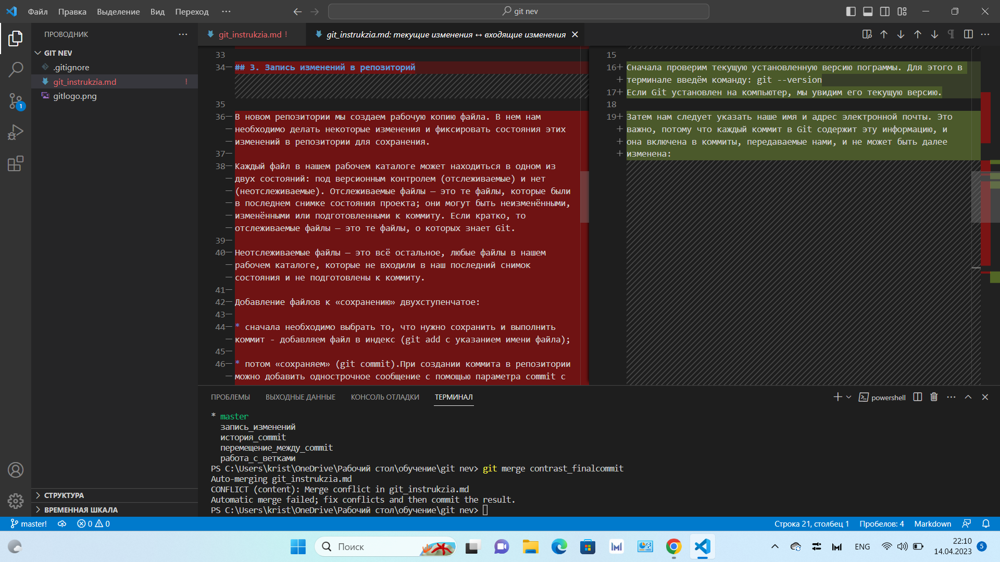

# *Инструкция по Git*

## 1. Установка и настройка Git

Git — это распределенная система контроля версий, которая позволяет разработчикам отслеживать изменения в коде с течением времени. Она хранит все версии проекта в репозитории, предоставляя пользователям возможность переходить от одной версии к другой. Кроме того, она позволяет нескольким программистам работать над одним проектом одновременно, что значительно упрощает совместный труд. Git — самая популярная система контроля версий, но не единственная. Алгоритм работы подобных систем схож.

Для установки Git воспользуемся одним из доступных способов, для этого необходимо зайти на официальном сайте Git (https://git-scm.com/). Выбрать свою ОС (в моем случае Windows) разрядность ПК. Загрузка запустится автоматически. После загрузки файла его необходимо установить на компьютер. Заходим в загрузки и запускаем установку Git. 

Осваивать Git проще с редактором файлов. Для удобства так же скачаем Visual Studio Code с официального сайта - https://code.visualstudio.com/. По анологии с установкой Git, скачиваем и устанавливаем VSCode. Visual Studio Code устанавливаем после установки Git.

Когда Git установлен в нашей системе, необходимо настроить среду для работы с Git под себя. Это нужно сделать только один раз — при обновлении версии Git настройки сохранятся. Но, при необходимости, мы можем поменять их в любой момент, выполнив те же команды снова.
Репозиторий Git - это виртуальное хранилище проекта. В нем можно хранить версии кода для доступа по мере необходимости. 

Для создания нового репозитория используется команда git init. Команду git init выполняют только один раз для первоначальной настройки нового репозитория. Выполнение команды приведет к созданию нового подкаталога git в нашем рабочем каталоге. Кроме того, будет создана новая главная ветка.

Открываем терминал Git Bash. Сначала проверим текущую установленную версию пограммы. Для этого в терминале введём команду: git --version
Если Git установлен на компьютер, мы увидим его текущую версию.

Затем нам следует указать наше имя и адрес электронной почты. Это важно, потому что каждый коммит в Git содержит эту информацию, и она включена в коммиты, передаваемые нами, и не может быть далее изменена:

*git config --global user.name name*

*git config --global user.email name@example.com*

Если указана опция --global, то эти настройки достаточно сделать только один раз, поскольку в этом случае Git будет использовать эти данные для всего, что мы делаем в этой системе.

Используя команду git config --list, мы можем проверить все настройки, которые Git найдёт.

## 2. Инициализация репозитория

Репозиторий Git - это виртуальное хранилище проекта. В нем можно хранить версии кода для доступа по мере необходимости. 

Для создания нового репозитория используется команда git init. Команду git init выполняют только один раз для первоначальной настройки нового репозитория. Выполнение команды приведет к созданию нового подкаталога git в нашем рабочем каталоге. Кроме того, будет создана новая главная ветка.

Для того чтобы Git начал отслеживать нашу папку, можно с помощью VSCode открыть данную папку. Командой git status убедимся, что данная папка не является репозиторием, и вызовем команду Git init. В папке создаётся скрытая папка .git. А так же Git создаёт ветку с именем master по умолчанию. 

## 3. Запись изменений в репозиторий

В новом репозитории мы создаем рабочую копию файла. В нем нам необходимо делать некоторые изменения и фиксировать состояния этих изменений в репозитории для сохранения.

Каждый файл в нашем рабочем каталоге может находиться в одном из двух состояний: под версионным контролем (отслеживаемые) и нет (неотслеживаемые). Отслеживаемые файлы — это те файлы, которые были в последнем снимке состояния проекта; они могут быть неизменёнными, изменёнными или подготовленными к коммиту. Если кратко, то отслеживаемые файлы — это те файлы, о которых знает Git.

Неотслеживаемые файлы — это всё остальное, любые файлы в нашем рабочем каталоге, которые не входили в наш последний снимок состояния и не подготовлены к коммиту.

Добавление файлов к «сохранению» двухступенчатое:

* сначала необходимо выбрать то, что нужно сохранить и выполнить коммит - добавляем файл в индекс (git add с указанием имени файла);

* потом «сохраняем» (git commit).При создании коммита в репозитории можно добавить однострочное сообщение с помощью параметра commit с флагом -m. Само сообщение вводится непосредственно после флага, в кавычках.

Так же для сохранения изменений в файле можно использовать объединенную команду git commit с флагом -am и сообщение в кавычках.

## 4. Получение информации об истории commit

После того как мы создали несколько коммитов, чтобы узнать, что происходило с этим репозиторием, можно посмотреть историю сохранений. Наиболее простой инструмент для этого — команда git log.

По умолчанию git log выводит список коммитов созданных в данном репозитории в обратном хронологическом порядке. То есть самые последние коммиты показываются первыми. Так же там отражена информация об авторе и дате изменения. Git log отображает историю коммитов той ветки,в которой мы находимся.

Для получения общего представления о проекте можно использовать команду git log --oneline. Флаг --oneline записывает каждый коммит в одну строку. По умолчанию отображаются только идентификаторы коммитов и первые строки комментариев к ним. Это удобно если мы просматриваем большое количество коммитов. 

## 5. Сравнение с последним commit 

Для вычисления разницы между любыми двумя Git деревьями используется команда git diff. Это может быть разница между вашей рабочей копией и индексом (собственно git diff), разница между индексом и последним коммитом (git diff --staged), или между любыми двумя коммитами (git diff master branchB).

## 6. Перемещение между сохранениями

Для переключение между версиями используется команда git checkout. Git checkout позволяет перемещаться между ветками, созданными командой git branch . При переключении ветки происходит обновление файлов в рабочем каталоге в соответствии с версией, хранящейся в этой ветке, а Git начинает записывать все новые коммиты в этой ветке.

Так же git checkout  применяется для перемещения между commit. 

Нам необходимо ввести команду git checkout и название той ветки или commit, куда необхимо попасть.

## 7. Работа с ветками

Ветвление стало неотъемлемой частью командной разработки, потому что оно дает возможность работать над разными версиями исходного кода. Основной идеей ветвления является отклонение от основного кода и продолжение работы независимо от него.

Под веткой принято понимать независимую последовательность коммитов в хронологическом порядке. Имя основной ветки Git-проекта по умолчанию — master (однако зачастую бывает main, например, в GitHub), она появляется сразу при инициализации репозитория. Эта ветка ничем не отличается от остальных и также ее можно переименовать, но по договоренности master принято считать главной веткой в проекте.

Команда git branch — главный инструмент для работы с ветвлением. С ее помощью можно добавлять новые ветки, перечислять и переименовывать существующие и удалять их.

Чтобы в Git добавить ветку мы используем: git branch и имя новой ветки.

После данной операции ветка уже была создана, но вы по-прежнему находитесь в прежней ветке. Если вы планируете переместиться на другую ветку, в том числе только что созданную, необходимо написать checkout: git checkout и имя ветки.

Часто при создании новой ветки git нам необходимо сразу же переключиться на нее. В таком случае стоит использовать: git checkout branch и имя ветки. 
Это равносильно последовательным командам: 

*git branch имя ветки*

*git checkout имя ветки*

Также мы получим тот же результат при использовании git checkout с ключом -b:

*git checkout -b имя ветки*

При выполнении просто команды git branch без названия ветки, мы получим список существующих веток, где символом "*" будет отмечена ветка, где мы сейчас находимся. Это может выглядеть так:

*init_repo*

*master*

*запись_изменений*

*история_commit*

**конфликты_Git*

*перемещение_между_commit*

*работа_с_ветками*

*сравнение_commit*

В процессе разработки могут возникнуть ситуации, когда нам необходимо по-другому называть уже созданную ветку. Чтобы переименовать ветку применяем:

*git branch -m новое имя ветки*

Данную команду применяем, находясь на ветке, которую переименовываем.
Однако здесь нужно быть аккуратными, чтобы не перегрузить проект ненужными ветками. Если запушить переименованную ветку, то на сервере появится ветка с новым именем, но и ветка со старым названием тоже останется. Чтобы избежать такой проблемы, необходимо удалить ветку локально и на сервере.

Удаление веток не такой простой процесс, как может показаться. Можно случайно удалить несохраненные изменения в исходном коде, что приведет к нежелательным последствиям. Поэтому здесь нужно действовать осторожно. С операцией удаления над ветками справляется уже привычная команда git branch с параметром -d:

*git branch -d имя ветки*

Для корректного удаления нужно помнить несколько правил, чтобы не получить ошибки:

Нельзя удалить ветку, в которой мы находимся. Git выкинет ошибку и не произведет удаление. Следовательно, нужно перейти на другую ветку.

Git не позволит удалить ветку, у которой есть несохраненные изменения. Так мы избегаем ситуации, когда часть написанного кода будет безвозвратно утеряна. Если же мы уверены, что изменения в этой версии не нужны и их можно смело удалять, то вместо флага -d используем -D:

*git branch -D имя ветки*

Для слияния веток использутся команда - git merge.
Сливать друг в друга можно любые ветки. Технически, с точки зрения git нет никакой разницы, сливается ветка с новым функционалом в мастер или наоборот. Для нас мастер - это основная ветка разработки, а для git это просто ветка. Поэтому, чтобы правильно произвести сливание веток, команду 
git merge необходимо вызывать из той ветки куда нужно поддтянуть информацию. Как правило это основная ветка master.

## 8. Конфликты слияния в Git

Системы контроля версий предназначены для управления дополнениями, вносимыми в проект множеством распределенных авторов (разработчиков). Иногда один и тот же контент могут редактировать сразу несколько разработчиков.  Для предотвращения конфликтов разработчики работают в отдельных изолированных ветках. Основная задача команды git merge заключается в слиянии отдельных веток и разрешении любых конфликтующих правок.

При слиянии одной ветви с другой изменения файлов из фиксаций в одной ветви могут конфликтовать с изменениями в другой. Git пытается устранить эти изменения, используя журнал в репозитории, чтобы определить, как должны выглядеть объединенные файлы. Если неясно, как объединить изменения, Git останавливает слияние и сообщает, какие файлы конфликтуют.

Обычно конфликты возникают, когда два человека изменяют одни и те же строки в файле или один разработчик удаляет файл, который в это время изменяет другой разработчик. В таких случаях Git не может автоматически определить, какое изменение является правильным. Git помечает файл как конфликтующий, останавливает процесс слияния и предлагает варианты для решения данного конфликта (рис. 1): 
- принять текущие изменения;
- принять входящие изменения;
- принять оба изменения;
- сравнить изменения.

Рисунок 1

При выборе первый 3-х вкладок, мы решаем какой вариант оставить. Сранение - в новой вкладке наглядно показывает нам отличие двух файлов. (рис. 2)

Рисунок 2

Сравнив варианты, выбираем подходящий нам.

## 9. Работа с удалёнными репозиториями

Для того, чтобы внести вклад в какой-либо Git-проект, нам необходимо уметь работать с удалёнными репозиториями. Удалённые репозитории представляют собой версии нашего проекта, сохранённые в интернете или ещё где-то в сети. У нас может быть несколько удалённых репозиториев, каждый из которых может быть доступен для чтения или для чтения-записи. Взаимодействие с другими пользователями предполагает управление удалёнными репозиториями, а также отправку и получение данных из них.

В качестве примера, мы будем использовать сервис хостинга удаленных репозиториев GitHub. GitHub - самый популярный сервис Git компании Майкрософт для организации работы удаленных репозиториев. В нем множество дополнительных функций и огромный архив различного кода.

Для работы в GitHab необходимо авторизоваться и связать свой личный кабинет с локальным Git.

Чтобы скопировать готовый репозиторий с сайта GitHab, воспользуемся командой git clone. Создаем новую папку, чтобы ее не отслеживал Git.
Открываем ее с помощью VSCode. Проверяем с помощью команды git status что в папке нет репозитория. Вводим команду git clone и вставляем скопированную ссылку. скопированные документы появляются в нашей папке. Далее нам необходимо с помощью команды cd зайти в нашу скопированную папку.

