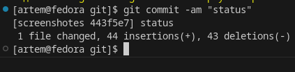
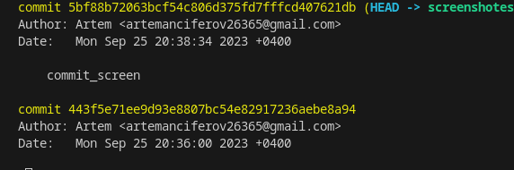

## GIT
# Руководство по работе с системой контроля версий git в организации Le, а также облачными сервисами GitHub и GitLab.
## Зачем нам GIT?
Не секрет, что совместная разработка - это, определённого рода, боль: разное окружение, все над чем-то работают, постоянно затрагивается код друг друга и т.п. Благодаря git, процесс совместной разработки становится приятнее, так как мы чётко видим и контролируем процесс разработки.
Благодаря удалённым репозиториям, таким как GitLab, мы обеспечиваем совместную работу с минимальным шансом возникновения конфликтов. Помимо этого, мы также обеспечиваем работу проекта в формате CI\CD.
# GIT крутил и меня тоже | да крутил

## Соглашение о ветках, коммитах и PR
*Простое соглашение о том, как нужно создавать ветки и писать сообщения коммитов/PR.*
## Настройка
Итак, мы установили git, теперь нужно добавить немного настроек. Есть довольно много опций, с которыми можно играть, но мы настроим самые важные: наше имя пользователя и адрес электронной почты. Откройте терминал и запустите команды:

Теперь каждое наше действие будет отмечено именем и почтой. Таким образом, пользователи всегда будут в курсе, кто отвечает за какие изменения — это вносит порядок.
Git хранит весь пакет конфигураций в файле .gitconfig, находящемся в вашем локальном каталоге. Чтобы сделать эти настройки глобальными, то есть применимыми ко всем проектам, необходимо добавить флаг –global. Если вы этого не сделаете, они будут распространяться только на текущий репозиторий.
Для того, чтобы посмотреть все настройки системы, используйте команду:

Для удобства и легкости зрительного восприятия, некоторые группы команд в Гит можно выделить цветом, для этого нужно прописать в консоли:

Если вы не до конца настроили систему для работы, в начале своего пути - не беда. Git всегда подскажет разработчику, если тот запутался, например:

Команда git --help - выводит общую документацию по git
Если введем git log --help - он предоставит нам документацию по какой-то определенной команде (в данном случае это - log)
Если вы вдруг сделали опечатку - система подскажет вам нужную команду
После выполнения любой команды - отчитается о том, что вы натворили
Также Гит прогнозирует дальнейшие варианты развития событий и всегда направит разработчика, не знающего, куда двигаться дальше
Тут стоит отметить, что подсказывать система будет на английском, но не волнуйтесь, со временем вы изучите несложный алгоритм ее работы и будете разговаривать с ней на одном языке.

# Создание нового репозитория
Как мы отметили ранее, git хранит свои файлы и историю прямо в папке проекта. Чтобы создать новый репозиторий, нам нужно открыть терминал, зайти в папку нашего проекта и выполнить команду init. Это включит приложение в этой конкретной папке и создаст скрытую директорию .git, где будет храниться история репозитория и настройки.
Создайте на рабочем столе папку под названием git_exercise. Для этого в окне терминала введите:

Командная строка должна вернуть что-то вроде:

Это значит, что наш репозиторий был успешно создан, но пока что пуст. Теперь создайте текстовый файл под названием hello.txt и сохраните его в директории git_exercise.
# Определение состояния
status — это еще одна важнейшая команда, которая показывает информацию о текущем состоянии репозитория: актуальна ли информация на нём, нет ли чего-то нового, что поменялось, и так далее. Запуск git status на нашем свежесозданном репозитории должен выдать:

Сообщение говорит о том, что файл hello.txt неотслеживаемый. Это значит, что файл новый и система еще не знает, нужно ли следить за изменениями в файле или его можно просто игнорировать. Для того, чтобы начать отслеживать новый файл, нужно его специальным образом объявить.

## Фиксация изменений
# Как сделать коммит
Представим, что нам нужно добавить пару новых блоков в html-разметку (index.html) и стилизовать их в файле style.css. Для сохранения изменений, их необходимо закоммитить. Но сначала, мы должны обозначить эти файлы для Гита, при помощи команды git add, добавляющей (или подготавливающей) их к коммиту. Добавлять их можно по отдельности:

или вместе - всё сразу:

Конечно добавлять всё сразу удобнее, чем прописывать каждую позицию отдельно. Однако, тут надо быть внимательным, чтобы не добавить по ошибке ненужные элементы. Если же такое произошло изъять оттуда ошибочный файл можно при помощи команды
 
Теперь создадим непосредственно сам коммит
 
Флажок -m задаст commit message - комментарий разработчика. Он необходим для описания закоммиченных изменений. И здесь работает золотое правило всех комментариев в коде: «Максимально ясно, просто и содержательно обозначь написанное!»
# Как посмотреть коммиты
Для просмотра все выполненных фиксаций можно воспользоваться историей коммитов. Она содержит сведения о каждом проведенном коммите проекта. Запросить ее можно при помощи команды:
 
В ней содержится вся информация о каждом отдельном коммите, с указанием его хэша, автора, списка изменений и даты, когда они были сделаны. Отследить интересующие вас операции в списке изменений, можно по хэшу коммита, при помощи команды git show :
 
Ну а если вдруг нам нужно переделать commit message и внести туда новый комментарий, можно написать следующую конструкцию:
 
В данном случае сообщение последнего коммита перезапишется. Но злоупотреблять этим не стоит, поскольку эта операция опасная и лучше ее делать до отправки коммита на сервер.
## Ветки
Создав ветвь, начинай вносить в неё изменения. Добавляя, редактируя или удаляя файлы, не забывай делать новые фиксации (commits) в ветви. Последовательность фиксаций образует в конечном счёте прозрачную историю работы над вашей задачей, по которой остальные смогут понять что ты делал и почему.
## Основные ветки в репозиториях:
master - основная ветка рабочего проекта, настроенная на тестовый стенд
develop - ветка для разработки (опционально)
prod - основная ветка рабочего проекта, настроенная на prod-сервер (опционально)
feat/*new_feature* - ветки для внесения новых фич
fix/*fix_name_or_issue_id* - ветки для исправления багов
...другие ветки смотрите ниже в таблице
Другие ветки, отличные от fix и feat разрешены. Например, nuxt3-configuration. В этом случае, вы не добавляете функционал и не фиксите баги, а работаете над окружением проекта.

## Основные префиксы для типов веток:
*build*     Сборка проекта или изменения внешних зависимостей
*ci*       Настройка CI и работа со скриптамиci
*docs*      Обновление документации
*feat*      Добавление нового функционала
*fix*       Исправление ошибок
*perf*      Изменения направленные на улучшение производительности
*refactor*  Правки кода без исправления ошибок или добавления новых функций
*revert*    Откат на предыдущие коммиты
*style*    Правки по кодстайлу (табы, отступы, точки, запятые и т.д.) 
*test*      Добавление тестов

## Коммиты
# Open Source 
проекты ведутся на английском языке, а приватные проекты на русском языке (кроме имён веток, версий и тегов). Это относится также к комментированию кода.
У каждой фиксации есть связанное сообщение, являющееся объяснением, почему было сделано то или иное изменение. Также каждая фиксация считается отдельной единицей изменения. Это позволяет откатить изменения, если обнаружилась ошибка, или если ты решишь пойти в другом направлении.
Внятное описание фиксации очень важно, так как позволяет остальным разработчикам (нашим коллегам) сразу понять твои намерения и оценить насколько внесённые изменения им соответствуют. А значит обратная связь от них придёт быстрее и окажется полезней.
Вливай изменения в свою ветвь как можно чаще, чтобы она всегда оставалась актуальной и готовой к обратному слиянию. Разрешение возможных конфликтов слияния — право и обязанность разработчика ветви, так как именно он лучше всего знает зафиксированные в ней изменения. Но выполнять слияние имеет право **ТОЛЬКО** TeamLead.
Область изменений (scope)
Работая над новым функционалом или исправлением багов, вы можете добавлять scope к описанию коммита, который укажет на область изменений (см. примеры).
Спецификации
Коммиты **ДОЛЖНЫ** начинаться с префикса, который содержит существительное feat, fix и др., за которым следует двоеточие и пробел
Тип feat ДОЛЖЕН использоваться для коммитов, которые добавляют новую функциональность
Тип fix ДОЛЖЕН использоваться для коммитов, которые исправляют баги
НЕ ОБЯЗАТЕЛЬНАЯ область (scope) МОЖЕТ быть указана после типа. Область - это фраза, описывающая контекст кодовой базы, измененной коммитом, заключенная в круглые скобки. Например, fix(parser):
Краткое описания ДОЛЖНО следовать сразу же после указания префикса типа/области. Краткое описание - это сжатое описание изменения кода, которое несет в себе коммит, например, fix: исправлена проблема с undefined при получении статей в рекомендациях
Тело коммита содержит в себе дополнительное, полное описание о изменении кодовой базы. Оно **МОЖЕТ** следовать после краткого описания. Тело **МОЖЕТ** идти после краткого описания, через одну пустую строку
Типы отличные от feat и fix **ДОЛЖНЫ** использоваться в сообщениях коммитов

## Примеры
*Коммит, добавляющий новую функциональность
Ветка feat/name_new_feature
Описание коммита: feat: добавлен функционал *название нового функционала*
Коммит с указанной областью (scope)
Ветка feat/add_polish_lang
Описание коммита: feat(lang): добавлен польский язык
Коммит, исправляющий баги и содержащий (необязательный) номер в баг-трекере (issues)
Ветка fix/fix_name_or_issue_id
Описание коммита: 
fix: исправил типизацию сообщений в чате
issue #123
Коммит, не содержащий функционала или фиксов
Ветка init-nuxt-project
Описание коммита: init-nuxt-project: инициализировал nuxt 3
Почему нужно использовать Общепринятые Коммиты
Автоматически создаваемые CHANGELOG’и
Коммуникация о характере изменения между товарищами по команде, общественностью и другими заинтересованными сторонами
Автоматически срабатываемый процесс сборки и публикации (ci/cd)
Людям проще участвовать в вашем проекте, потому что им доступна более структурированная история коммитов*

## *FAQ*
Как я должен писать сообщения коммитов на начальной стадии разработки?
Рекомендуется писать сообщения коммитов так, как будто вы уже выпустили продукт. Как правило, кто-то, например, ваши коллеги, уже используют ваш код. И они хотят знать, что исправилось, что изменилось, какие нарушения обратной совместимости появились и т.д.
В каком регистре я должен писать заголовки коммитов?
Любой регистр можно использовать, но лучше во всей истории использовать один стиль.
Что мне делать, если коммит должен содержать больше одного типа?
Вернитесь назад и сделайте несколько коммитов, если это возможно. Часть из преимуществ использования Общепринятых Коммитов - это его способность побуждать делать более организованные коммиты и PR’ы.
Разве это не препятствует быстрому развитию и быстрой интеграции?
Это препятствует быстрому развитию в неорганизованном виде. Это помогает быстро двигаться в нескольких проектах с несколькими участниками.
Могут ли Общепринятые Коммиты заставить разработчиков ограничивать их типы коммитов, потому что им придется думать об этих типах?
Общепринятые Коммиты побуждают делать больше коммитов с определенными типами, такими как fix. Кроме того, гибкость Общепринятые Коммиты позволяют вашей команде создавать свои собственные типы и изменять их с течением времени.
Как мне эффективнее внести новый функционал?
Можно сделать что-то вроде:
git clone *remote repo* - клонируем проект, если ещё не клонировали
git checkout -b feat/*new_feature* - создаём ветку и сразу переключаемся
git commit -m "feat: *что сделали?*" - делаем коммиты по каждым основным изменениям (предварительно не забываем добавить файлы git add *file or directory* c изменениями)
git push origin HEAD - пушим коммиты в свою ветку (если ты хочешь отправить ветку, отличную от текущей, команда не будет работать)
Что, если пришлось на этапе работы над функцией заняться, например, исправлением бага, а изменения совсем не готовы для коммита?
git stash - сохраняем изменения (подробнее*)
git checkout -b fix/*fix_name_or_issue_id* - создаём ветку и сразу переключаемся
git commit -m "fix: *что сделали?*" - делаем коммит(-ы), предварительно не забыв добавить файлы git add *file or directory* c изменениями)
git push origin HEAD - пушим коммиты в свою ветку (если ты хочешь отправить ветку, отличную от текущей, команда не будет работать)
git checkout feat/*new_feature* - возвращаемся на ветку
git stash apply - возвращаем незавершенный код
Настроим утилиту commitizen
Этот инструмент позволяет генерировать коммиты при помощи встроенного визарда. Кроме того, commitizen хорошо поддерживается сообществом и, благодаря дополнительным модулям, отлично настраивается.
1. Установим утилиту commitizen глобально (вам могут потребоваться права администратора).
npm i -g commitizen
2. Следом установим адаптер cz-customizable. Он нужен для настройки шаблона с вопросами, которым пользуется утилита commitizen.
npm i -D cz-customizable
3.Создадим файл commitizen.js, он нужен для настройки cz-customizable. Поместим созданный файл в директорию ./config/git. Рекомендую не захламлять корень проекта конфигурационными файлами и стараться группировать файлы в подготовленной для этого папке. Содержимое:

4. Добавим в package.json ссылки на cz-customizable и созданный ранее конфигурационный файл:

5. Давайте проверим получившийся результат. Наберите в терминале следующую команду:
git cz
Визард commitizen сначала соберет информацию о типе, области коммита, затем последовательно запросит текст, который будет в описании, в теле, в нижнем колонтитуле и после вашего согласия создаст коммит.
Обязательно посмотрите на пример работы настроенной утилиты commitizen и подключенного к нему адаптера cz-cusomizable
## Для того что бы добавить нашу картинку мы должны положить её в папку, после чего она должна отобразится в проводнике
прописываем команду 
! [ ] ( название файла с расширением )
для того что бы удалить файлы с отлеживание нужно создать файл .gitignore
что бы убрать все файлы формата .png в gitignore пишем *.png

## Ветвление
Для создания новой ветки необходимо ввести команду git branch и имя новой ветки. Ветвление необходимо для работы с файлами в отдельной ветке, сохраняя при этом исходное состояние файла до их слияния. Чтобы отобразить созданные ветки используется команда git branch. Чтобы перейти на другую ветку вводим в терминале команду git checkout и имя ветки.

## Конфликты
Конфликты возникают при слиянии двух веток в одну и когда в этих ветках была изменена одна и та же строка (строки) файла. Разрешение конфликта возможно путем следующих методов:
1. принять текущее изменение
2. Принять входящее изменение
3. Оба изменения
4. Сравнить изменения

## Как опубликовать первый проект на GitHub

Зайдите в ваш профиль: для этого кликните по иконке в правом верхнем углу и нажмите Your Profile:

Теперь создайте репозиторий: перейдите во вкладку Repositories и кликните по кнопке New:

Задайте имя репозитория. Мы придумали название проекта test-github и сделали его публичным, чтобы его могли просматривать все пользователи. Далее нажмите кнопку Create repository:

Пока проект пустой, но мы можем поместить в него наши файлы с локальной машины.

Будем использовать протокол HTTPS — с ним проще работать с Git, чем с SSH. Подробнее про различия протоколов можно прочитать в документации.
Github предлагает несколько вариантов создания проекта:

* клонировать папку по выбранному протоколу;
* создать проект с нуля — сегодня мы рассмотрим именно этот способ;
* опубликовать уже созданный проект; 
* скопировать проект.

# Создание проекта с нуля 
При помощи команды cd нужно найти нужную папку. Про часто используемые команды можно прочитать в статье про работу с терминалом.

Команда echo "# test-github" >> README.md добавляет новый файл в проект. Его также можно создать вручную в папке.

git init — инициализирует проект. После инициализации создаётся специальная скрытая папка для Git:

В ней файлы и папки генерируются автоматически. Они нужны для корректной работы Git, никакого дополнительного взаимодействия с этой папкой не предусмотрено:

git add README.md — добавляет изменённые файлы к коммиту. Также это можно сделать при помощи команды git add . — в таком случае вы добавите не конкретные файлы, а все изменённые, если их много:

git status поможет проверить, что происходит с изменёнными файлами. В нашем случае, например, файлы не прикреплены к коммиту:

git commit -m "first commit" добавляет сообщение к коммиту — то, что будет отображаться в истории. В скобках можно указать любой текст. Как правило, в нём кратко описывают, что делали в коммите.

Теперь снова посмотрим, что скажет git status. Сейчас он пустой, так как все изменённые файлы мы прикрепили к только что созданному коммиту:

git log показывает историю коммитов:

git branch позволяет просмотреть ветки. В нашем примере текущая ветка называется master. Но с 2020 года GitHub выступает за то, чтобы главная ветка называлась main (по политическим причинам) и рекомендует переименовать ветку с помощью команды git branch -M main.

Команда git remote add origin https://github.com/test-github-04/test-github.git добавляет сервер, где origin — это имя сервера, а url — это адрес.

У вас может быть несколько удалённых серверов, с которыми работает проект. Проверить добавленные сервера можно командой git remote -v (fetch — откуда забирать, push — куда отправлять изменения).

git push -u origin main позволяет запушить (отправить) ветку main на сервер origin. Тут вам, скорее всего, потребуется связать приложение и GitHub, повторно залогинившись через браузер.

И теперь вас можно поздравить с первым опубликованным проектом!

В следующих статьях мы рассмотрим альтернативные способы публикации проекта и дальнейшее взаимодействие с ним.

                                            Собрал материал: Андрей Чибисов
                                            Источники Google и GeekBrains