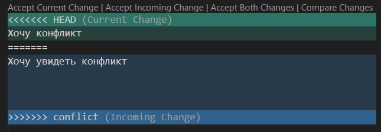
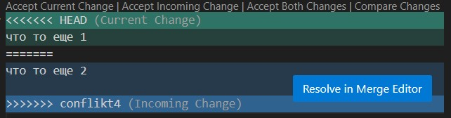

# Инструкция по git
## 1. Проверка наличия установленного git

В терминале выполняем команду git version. Если git установлен, появится сообщение с информацией о версии файла, иначе будет сообщение об ошибке

## 2. Установка git

Загружаем последнюю версию -  https://git-scm.com/downloads 

## 3. Настройка git

При первом использовании git необходимо представиться. Для этого необходимо представиться

git config --global user.name "Ваше имя"

git config --global user.email "Ваша почта"

Для того, чтобы проверить прошла ли регистрация надо ввести команду:

 git config --list

## 4. Инициализация репозитория

Прописываем в терминале команду git init.
В исходной папке появится скрытая папка .git

## Домашнее задание

Описать команды git status,  git log, git commit, git checkout

## 5. Команды Git
1. *git status* - получить информацию о текущем состоянии

2. *git log* - вывод на экран инстории всех коммитов

3. *git checkout* - переход от одного коммита к другому

4. *git checkout master* - вернуться к актуальному состоянию и продолжить

5. *git diff* - увидеть изменения

# 6. Добавление картинок и игнорирование файла

Для того,чтобы разместить картинку в нашем файле, надо добавить ее в папку и после этого в нужном месте пишем следующее:

Для того, чтобы удалить файлы с изображениями из отслеживания, надо создать файл .gitignore

# 7. Ветвление

Для создания новой ветки надо ввести команду: git branch name

Ветвление необходимо для работы с файлами в отдельной ветке, сохраняя при этом исходное состояние файла до их слияния.

Чтобы отобразить созданные ветки, используется команда git branch

Чтобы перейти на другую ветку используем команду git checkout имя ветки

# 8. Слияние веток

Для слияния веток и внесения изменений в наш основной файл используется команда:

git merge имя ветки

Слияние делается в ту ветку, в которой мы находимся сейчас

# 9. Конфликт 

Хочу конфликт

Конфликты возникают при слиянии двух веток в одну, при этом должны быть изменена одна и та же фтрока файла
Конфликт выглядит вот так:

# Д\З

Написать еще 4 ветки,ветки не удалять, сделать и решить еще один конфликт, добавить скрины

# 10. Удаление веток

Для локально расположенных веток существует команда:

git branch -d имя ветки

Удалить текущую ветку, в которую вы, в данный момент просматриваете - нельзя.  Так что при удалении ветвей, обязательно переключитесь на другой branch.

# 11. Дополнительные команды в git

* git clone - копирует существующий репозиторий Git

Полученная «рабочая копия» представляет собой полноценный репозиторий Git с собственной историей и файлами, полностью обособленный от исходного репозитория.

* _git remote_ -  позволяет создавать, просматривать и удалять подключения к другим репозиториям. 

* _git fetch_ -  загружает коммиты, файлы и ссылки из удаленного репозитория в ваш локальный репозиторий.

* _git push_ -  выполняет отправку недавних коммитов c компьютера локального репозитория на сервер с удаленным репозиторием

* _git pull_ -  используется для извлечения и загрузки содержимого из удаленного репозитория и немедленного обновления локального репозитория этим содержимым

# Крайняя попытка решить конфликт прошла успешно!

что то еще 1
что то еще 2

## Как настроить совместную работу

1. Создать аккаунт на GitHub.com
2. Создать локальный репозиторий
3. “Подружить” ваш локальный и удалённый репозитории. 
GitHub при создании нового репозитория подскажет, как это можно сделать
4. Отправить (push) ваш локальный репозиторий в удалённый (на GitHub), при этом, возможно, 

вам нужно будет авторизоваться на удалённом репозитории
5. Провести изменения “с другого компьютера”
6. Выкачать (pull) актуальное состояние из удалённого репозитория

## pull request

* команда для предложения изменений

* запрос на вливание изменений в репозиторий

В больших компаниях один ответственный за проект создает аккаунт. Другие пользователи дают
команду pull request. Предлагать изменения на GitHub нужно в отдельной ветке. 
Сначала пользователь копирует репозиторий на свой компьютер, делает fork репозитория, затем клонирует версию на своём ПК, создаёт ветку с предлагаемыми изменениями, отправляет
изменения командой push в свой аккаунт на GitHub и даёт команду pull request. 

## Как сделать pull request
* Делаем   (ответвление) репозитория fork

* Делаем git clone версии репозитория СВОЕЙ версии репозитория

* Создаем новую ветку и в НЕЕ вносим свои изменения

* Фиксируем изменения (делаем коммиты)

* Отправляем свою версию в свой GitHub

* На сайте GitHub нажимаем кнопку pull request

