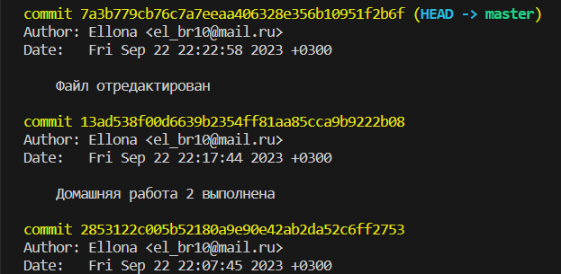
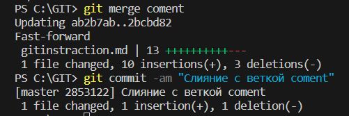

# Инструкция GIT

## Предисловие

Git — самая популярная в мире распределённая система контроля версий. Линус Торвальдс, разработчик ядра ОС Linux, создал этот инструмент ещё в 2005 году, а сегодня Git активно поддерживается как проект с открытым исходным кодом. Огромное количество открытых и коммерческих проектов используют Git для контроля версий.

## 1. Проверка наличия установленного GIT
В терминале выполняем команду git version.
Если GIT установлен, то появится сообщение с информацией  о версии файла, иначе будет информация об ошибке

## 2. Установка GIT
Загружаем последнюю версию  с официального сайта в разделе загрузок. Выбираем необходимую версию в зависимости от параметров компьютера и скачиваем актуальную версию. Запускаем скачанный файл  с правами администратора и выбираем необходимые компоненты (наличие иконок на рабочем столе, проверка наличия новой версии.) Остальные параметры рекомендуется оставить по умолчанию.

## 3. Настройка GIT
При первом использовании GIT необходимо представиться.
Для этого надо ввести две команды:

git config --global user.name

git config -- global user.emal

Для того, чтобы проверить прошла ли регистрация, надо ввести команду

git config --list

## 4. Инициализация репозитория

Создать пустой репозиторий или вновь инициализировать существующий  можно с помощью команды 

 git init

В исходной папке появится скрытая папка git.init, в которой будут содержаться все объекты и ссылки GIT,

## 5.Проверка статуса репозитория

Просротреть статус нужного репозитория с помощью ключевого слова  status : его действие распространяется на подготовленные, неподготовленные и неотслеживаемые файлы

git status

## 6. Добавление отдельных файлов или всех файлов в область подготовленных файлов

Добавить отдельный файл в область подготовленных файлов можно параметром add  с указанием имени файла. Просто заменить  somefile.js на актуальное имя.

git add somefile.js

Кроме того, можно добавить все файлы и папки в эту область

git add .

## 7. Внесение изменений однострочным сообщением или через редактор
При создании коммита в репозитории можно добавить однострочное сообщение с помощью параметра commit с флагом -m
 далее в кавычках вводится сообщение

git commit -m "Cообщение здесь"

Также можно открыть текстовый редактор в терминале для написания полного сообщения коммита.
 - переименовать последный комментарий в коммите можно используя команду
 git commit --ament -m "Изменения в последный комментарий"

## 8. Просмотр истории коммитов с изменениями
Просматривать  изменеия , внесенные в репозиторий можно с помощью параметра log.  Он отображает список последних коммитов в порядке выполнения. Добавив флаг -p можно подробно изучить внесенные изменения

git log

## 9. Просмотр изменений до коммита
Просмотр списка изменений, внесенных в репозиторий.
По умолчанию отображаются только изменения, не подготовленные для фиксации.

git diff

Для  просмотра подготовленных изменений необходимо добавить флаг
 --stager. 
 
 Для просмотра изменений, внесенных в конктетный файл необходимо добавить имя файла как параметр
--somefile.js

 ## 10. Временно переключиться на другой коммит
 Переключиться на другой коммит и продолжить работу с него

 git checkout 5567  - где цифры это первые 4 цифры коммита

 git checkout master     - перейти на актуальную версию
 
 Номер коммита выглядит так (команда git log):
 
 

## 11. Добавление картинок и игнорирование файлов

Для того, чтобы разместить картинку, надо добавить добавить ее в папку и после пишем

Для того, чтобы удалить файлы с изображением из отслеживания, надо создать файл
.gitignore

## 12. Ветвление
Для создания новой ветки надо ввести
git branch имя ветки
Ветвление необходимо для работы с файлами в отдельной ветке, сохраняя при этом исходное состояние файла
до их слияния. Чтобы отобразить созданные ветки, используется команда  
git branch
Чтобы перей ти на другую ветку 
  git checkout  имя ветки

  ## 13. Слияние веток
  Для слияния веток и внесения изменений в основной файл используется команда
  git merge имя ветки
  Cлияние делается в ту ветку, в которой находимся
  Cлияние веток в терминале выглядит так:

  

  ## Конфликты!!
  Хочу увидеть конфликт

  должен быть конфликт
  ## Конфликты
  Хочу увидеть конфликт
  Очень нужен конфликт
  Хочу что-то увидеть
Конфликты возникают при слиянии двух веток в одну, при этом дб изменена одна и та же строка файла
Конфликт выглядит вот так

 - ДЗ 
- Создать 4 ветки и слить их с основной.
Ветки не удалять.
- Дополнить инструкцию своими скринами.
- Сделать и решить еще один конфликт.

конфликт2 выглядит так

