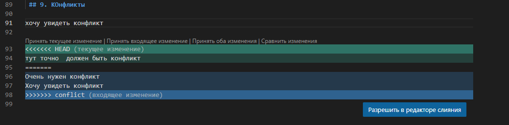
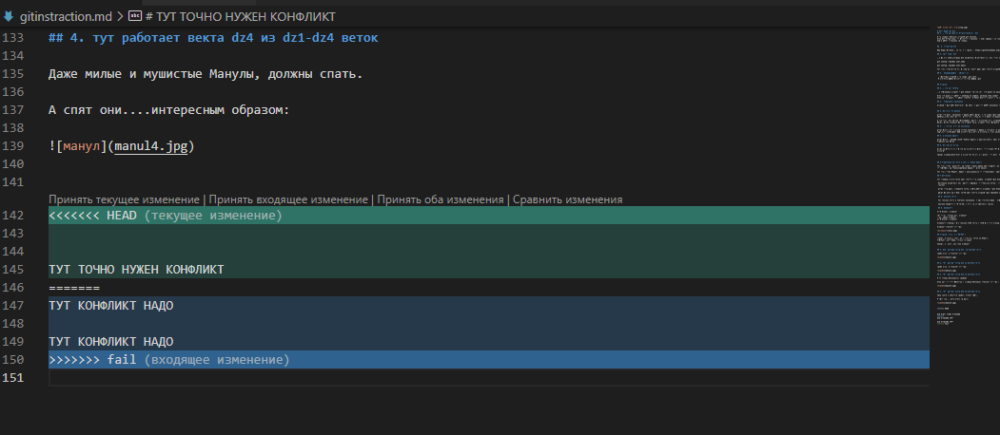

# Инструкция по Git
## 1. Проверка наличия уставновленного  Git

В терминале выполняем команду git version.
Если Git установлен, то появится сообщение  с информацией о версии файла.
Иначе будет сообщение об ошибке.

##  2. Установка Git

Загружаем последнюю версию в с сайта :  https://gitforwindows.org/

## 3. Настройка  Git

При первом использовании Git необходимо представиться, для этого надо ввести  две команды.

git config --global user.name 

git config --global user.email

Для того,чтобы проверить прошла ли регистрация надо ввести команду : git config --list

## 4.  Инициализация  Репозитория 

 Прописываем команду в терминал  git init .
 В исходной папке появиться скрытая папка .git

## Домашка

## 1. Проверка статуса 

При выполнении команды " git status " проверяет  сохранены ли изменения в файле.

Если сохранено,то будет " nothing to commit, working tree clean"
Если не сохранено, то будет вылетать КРАСНЫМ цветом моменты в терминале

## 2.  Добавления изменений 

Команда " git add" позволяет  передать в git,что будут изменения в следующем коммите.

## 3. Блочное сохранение

Чтобы сохранить изменения в файле,нужно писать в терминал "git commit -m "сообщение ",чтобы изменения сохранились, и в будушем,можно было бы это рассмотреть отдельно от других сохранений 

Кроме того, для лучшей оптимизации работы с коммитами есть команда "git commit -am "сообщение ",но эту команду можно писать после введения первой команды (Т.Е. команды выше описанной в этом разделе )

## 4.  Проверка  историй изменений

Чтобы понять,кто и когда вводил изменения в файле и сохранял через команды в прошлом разделе нужно использовать " git log",который покажет ВСЕ коммиты да и автора коммита и время изменений

## 5. Сравнение файлов

Чтобы понять разницу между текущим файлом и закомииченным, надо использовать " git diff " чтобы увидеть  какой текст добавлен или убран 

## 6. Блочная проверка  

Чтобы не потеряться в проверке коммитов и понять что вообще тут происходит в файле,есть "git chechout "первые 4 буквы коммита"

Данная команда позволяет 1 коммит проверить и сравнить что было  до след. коммита

## 6.Добавление картинок и игнорирование файлов 

Для того,чтобы разместить картинку в нашем файле надо добавить ее в папку и после этого в нужном месте пишем следующее :" 

Для того,чтобы удалить файлы с изображениями от отслеживания  надо создать файл " .gitignore"

## 7.Ветвление 

Для создания новой ветки надо ввести в терминале  команду "git branch  name "

 Ветвление необходимо для работы с файлами  в отдельной ветке,  сохраняя при этом  исходное состояние файла  до их слияния 

 Чтобы отобразить созданные ветки, используется команда " git branch"

 ЧТобы перейти на другую ветку надо ввести команду "git chechout название ветки"

 ## 8. Слияние веток

 Для слияние веток и внесения изменений  в наш основной файл   используется команда  " git merge названиеи ветки"
 
 Слияние делается в ту ветку, в которой мы находимся сейчас. 

 ## 9. Кoнфликты 

хочу увидеть конфликт 

тут точно  должен быть конфликт
Очень нужен конфликт 
Хочу увидеть конфликт 

Конфликты возникают при слиянии двух веток в одну при этом должна быть изменена одна и таже строка файла.

Конфликт выглядит вот так:

## Домашка  номер 2 (РАБОТАЙ )

создать 4 ветки и слить их с основой, ветки не удалять 
Дополнить инструкцию своими скринами 

Сделать и решить еще один конфликт 

## 1. ТУТ работала ветка dz1  из dz1-dz4 веток

Манул номер 1 выглядит вот так:

## 2. тут работает ветка dz2 из dz1-dz4 веток

Манул номер 2 выглядит вот так:

## 3. тут работает ветка dz3 из dz1-dz4 веток

А вы выдели удивленного Манула?

Если нет, то этот пушистик с эмоцией удивления выглядит вот так :

## 4. тут работает векта dz4 из dz1-dz4 веток

Даже милые и мушистые Манулы, должны спать.

А спят они....интересным образом:

## 2. ТУТ второй конфликт был выполнен  В ДЗ

 ##  2 Глава работа с репозиториями

## 1. Git hub

Чтобы начать соединять репозитории с кодом, надо завести аккаунт на Git Hub 

## 2.  Дружба репозитория и кода

Чтобы так скажем "подружить их" надо использовать 2 команды

1) git remote add origin https://github.com/manulm/NAME REPOSITORY.git

2) git push -u origin main/master

## 3.  git push 

НУ чтобы Главный дядя отвечающий  за проект, а именно  вот этот:

То вам надо сделать pull request  человеку,чтобы он или принял ваш запрос на изменение  или отказался

По сути, это как....как почта получается

ВЫ отправили запрос на изменение  и вы получаете,или отказ,или согласие на изменение данных в коде