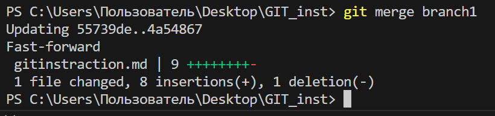
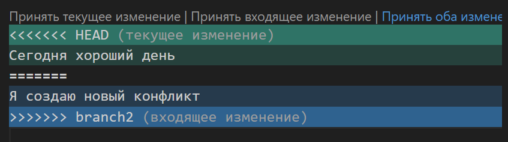
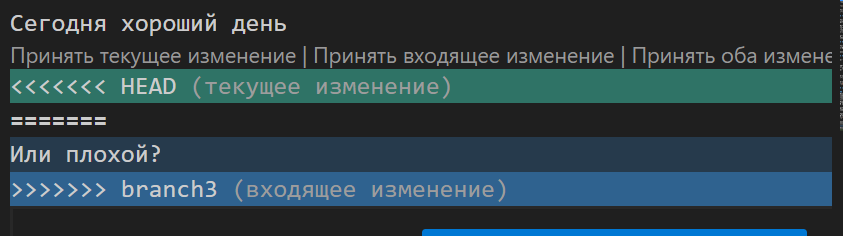

# Инструкция по Git

## 1. Проверка наличия установленного Git

В терминале выполняем команду git version. Если Git установлен, то появится сообщение с информацией о версии файла. Иначе будет сообщение об ошибке.

## 2. Установка Git

Загружаем последнюю версию Git с сайта

## 3. Настройка Git

При первом использовании Git нужно представиться. Для этого надо ввести две команды.

git config --global user.name

git config --global user.email 

Для того, чтобы проверить прошла ли регистрация, нужно ввести команду 

git config --list

# 4. Инициализация репозитория

В терминале выполняем команду git init. В исходной папке появится скрытая папка .git

# 5. Основные команды Git

git status - инициализация локального репозитория

git add - добавить файл или файлы к следующему коммиту

git commit -m "message" - создание коммита 

git log - вывод на экран истории всех коммитов с их хеш-кодами

git checkout - переход от одного коммита к другому

git checkout master - вернуться к актуальному состоянию и продолжить работу

git diff - увидеть разницу между текущим файлом и закоммиченным файлом

# 6. Добавление картинок и игнорирование файла

Для того, чтобы разместить картинку в нашем файле, надо добавить её в папку и после этого в нужном месте пишем следующее

Для того, чтобы удалить файлы с изображениями из отслеживания, надо создать файл .gitignore

# 7. Ветвления

Для создания новой ветки нужно ввести в терминале команду git branch name_branch 

Ветвление необходимо для работы с файлами в отдельной ветке, сохраняя при этом исходное состояние файла до их слияния. Чтобы отобразить созданные ветки, используется команда git branch

Чтобы перейти на другую ветку, используем команду git checkout name_branch

# 8. Слияние веток

Для слияния веток и внесения измениния в наш основной файл используется команда git merge name_branch

Слияние делается в ту ветку, в которой мы находимся сейчас.

# 9. Конфликты

Хочу увидеть конфликт

Тут точно должен быть конфликт
Очень нужен конфликт
Хочу увидеть конфликт

Конфликты возникают при слиянии двух веток в одну, при этом должна быть изменена одна и та же строка файла.

Конфликт выглядит вот так

# 10. Другие полезные функции

## Изменение последнего коммита
Внести изменения в последний коммит можно параметром commit с флагом --amend. Например, вы записали изменения, внесённые в ряд файлов, и поняли, что допустили ошибку в сообщении коммита. В этом случае можете воспользоваться указанной командой, чтобы отредактировать сообщение предыдущего коммита, не изменяя его снимок.

git commit --amend -m "Updated message for the previous commit"

Далее картинка того, как слили ветку branch1 c этим подразделом в ветку master

Сегодня хороший день
Или плохой?

Вот как это было

* Спасибо, что дочитали инструкцию до конца 