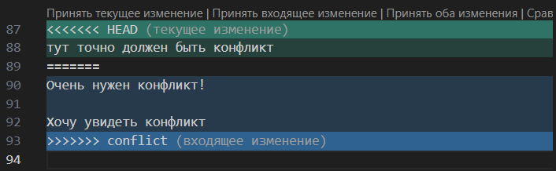
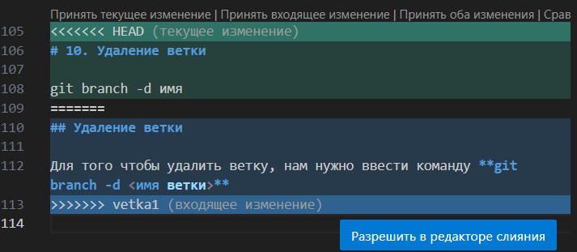

# Инструкция по Git

## 1. Проверка наличия установленного Git 

В терминале выполняем команду git version.

Если Git установлет, то появится сообщение с информацией о версии файла. Иначе будет сообщение об ошибке.

## 2. Установка Git
Загружаем последнюю версию Git с сайта - https://git-scm.com/downloads

## 3. Настройка Git

При первом использовании Git необходимо представиться, для этого надо ввести две команды:

1. git config --global user.name
2. git config --global user.email

Для того чтобы проверить прошла ли регистрация надо ввести команду: git config --list

## 4. Инициализация репозитория

Прописываем команду git init.

В исходной папке появится скрытая папка .git

## Домашка 
Описать git status/ git add/ git commit/ git log/ git diff/ git checkout

# Git Status
Для того, чтобы посмотреть состояние репозитория используется команда *git statuse*. 

Для этого необходимо в папке с репозиторием написать *git statuse*, и Вы увидите были ли изменения в файлах, или их не было.

# Git add
Для добавления изменений в коммит используется команда *git add*. 

Чтобы использовать данную команду напишите *git add <имя файла>*. 

Имя файла можно подобрать используя клавишу *Tab*. При нажатии на клавишу *Tab* дойдите до нужного репозитория и надмите *Enter*.

# Git commit
Для того, чтобы создать коммит(сохранение) необходимо выполнить команду *git commit*. Выполняется она так:
1. git commit -m <Название коммита>.
2. Можно совместить сразу две команды *git commit и git add* git commit -am <Название коммита>

# Git log
Для того чтобы посмотреть историю коммитов мы используем команду *git log*. Данная команда показывает развернутую историю коммитов.

Если мы хотим посмотреть сжатую историю, где указывается только название коммита и его номер, то мы испольнуем команду *git log --oneline*

# Git diff
Команда *git diff* используется для просмотра различий между версиями файлов в репозитории. Она показывает, какие изменения были сделаны в файлах с момента последнего коммита. 

# Git checkout
Команда *git checkout* позволяет перемещаться между ветками. При переключении ветки происходит обновление файлов в рабочем каталоге в соответствии с версией, хранящейся в этой ветке, а git начинает записывать все новые коммиты в этой ветке.

## 6. Добавление картинок и игнорирование файла

Для того чтобы разместить картинку в нашем файле надо добавить ее в папку и после этого в нужном месте пишем следующее: 

Для того чтобы удалить файлы с изображениями из отслеживания надо создать файл .gitignore

## 7. Ветвление

Для создания новой ветки надо ввести в терминале команду git branch и имя ветки

Ветвление необходимо для работы с файлами в отдельной ветке, сохраняя при этом исходное состояние файла до их слияния.

Чтобы отобразить созданные ветки, используется команда git branch.

Чтобы перейти на другую ветку используем команду git checkout имя ветки

*Чаще всего ветвление используется для удобства создания проекта. Люди, работающие над одним проектом, создают ветку со своим именем и работают в ней. Далее главный по проекту уже делает слияние веток*

## 8. Слияние веток

Для слияния веток и внесения изменений в наш основной файл используется команда git merge имя ветки.

Слияние делается в ту ветку, в которой мы находимся сейчас. 

## 9. Конфликты

Хочу увидеть конфликт

тут точно должен быть конфликт
Очень нужен конфликт!

Хочу увидеть конфликт

Конфлинты возникают при слиянии двух веток в одну, при этом должна быть изменена одна и та же строка файла.

Конфликт выглядит вот так:

При слиянии веток мы обязаны выбрать один из следующих вариантов:
* Принять текущие изменения 
* Принять входящие изменения
* Принять оба изменения 
* Сравнить ветки

# Домашка 

Создать 4 ветки и слить их с основной, ветки не удалять.

Дополнить инстпукцию своими скринами.

Сделать и решить еще один конфликт.

## Удаление ветки

Для того чтобы удалить ветку, нам нужно ввести команду **git branch -d <имя ветки>**

В подзаголовке "Удаление ветки" я создала конфликт при слиянии vetka1 и master, и у меня вышло следующее:

# Домашка №2
## 1. Git push
Данная команда позволяет отправить нашу версию репозитория на внешний
репозиторий. 

**Требует авторизации** на внешнем репозитории.

## 2. Git pull
Эта команда позволяет скачать все из текущего репозитория и автоматически
сделать merge с нашей версией 

## 3. Git clone
Эта команда позволяет склонировать внешний репозиторий на наш ПК

## 4. Pull request
Pull request — это заявка на слияние кода из разных веток. В процессе слияния Git создаст коммит и покажет все изменения в файле кода: добавленные до разветвления строки подсветятся зеленым цветом, удаленные — красным. Так каждый из разработчиков и менеджер проекта увидят, что произошло с кодом после совместной работы над коммитом. Перед окончательным слиянием (merge) все разработчики должны просмотреть изменения кода (code review) и принять их.

## 5. Fork 
Fork — собственное ответвление (fork) какого-то проекта. Это означает, что GitHub создаст вашу собственную копию проекта, данная копия будет находиться в вашем пространстве имён, и вы сможете легко делать изменения путём отправки (push) изменений.