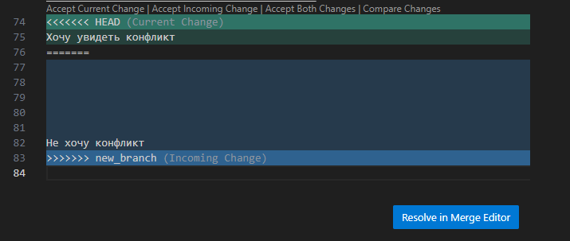

# Краткая инструкция по GIT

## 1. Проверка системы на наличие GIT ##

Для того, чтобы проверить установлена ли система гит на компьютер, и если установлена, то какая версия, нам поможет команда в терминале  *git version*.

Результат выполнения команды будет примерно следующий:

 _$ git --version_

_git version 2.18_

Если вдруг в результате выполнения команды, выскакивает сообщение: *git: command not found*, то это означает, что либо Git не установлен в вашей системе, либо путь до git не добавлен в переменную окружения $PATH.

## 2. Установка системы GIT ##

Установить git на свою машину очень просто:

Для системы Linux — нужно просто открыть терминал и установить приложение при помощи пакетного менеджера вашего дистрибутива. Для Ubuntu команда будет выглядеть следующим образом:

_sudo apt-get install git_

Windows — с официального сайта необходимо скачать клиент с графическим интерфейсом, и эмулятор bash. Далее следовать инструкциям по установке.

OS X — проще всего воспользоваться homebrew. После его установки запустите в терминале:

_brew install git_

## 3. Первичная настройка системы GIT ##

Итак, мы установили git, теперь нужно добавить немного настроек. Есть довольно много опций, с которыми можно играть, но мы настроим самые важные: наше имя пользователя и адрес электронной почты. Откройте терминал и запустите команды:

_git config --global user.name "My Name"_

_git config --global user.email myEmail@example.com_

Теперь каждое наше действие будет отмечено именем и почтой. Таким образом, пользователи всегда будут в курсе, кто отвечает за какие изменения — это вносит порядок.

Посмотреть первичные настройки можно введя команду 

_git config --list_

## 4. Создание нового репозитория ##

Чтобы создать новый репозиторий, нам нужно открыть терминал, зайти в папку нашего проекта и выполнить команду 

_git init_

 Это включит приложение в этой конкретной папке и создаст скрытую директорию .git, где будет храниться история репозитория и настройки.

## 5. Отслеживание файлов ## 

Для отлеживания файлов необходимо ввести команду

 git add название файла  

Так же можно использовать регулярные выражения для группы файлов. Например:

 git add **.txt*  

## 6. Запоминание файлов ## 

Для запоминание файлов необходимо ввести команду

 git commit -m "Название коммита" 

Так же можно использовать обобщенную команду . Например:

 git commit -am "Название коммита"  

## 7. Увидеть изменения ## 

Чтобы посмотреть изменения в файле достаточно ввести команду

 git diff 

## 8. Увидеть все коммиты ## 

Чтобы посмотреть все коммиты достаточно ввести команду

 git log 

## 9. Переходить между коммитами ## 

Для перехода с одного коммита на другой необходима команда

 git checkout Название коммита (хеш) 

# Ветки #

## 1. Вывод всех веток ##

 Для просмотра всех веток необходимо ввести команду 

 git branch 

## 2. Создание новой ветки ##

 Для создания новой ветки

 git branch название новой ветки 

## 3. Переход на другую ветку ##

 Переход между ветками осуществляется  командой

 git checkout название  ветки 

## 4. Переход на другую ветку ##

 Переход между ветками осуществляется  командой

 git checkout название  ветки 

## 5. Переход на другую ветку ##

 Переход между ветками осуществляется  командой

 git checkout название  ветки 

## 6. Слияние веток ##

Необходимо перейти в основную ветку master  и ввести команду

 git merge название  ветки слияния

## 7. Удаление ветки ##

Удалить ненужную ветку можно

 git branch -d  название   удаляемой ветки

##  8. Gitignore ##

Чтобы игнорировать файлы необходимо внести их в .gitignore файлы

##  9. Конфликт слияния ##

Конфликт слияния происходит при изменении одного и того же куска текста (кода) в разных ветках.

Во время слияния необходимо разрешит конвликт автомтически или вручную.

Не хочу конфликт

##  10. Графическое отображение веток ##

Выполняется командой

 git log --graph

