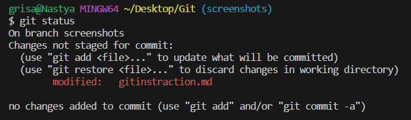
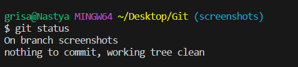

# Инструкция по Git

## 1. Проверка наличия устанвленного Git

В терминале выполняем команду git version. Если Git установлен, появится сообщение с информацией о версии файла. Иначе будет сообщение об ошибке.

## 2. Установка Git

Загружаем последнюю версию Git с сайта <https://git-scm.com/>

## 3. Настройка Git

При первом использовании Git необходимо представиться, для этого надо ввести две команды.

git config --global user.name

git config --global user.email

Для того,чтобы проверить прошла ли регистрация, надо ввести команду: git config --list

## 4. Инициализация репозитория

Прописываем команду в терминале git init.

В исходной папке появится скрытая папка .git

## 5. Просмотр состояния репозитория

Для просмотра текущего состояния репозитория необходимо ввести команду git status. Команда показывает были ли изменения в файлах.

Если изменения не добавлены и не сохранены, команда отобразит следующее:

Если сохраненная версия совпадает с текущей, команда отобразит:

## 6. Добавление изменений в коммит

Чтобы добавить изменения в коммит, необходимо ввести команду git add <имя файла>.

## 7. Создание коммита

Для создания коммита необходимо ввести команду git commit -m "комментарий к коммиту". Данная команда берет изменения, добавленные с помощью git add, и сохраняет их.

## 8. Просмотр истории коммитов

Для просмотра истории коммитов используется команда git log.

## 9. Просмотр разницы

Чтобы увидеть разницу между текущей версией файла и добавленной в коммит, необходимо ввести команду git diff.

## 10. Переключение между версиями 

Чтобы изменить текущую версию на любую сохраненную, необходимо ввести команду git checkout.

## 11. Добавление картинок и игнорирование файлов

Для того, чтобы разместить картинку в нашем файле, надо добавить ее в папку и после этого в нужном месте пишем следующее:

Для того,чтобы удалить файлы с изображениями из отслеживания, надо создать файл .gitignore

## 12. Ветвление

Для создания новой ветки надо ввести в терминале команду git branch branch_name

Ветвление необходимо для работы с файлами в отдельной ветке, сохраняя при этом исходное состояние файла до их слияния.

Чтобы отобразить созданные ветки, используется команда git branch. Звездочкой будет помечена ветка на которой мы находимся.

Чтобы перейти на другую ветку, используется команда git checkout branch_name.

Чтобы удалить ветку, используется команда git branch -d branch_name.

## 13. Слияние веток

Для слияния веток и внесения изменений в наш основной файл используется команда git merge branch_name.

Слияние делается в ту ветку, в которой мы находимся сейчас.

## 14. Конфликты

Конфликты возникают при слиянии двух веток в одну, при этом должна быть изменена ожна и та же строка файла.

Конфликт выглядит вот так:

Второй конфликт:
