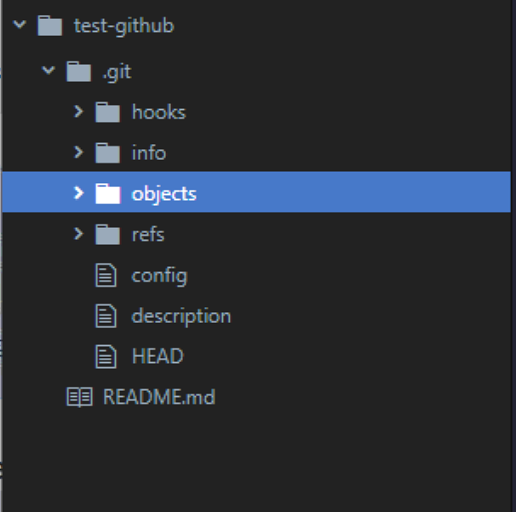
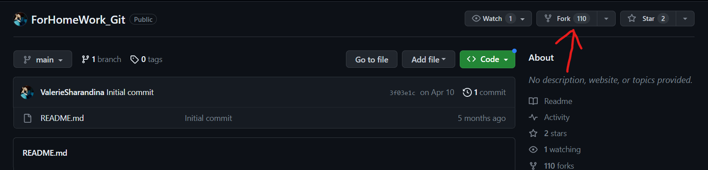
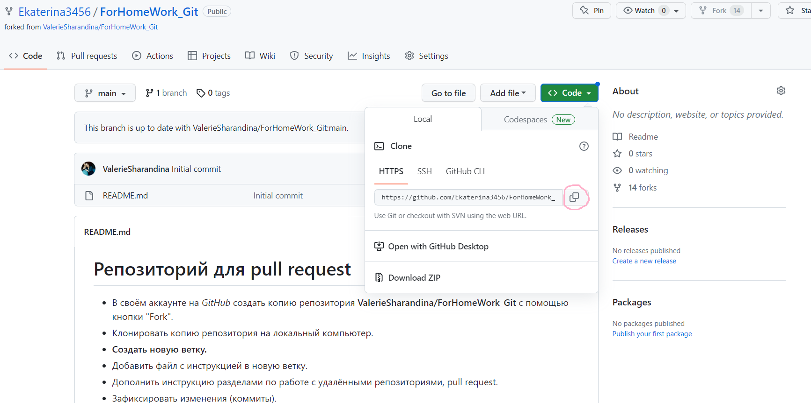

# Инструкция по Git

## 1. Проверка наличия установленного Git

В терминале выполняем команду "git version".Если Git установлен, появится сообщение с информацией о версии файла. Например: *__git version 2.35.1.windows.2__*. Иначе будет сообщение об ошибке.

## 2. Установка Git

Загружаем последнюю версию Git с сайта https://git-scm.com/downloads. Устанавливаем с настройками по умолчанию.

## 3. Настройка Git

При первом использовании Git необходимо представиться. Для этого надо ввести две команды:

1. git config --global user.name "Имя Пользователя"
2. git config --global user.email "почта_пользователя@example.com"

Для того чтобы проверить прошла ли регистрация надо ввести команду:

* git config --list 

После этого на экране терминала появится много строчек с информацией.  Если все данные внесены без ошибок, то на последних строчках будет отображено имя и почта пользователя.

## 4. Инициализация репозитория

Получить репозиторий можно двумя способами:
* В терминале переходим к папке, в которой хотим создать репозиторий. Выполняем команду **git init**. В исходной папке появится скрытая папка **.git**, содержащая все необходимые файлы репозитория - структура Git репозитория.

Теперь у нас есть папка, которая отслеживается Git. но в ней пока что нет ни одного файла. Для создания файла мы можем использовать кнопку в меню *Проводник* или с помощью правой кнопки мыши выбрать во всплывающем окне *создать файл*. Создавая новый файл необходимо указать его **название вместе с расширением**. Например: *Gitinstruction.md*
* В терминале вводим команду "git clone". Эта команда позволяет получить копию существующего Git репозитория. Эта команда подойдет для того чтобы вносить правки в существующий проект. При выполнении этой команды с сервера (или из исходной папки) забирается каждая копия каждого находящегося там файла.
  
## 5. Добавление картинок и игнорирование файлов 

Для того чтобы разместить картинку в нашем файле нам надо добавить необходимый файл в папку с гитом, после чего он отобразится в проводнике. После этого в том месте где должна быть картинка пишем следующее:

Например так:

Для того, чтобы удалить файлы с изображениями из отслеживания нам надо создать файл:

* .gitignore

В этом файле мы можем указать файлы с каким расширением убрать из отслеживания. 

Например:

* *.png

## 6. Ветвление 

Для создания новой ветки надо ввести в терминале команду:

* git branch имя_ветки

Ветвление необходимо для работы с файлами в отдельной ветке, сохраняя при этом исходное состояние файла до их слияния.

Чтобы отобразить созданные ветки, используется команда:

* git branch

Чтобы перейти на другую ветку вводим в терминале команду:

* git checkout имя_ветки

Посмотреть в какой ветке мы находимся на данный момент можно командой **git status** или **git branch**.

Когда мы работаем в новой ветке, файл в ветке *master* остается неизменным до тех пор, пока мы не сделаем их слияние.

## 7. Слияние веток

Для слияния веток и внесения изменений в наш основной файл используется команда:

* git merge имя_ветки

Слияние делается в ту папку, в которой мы находимся сейчас. Например:

* git checkout master
* git merge egor

Это означает что мы перешли в ветку *master* и в нее добавили ту информацию, которая была в ветке **egor**.

## 8. Конфликты

Конфликты возникают при слиянии 2 веток в одну при этом должна быть изменена одна и та же строка файла 

Конфликт выглядит вот так:

## 9. Запись изменений в репозиторий

У нас есть файл в который мы начинаем вносить информацию. Над этим файлом может работать один человек или целая команда. Для удобства работы с информацией в файле ее необходимо сохранять. В этом разделе разберем когда и как это надо делать.d
Сохранения в рабочем файле схожи с сохранениями в компьютерных играх. Их не должно быть слишком много или слишком мало. Важно помнить, что к каждому сохранению можно вернуться в любой момент работы с файлом. Это значит что они должны быть логичными и у каждого сохранения должен быть свой развернутый комментарий.

Чтобы определить соcтояние файлов в репозитории, необходимо выполнить команду:

* git status

Для проверки статуса в сокращенном виде, можно использовать такие команды:

* git status -s
* git status --short

## 10. Отслеживание файлов

Первым делом надо сохранить изменения в самом файле. Для этого используется сочетание клавиш *Ctrl+S*. Без сохранения Git будет считать что наш файл пустой. Увидеть сохранены изменения или нет можно по виду названия нашего файла. Если рядом с названием показан белый кружок, значит изменения не сохранены, если видим букву М - значит изменения зафиксированы. 
Для того чтобы не вспоминать каждый что надо сохранять файл можно включить *Автосохранение* в меню *Файл*

Теперь наш файл сохранен и мы можем добавить его к отслеживанию. Для этого в терминал вводим команду:

* git add <название файла.расширение файла>

При работе с командой **git add** возможно использовать следующие сокращения:

* Для обновления отслеживаемых файлов **git add -u**
* Для добавления изменений из всех отслеживаемых и неотслеживаемых файлов **git add -A** или **git add --all**

Если вышло так, что после ввода команды **git add** в файл вносились изменения, то эту команду надо будет повторить перед сохранением. Если понадобится узнать какие именно изменения вы внесли в файл, понадобится команда **git diff**. она показывает разницу между проиндексированными и непроиндексированными изменениями в файле.

## 11. Совершение коммита

**Commit** - означет фиксация. **Git commit** - это команда означает фиксацию изменений файла и присвоение ему короткого имени (метки, коммита). Существует несколько вариантов использования данной команды:

1. Задаем произвольный комментарий

* git commit -m "комментарий"

2. Отслеживаем файл и задаем произвольный комментарий. При этом мы пропускаем команду **git add**, так как данная команда выполняет 2 действия одновременно.

* git commit -am "комментарий"

Комментарий записываем обязательно, без него сохранить изменения не получится. И с помощью корректных комментариев нам будет проще перемещаться по файлу для его корректировки. 

Если получилось так что мы ошиблись и внесли неправильный комментарий, исправить его можно с помощью команды:

* git commit --amend -m "правильный комментарий"

Эта команда изменяет только тот комментарий, который был записан в последнем сохранении. 

## 12. Получение информации о истории коммитов

После того как мы выполнили несколько коммитов, можно посмотреть историю этих сохранений и попробовать перемещаться между ними.

Для того чтобы посмотреть все сохранения которые были в репозитории надо в терминале ввести команду:

* git log
  
После ввода команды терминал покажет все сохранения которые были в репозитории с указанием того в какой ветке оно было сделано, времени, автора этого сохранения и комментарий к нему. У каждого сохранения есть свое индивидуальное имя из 40 символов. 
 
Также просмотреть историю коммитов можно с помощью команды:
 
* git log --oneline

Это сокращенная версия с помощью которой мы видим короткие имена коммитов (первые 7 символов) и комментарий к ним. 

Для отображения текущей ветки и истории слияния используют следующую команду:

* git log --graph

## 13.Сравнение с последним коммитом

Для того чтобы посмотреть какие изменения были внесены в файл по сравнению с последним коммитом используеся команда:

* git diff

Для того чтобы посмотреть изменения, которые были внесенв в файл и зафиксированны командой **git add** необходимо в терминале ввести команду:

* git diff -c или
* git diff --cached

Если информация не помещается в терминале нажимаем клавишу END.

Для выхода из режима нажимаем клавишу Q.

## 14. Перемещение между сохранениями (коммитами) 

Для того чтобы переместиться на любой коммит который был сделан в файле, надо ввести в терминале команду:

* git checkout <хеш-код>

Например: **git checkout 0111f1**. Данный вид перехода используется только для просмотра. Для дальнейшей корректной работы, необходимо вернуться к последнему коммиту.

Ответ на вопрос: где же найти все-таки хеш-код. Пишем в терминале команду **git log**, и там будет написано commit и много букв и цифр. Это и есть наш хеш-код. 

## 15. Удаление ветки

Для удаления ветки надо ввести в терминале команду:

* git branch -d имя_ветки или
* git branch --delete имя_ветки

Удалить ветку мы можем только в том случае если у нас обе ветки закоммичены и слиты. 

Если нам надо удалить ветку но при этом мы не хотим забирать изменения из нее в основную ветку мы вводим в терминал команду:

* git branch -D имя_ветки

Но пользовать этой командой надо очень осторожно, чтобы случайно не потерять кусок работы.

## 16. Подготовка к работе с удаленным репозиторием

**Удаленный репозиторий** - это проект, который располагается не на нашем компьютере, а в сети интернет, либо на другом компьютере, к которому имеется доступ по средствам локальной сети, на сервере и тд. Например сайт [Git.Hub](https://github.com)

Для работы с удаленными репозиториями необходимо зарегистрироваться на сайте. После этого нам предоставят доступ к работе с удаленными репозиториями. 

Чтобы приступить к работе над каким-либо проектом на GitHub, необходимо сначала перейти к репозиторию данного проекта на сайте.

Для того чтобы работать с удаленным репозиторием на своем компьютере необходимо выполнить следующие действия:

* После перехода на страницу разработчика проекта, необходимо в правом верхнем углу выбрать кнопку **Fork**. Вот так:

* Написать имя репозитория и нажать кнопку *Creat Fork*. После этого страница сайта обновиться, мы окажемся на странице своего аккаунта, где будет отображаться репозиторий добавленного проекта.
* Для того чтобы забрать проект на свой компьютер необходимо нажать на кнопку **Code** скопировать ссылку. Вот так:

* Создать рабочую папку в любом удобном месте (главное чтобы она была пустая). Открыть VS Code, либо другой редактор, в нем открыть рабочую папку. **_В этой папке не должно быть репозитория! команду *git.init* не используем!_**

* В терминале вводим команду:

git clone https://github.com/hustlee13/ForHomeWork_Git.git (ссылка, которую мы скопировали на сайте)

После этого в нашу папку будет клонирован весь проект. 

* Теперь командой cd переходим в скопированную папку. Вот так: 

* Начиная работу над проектом обязательно создаем новую ветку! И все изменения которые мы хотим добавить пишем именно в ней. 

## 17. Команда Push

**Git push** используется для отправки всех обновленных коммитов из локальной ветки в удаленную.
Для того чтобы отправить определенную ветку на удаленный сервер со всей историей работы над ней, в терминале вводим команду:

* git push

Чтобы отправить все ветки, вводим команду:

* git push --all

Чтобы удалить конкретную ветку, вводим команду:

* git push --delete или
* git push -d

Если мы создаем новый репозиторий на своем локальном компьютере и хотим отправить его в удаленный репозиторий на GitHub, то для начала надо будет создать в своем профиле новый репозиторий и после этого ввести в терминале команду:

* git push (ссылка на новый репозиторий)