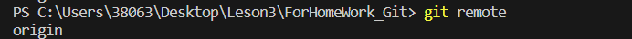
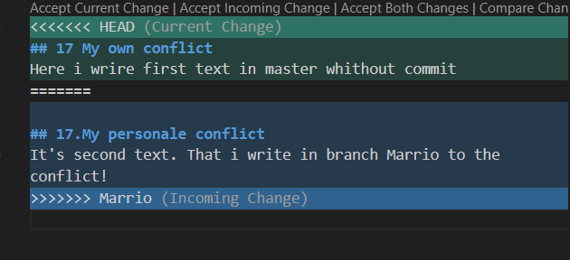
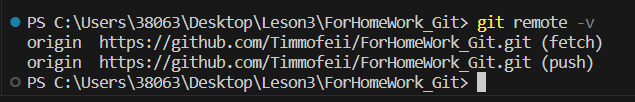
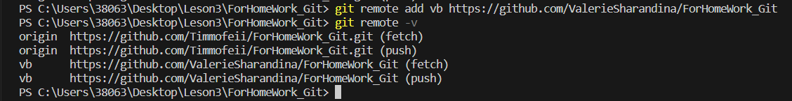
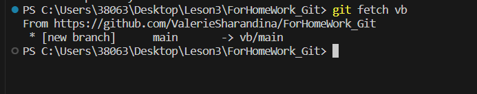
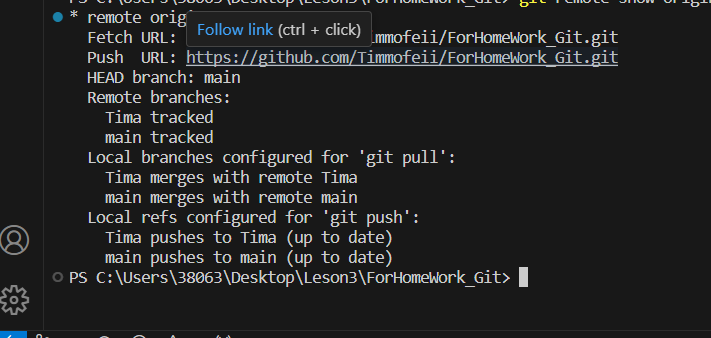
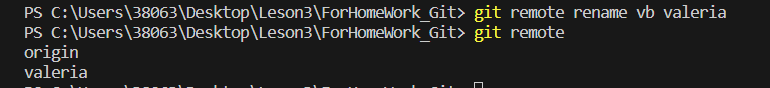
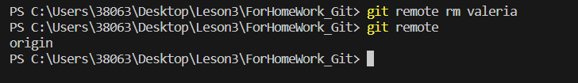

# Git manual

## 1. Checking the installation Git

 In termimal we use command git version.
 If Git install,then terminal  show message with information for version file.
 Otherwise will message error.
 
## 2. Installing Git

Download last version on website: https://code.visualstudio.com/Download
 
## 3. Setting Git
In first use Git you will have introduce, for this set two commands:

git config --global user.name

git config --global user.email 
## 4. Initialization repository
 You need to start by creating a new repository;
  to do this enter the command in the terminal: 
  
  git init

 After this, a hidden .git folder appears. We don't need to climb into it and do anything, just the important fact that it appeared after entering the command.

## 5. Cheching status 
To view the current state of file and the local repository as a whole, enter the command in the terminal:

 git status.

## 6. Adding files to the index
If you need to add all the repository files to the index at once use the command: 

git add.

## 7. Committing indexed changes
For commiting indexed changes use the command :

 git commit "your comment".

## 8. Looking history commits
For look history commits use the command:

git log.

## 9. Changes have been made to the file whithout commits
To see what changes have been made to the file, but have not yet been added to the commit, you can enter the command:

 git diff.

## 10. Transition between branches
To swich from one branch to another use the command: 

git checkout.

# 11. Adding picture and ignore file 
In order to place a picture in our file, we need to add it to the folder and then write the following in the right place: 
in order to remove image files from tracking, you need to create a .gitignor file
## 12. Branch 

To create a new branch you need to enter the command in the terminal: git branch name_branch

branching is necessary to work with files in a separate branch, while maintaining the original state of the file before merging them.

to display created branches, use the command: git branch

to move to another branch use the command: git checkout name_branch
## 13. Merging branches
To merge branches and make changes to our main file, use the command: 

git merge name_branch

The merge is done in the branch we are in now.

## 14. Conflicts

I want to see a conflict 

Here 100% mast be a conflict 
I wnat too much see a conflinct 

I want to see a conflict 

conflicts arise when merging two branches into one and the same line of the file must be changed

the conflict looks like this:
 

## 15. Workink with  remote repositories
Next, to work with the remote repository, you need to connect to it with the command:  

## 16. View a list of all remote repositories

To view, use the command:

## 17 My own conflict 
Here i wrire first text in master whithout commit 

## 17.My personale conflict 
It's second text. That i write in branch Marrio to the conflict!
=

## 18. Работа с удаленными репозиториями 
Для добавления в git удаленного репозитория сперва создаем пустую папку и нужно выполнить командку: 

git clone тут ссылка на репозиторий.

Для просмотра списка настроенных репозиториев нужно выполнить команду:

git remote 

Так же можна указать ключ -v чтобы посмотреть адреса для чтения и записи, привязаные к репозиторию.

Для того чтобы довалить удаленный репозиторий и присвоить ему имя, выполните команду: git remote add вашеКороткоеИмя егоАдресс.
Теперь вместо указания полного пути вы можете использовать использовать vl. Например, если вы хотите получить изменения, которые есть у Валерии, но нет у вас, вы можете выполнить команду git fetch vb

Теперь вместо указания полного пути вы можете использовать vb. Например хотите получить измения которые есть у Валерии, но нет у вас, вы можете выполнить команду : git fetch vb
 
 Ветка master из репозитория Валерии сейчас доступна вам под именем vb/master. Вы можете слить её с одной веткой из ваших или переключить на неё локальную ветку, чтобы посмотреть содержимое ветки Валерии.
 Просмотр удаленного репозитория
 если вы хотите побольше информации об одном из удаленных репозиториев, вы можете использовать команду: git  remote show<remote>. Выполнив эту команду с некоторым именем, например origin вы получите следующий результат:
 Для отправки изменений в удаленный репозиторий
 Когда вы хотите поделится своими наработками, вам необходимо отправить их в удаленный репозиторий. Команда для этого : git push remote-name branch name
 
 она выдает URL удаленного репозитория, а также информацию об отслеживаемых ветках. Эта команда любезно сообщает вам, что если вы находять на ветке master, выполите git pull, ветка master с удаленного сервера будет автоамтически влита в вашу, сразу после получения всех необходимых данных. Она так же выдает список всех получинных ею ссылок. 
 Удаление и переименнование удаленных репозиториев
 для переименования удаленного репозитория можно выполнить git remote rename. Например, если вы хотите перименновать vb в Valerіa, вы можите сделать при помощи git remote rename:
 
 Если нужно удалить удаленный репозиторий- вы можете использовать git remote rm:
 
 Когда вы хотите поделиться своми наработками, вам необходимо отправить их в удаленный репощиторий. Команда для этого git push<remote-name> <branch-name> чтобы отправить вашу ветку master на сервер origin(повторим, что клонирование обычно настраивает оба этих имени автоматически), вы можите выполнить команду для отправки ваших коммитов:  